- [第 0 部分 — 导览](#part-0--orientation)
  - [0.1 这是什么](#01-what-this-is)
  - [0.2 系统模型](#02-system-model)
  - [0.3 三种存储](#03-the-three-stores)
  - [0.4 实例 — Slack 线程](#04-worked-example--a-slack-thread)
  - [0.5 实例 — 工具执行期间崩溃](#05-worked-example--a-crash-mid-tool)
  - [0.6 非目标](#06-non-goals)
  - [0.7 记法与源类型](#07-notation-and-source-types)
- [第 1 部分 — 存储](#part-1--storage)
  - [1.1 模型](#11-the-model)
  - [1.2 标识](#12-identity)
  - [1.3 寄存器命名空间](#13-register-namespaces)
  - [1.4 事务](#14-transactions)
  - [1.5 查询](#15-queries)
  - [1.6 用量账本](#16-usage-ledger)
  - [1.7 后端](#17-backends)
  - [1.8 为何采用一次写入加寄存器](#18-why-write-once-plus-registers)
- [第 2 部分 — 对话树](#part-2--the-conversation-tree)
  - [2.1 条目](#21-entries)
  - [2.2 放置](#22-placement)
  - [2.3 通道](#23-lanes)
  - [2.4 事实](#24-facts)
  - [2.5 分支查询与上下文](#25-branch-queries-and-context)
  - [2.6 分支索引](#26-the-branch-index)
  - [2.7 分叉](#27-forks)
  - [2.8 会话与仓库边界](#28-session-and-repository-boundary)
  - [2.9 精确重写](#29-the-precise-rewrite)
- [第 3 部分 — 操作状态机](#part-3--the-operation-state-machine)
  - [3.1 操作](#31-operations)
  - [3.2 操作状态 — 程序计数器](#32-operation-state--the-program-counter)
  - [3.3 通道状态与当前状态有效性](#33-lane-state-and-current-state-validity)
  - [3.4 原子转换规则](#34-the-atomic-transition-rule)
  - [3.5 状态图](#35-the-graph)
  - [3.6 接受](#36-acceptance)
  - [3.7 助手生成](#37-assistant-generation)
  - [3.8 工具](#38-tools)
  - [3.9 摘要生成 — 压缩与导航摘要](#39-summary-generation--compaction-and-navigation-summaries)
  - [3.10 导航](#310-navigation)
  - [3.11 收件箱、队列与延迟写入](#311-inbox-queues-deferred-writes)
  - [3.12 检查点过程](#312-the-checkpoint-procedure)
  - [3.13 终止事务](#313-terminal-transactions)
- [第 4 部分 — 执行、恢复、中止与关闭](#part-4--execution-recovery-abort-close)
  - [4.1 解释器](#41-the-interpreter)
  - [4.2 副作用边界](#42-the-effects-boundary)
  - [4.3 通道变更线](#43-the-lane-mutation-line)
  - [4.4 恢复](#44-restore)
  - [4.5 崩溃位置与恢复策略](#45-crash-positions-and-recovery-policy)
  - [4.6 中止](#46-abort)
  - [4.7 关闭 — 一次受控崩溃](#47-close--a-controlled-crash)
  - [4.8 故障](#48-faults)
  - [4.9 外部终结](#49-external-finalization)
- [第 5 部分 — 公共接口](#part-5--public-surface)
  - [5.1 通道接口](#51-the-lane-surface)
  - [5.2 harness](#52-the-harness)
  - [5.3 SessionTree](#53-sessiontree)
  - [5.4 快照与订阅](#54-snapshots-and-subscription)
  - [5.5 事件](#55-events)
  - [5.6 钩子](#56-hooks)
  - [5.7 Agent 循环构建块](#57-agent-loop-building-blocks)
  - [5.8 遥测](#58-telemetry)
- [第 6 部分 — 未来：分区保留（Postgres）](#part-6--future-partitioned-retention-postgres)
- [第 7 部分 — 模式演进](#part-7--schema-evolution)
  - [7.1 问题](#71-the-problem)
  - [7.2 此设计为何能缩小问题范围](#72-why-this-design-shrinks-the-problem)
  - [7.3 机制：存储版本加打开时迁移](#73-the-mechanism-storage-version-plus-migrate-on-open)
  - [7.4 迁移是全定义的](#74-migrations-are-total)
  - [7.5 三个层次，重述为策略](#75-the-three-strata-restated-as-policy)
- [第 8 部分 — 构建顺序](#part-8--build-order)
- [第 9 部分 — 不变量与测试](#part-9--invariants-and-tests)
  - [9.1 不变量](#91-invariants)
  - [9.2 竞态目录](#92-race-catalog)
  - [9.3 测试层级](#93-test-tiers)
- [附录 A — 术语表](#appendix-a--glossary)
- [附录 B — coding-agent v3 格式兼容性](#appendix-b--coding-agent-v3-format-compatibility)
- [附录 C — 开放问题](#appendix-c--open-questions)

<a id="part-0--orientation"></a>
# 第 0 部分 — 导览

<a id="01-what-this-is"></a>
## 0.1 这是什么

一个用于 Agent 对话的持久化运行时。它持久化对话和操作状态，使中断的工作能够恢复，而无需重复已经确定完成的副作用。

<a id="02-system-model"></a>
## 0.2 系统模型

### 会话

一个会话将相关工作组织在一起，由四个部分组成：

- **条目树。** 条目是消息、压缩、分支摘要或应用定义的自定义条目。条目不可变。每个分支都是一个对话线程；共享树在保留历史的同时，支持分支、压缩、分叉和并行工作。

  ```text
  a ── b ── c ── d
        └── e ── f
  ```

- **事实。** 可变的、带命名空间的键值状态。内置事实包括会话名称和条目标签；应用可以存储自定义事实。
- **通道。** 指向树中位置的具名游标。每个会话都有 `main`。通道拥有自己的叶节点、模型配置、队列，并且至多拥有一个操作。额外通道支持 Slack 线程、子 Agent，以及其他基于共享历史的并行工作。
- **用量账本。** 会话中仅追加的 token 与成本事件。

### harness 与操作

会话层管理持久化数据，并公开类型化的树视图。harness（执行框架）驱动通道：接受提示、运行模型和工具步骤、管理队列、压缩或导航树，以及恢复中断的工作。它还拥有 harness 范围内的可用工具与提示资源注册表、拦截和转换执行的钩子、报告活动及持久化变更的被动事件，以及运行时配置。

一个**操作**是通道中一个已接受的工作单元：运行、压缩或导航。其不可变元数据记录它的标识、意图和起点；其完备的当前状态记录阶段、控制信息、队列和恢复数据。每次持久化转换都会替换当前状态。完成时会移除操作状态，并记录通道结果。

### 存储

在会话和 harness 之下，`Storage` 通过三种持久化形式提供原子事务与查询：不可变条目、可变寄存器和仅追加的用量行。寄存器构成一个可变的、带命名空间的键值存储。事实位于其中；harness 的内部命名空间持久化存储崩溃恢复所需的待处理内容、通道状态和操作状态。具体而言，`op.meta` 仅写入一次，用于保存操作元数据；`op.state` 则在每次转换后替换为完整的当前状态。终止事务会删除二者，并写入 `lane.lastResult`。任何不完整事务都不可见。

<a id="03-the-three-stores"></a>
## 0.3 三种存储

第 1–5 部分的所有内容都由此推导而来。

**1. 三种存储，一个不变量。** 一切持久化内容都属于以下三者之一：

```text
entries        the conversation tree — write-once, append-only
registers      current mutable state — namespaced typed cells, overwrite or delete
usage ledger   cost history — append-only rows
```

*每个有效载荷都位于条目、寄存器或账本中；不存在第四个存放位置。* 一个条目就是完整的对话记录——位置和有效载荷位于同一行。寄存器直接保存其当前类型化值；覆盖会丢弃旧值，删除则移除该键。在树中获得位置之前已经持久化存在的内容（排队输入、延迟写入）会在 `pending.entry` 寄存器中等待，并在放置它的事务中成为条目。各后端的投影——分支索引、全文搜索、统计信息——均可由这三种存储重建，不具有权威性。

**2. 原子事务。** 一个事务由一组条目插入、用量插入和寄存器写入（设置或删除）组成，以全有或全无的方式提交，并带有严格递增的序列号。事务内部不存在崩溃状态。这是唯一的写入原语。

**3. 持久化程序计数器。** 每个步骤完成后，harness 都会覆盖一个寄存器——`op.state/{operationId}`——写入操作的*完整*当前状态。恢复过程不会重放日志，也不会根据缺失内容推断位置；它读取该寄存器并按其内容分派。该状态是*完备的*——绝不依赖先前状态。较小的捕获值（配置、流选项、重试策略）直接内联；较大的稳定有效载荷位于同级 `op.*` 寄存器中，或通过 id 引用。操作结束时，终止事务会删除其寄存器：一个已完成会话仅保留对话、账本以及少量通道和事实寄存器。不存在需要回收的废弃状态。

**4. 副作用三明治。** 提供商请求和真实工具调用由两次提交包裹：

```
commit:  "about to do X; its output will use ids R and U"     ← intent
         do X                                                  ← the uncertain part
commit:  output + usage + next state                           ← settlement
```

钩子则遵循其重放契约：结果在消费它的事务中持久化，而在该事务之前发生崩溃可能导致钩子重新运行。因此，每个外部副作用都可能已经发生，却没有持久化结算。提供商/工具意图会在重放策略依赖这种不确定性时将其明确表达；对于幂等钩子，该问题被视为非目标。

<a id="04-worked-example--a-slack-thread"></a>
## 0.4 实例 — Slack 线程

用户在一个已有 400 个历史条目的频道中发帖。应用为该线程创建一个通道，并将其锚定到频道当前的叶节点。条目 id 是 UUIDv7（§1.2）；示例中将其缩写。

```
harness.createLane("slack:1719432.0021", at: "0195c8d1-4a2e-7b31-…")
lane.prompt("what changed in auth last week?")
```

按顺序发生以下过程：

1. **接受。** harness 验证输入，运行 `before_run` 钩子，并提交一个事务：用户消息条目、操作的 `op.meta` 寄存器，以及其首个 `op.state`——*“我位于检查点，需要一个助手响应。”*
2. **意图。** 在一次内部就绪状态提交之后，它提交请求意图：*“我即将发起提供商请求。响应将使用条目 `0195c8d1-53a0-7c44-…`，用量行将使用 `0195c8d1-53a0-7d18-…`。”* 两个 id 此时生成；请求尚未发送。
3. **请求。** 执行流式传输。这是唯一不持久化的部分。
4. **结算。** 一个事务提交响应条目、用量行和下一状态：*“响应包含工具调用；这是批次计划，结果 id 已经分配。”*
5. 工具调用遵循相同的“意图 → 副作用 → 结算”结构，每个调用各有一对提交。
6. 当模型停止且没有工具调用时，终止事务删除操作的寄存器，在 `lane.lastResult` 中记录结果，并使通道进入空闲状态。

以下是相应轨迹（id 已缩写；每个 `TX[...]` 都是一次原子提交）：

```text
TX[ insert entry n1 (user msg), upsert op.meta/O, upsert op.state/O = checkpoint,
    upsert lane.leaf = n1, upsert lane.state = { currentOperationId: O } ]
TX[ upsert op.state/O = assistant ready (config snapshot) ]
TX[ upsert op.state/O = effect_pending (reserves response n2, usage u1) ]
… provider streams …                                  ← the uncertain window
TX[ insert entry n2, insert usage u1, upsert lane.leaf = n2,
    upsert op.state/O = tools (result id n3 reserved) ]
TX[ upsert op.tool_args/O:s1:0, upsert op.state/O = call 0 effect_pending ]
… tool runs …
TX[ insert entry n3, upsert lane.leaf = n3, upsert op.state/O = checkpoint ]
… second turn: ready · intent · stream · settle (n4, u2) …
TX[ delete op.meta/O, op.state/O, op.tool_args/O:*,
    upsert lane.lastResult = { O, completed, n4 },
    upsert lane.state = { currentOperationId: null } ]
```

在任意两个事务之间终止进程并重新启动。harness 会读取通道寄存器，准确识别最后提交的是上述哪一句状态，并从那里继续。如果它在步骤 3 中崩溃，它知道某次请求可能已经计费，也可能已产生或尚未产生输出——这是整个系统中唯一真正不确定的窗口，并且有明确的处理策略。

与此同时，同一频道中的第二个线程在自己的通道中运行，使用相同的 400 个共享历史条目，二者无需协调。

<a id="05-worked-example--a-crash-mid-tool"></a>
## 0.5 实例 — 工具执行期间崩溃

```
lane.prompt("delete the stale migrations and run the test suite")
```

模型返回两个工具调用。harness 提交批次计划，然后提交“调用 0 即将使用这些确切参数执行，并声明自身无法安全重放”。工具开始删除文件。进程被终止。

```text
TX[ insert entry n2 (assistant, 2 calls), insert usage u1, upsert lane.leaf = n2,
    upsert op.state/O = tools (result ids n3, n4 reserved) ]
TX[ upsert op.tool_args/O:s1:0, upsert op.state/O = call 0 effect_pending,
                                                    replay: "never" ]
… tool deletes files …  ← CRASH
```

重新启动后，harness 读取一个寄存器，并发现 `calls[0].status = "effect_pending", replay = "never"`。它不会重新执行删除操作。它使用副作用开始前预留的结果 id 追加一个合成错误结果，将该调用标记为完成，然后继续执行调用 1：

```text
TX[ insert entry n3 (synthetic "interrupted" result), upsert lane.leaf = n3,
    upsert op.state/O = call 0 completed ]
```

对话保持连贯——每个工具调用都有一个结果——并且没有任何操作执行两次。

如果工具声明的是 `replay: "safe"`（读取、查询），harness 就会使用已持久化的参数重新执行它。

<a id="06-non-goals"></a>
## 0.6 非目标

- **外部副作用恰好执行一次。** 见上文。自身带有副作用的钩子必须以操作 id 为键实现幂等。
- **恢复提供商流。** 部分流仅存在于进程本地，绝不持久化。已结算的响应必须在任何分类操作之前完整持久化。
- **多个写入者。** 每个会话仅由一个进程处理。服务层据此进行路由，SQLite 后端通过带防护令牌的租约强制执行这一约束（§1.7）。通道负责处理那些看起来类似多写入者的工作负载。
- **复制。** 一个会话仅存在于一个位置。
- **持久化写入历史。** 寄存器只保存当前值：被覆盖的寄存器值即告消失，且没有任何 API 或表公开写入历史。测试中的写入顺序断言使用包装 `commit()` 的插桩式存储装饰器（第 9 部分）；生产环境审计属于遥测层（§5.8）。
- **将删除作为运行时功能。** 条目和用量行永不删除：压缩改变的是提供商上下文，而不是存储；终止清理只删除寄存器。请注意，`retainedTail` 会将旧消息向前复制到较新的压缩条目中，摘要也派生自旧内容，因此压缩也不等于擦除。满足合规要求的“擦除这个”是管理性的精确重写（§2.9），也是唯一获准的例外。

<a id="07-notation-and-source-types"></a>
## 0.7 记法与源类型

- `TX[ a, b, c ]` — 一个原子提交，其中按顺序包含写入 `a`、`b`、`c`。写入词汇包括 `insert entry`、`insert usage`、`upsert namespace/key = value` 和 `delete namespace/key`。
- Id 是 UUIDv7（§1.2）。示例会将其缩写：当时间前缀无关紧要时，短标签——条目 id 使用 `e_*`、用量 id 使用 `u_*`、操作 id 使用 `op_*`——代表完整 id；当前缀有意义时，示例会完整展示它（`0195c8d1-4a2e-7b31-…`）。
- `S(next)` — 用下一个完备操作状态覆盖 `op.state/{operationId}` 寄存器。`L(next)` — 对 `lane.state/{lane}` 执行相同操作。
- **must / must not** 分别表示规范性的**必须 / 不得**。其他内容均为解释。

源类型出处：

- `AgentMessage`、`AgentTool`、`AgentToolResult`、`QueueMode` 和 `ThinkingLevel`：`packages/agent/src/types.ts`。
- `AgentEventSink`：`packages/agent/src/agent-loop.ts`。
- `Skill`、`PromptTemplate`、`AgentHarnessResources`（下文简称 `Resources`）、`AgentHarnessTool`、`AgentHarnessStreamOptions` 和 `AgentHarnessStreamOptionsPatch`：`packages/agent/src/harness/types.ts`。
- `Model`、`Models`、`Usage`、`RetryPolicy`、`StopReason`、`AssistantMessage`、`ImageContent`、提供商消息、流选项和延迟句柄：`packages/ai`。
- `CompactionSettings`、`CompactionPreparation`、`CompactResult`、`BranchPreparation` 和 `BranchSummaryResult`：`packages/agent/src/harness/compaction/`。除非本文档明确修改，现有的准备算法和轮次拆分算法仍是实现起点。
- `TelemetryContext` 和类型化模式辅助工具：`packages/telemetry`；Agent 所有的模式仍位于 `packages/agent/src/harness/telemetry.ts`。
- 用于持久化自定义消息注册的 `TSchema`：`typebox`。

公共 `QueueMode` 保持为 `"all" | "one-at-a-time"`。公共 `RetryPolicy` 保持 pi-ai 形状 `{ enabled, maxRetries, baseDelayMs }`；操作状态存储其规范化的等价形式 `{ maxAttempts, baseDelayMs }`。`maxRetries` 和 `baseDelayMs` 必须是有限、非负的安全整数，且 `maxRetries + 1` 必须仍为安全整数；禁用重试时规范化为一次尝试。指数延迟和 `notBefore` 算术在 `Number.MAX_SAFE_INTEGER` 处饱和。公共 `CompactionSettings` 保持为 `{ enabled, reserveTokens, keepRecentTokens }`；两个 token 数都必须是有限、非负的安全整数。构造函数和 setter 必须在发布前拒绝无效设置。此设计向 `AgentHarnessStreamOptions` 及其 patch 类型新增 `deferred?: boolean | { window?: "15m" | "1h" | "24h" }`；结构性请求始终强制将其设为 false。

```ts
type SettledAssistantMessage = AssistantMessage & {
  stopReason: Exclude<StopReason, "pending">;
};

// Provider dispatch resolves the durable { provider, modelId } identity
// through Models at request time, which also applies auth. A missing or
// swapped registry entry fails the request in-band, like an unknown tool.
```

---

<a id="part-1--storage"></a>
# 第 1 部分 — 存储

Storage 不了解 Agent、通道或对话。它存储条目和用量行、更新寄存器，并响应一小组固定查询。第 2–4 部分完全建立在此之上。

<a id="11-the-model"></a>
## 1.1 模型

```ts
type JsonValue = null | boolean | number | string | JsonValue[] | { [k: string]: JsonValue };

/** Write-once. The complete conversation record: placement and payload in one
    row. Created in exactly one transaction, never modified or deleted. The
    four concrete entry types extending this base are defined in §2.1. */
interface EntryBase {
  id: string;                // UUIDv7 (§1.2)
  parentId: string | null;
  seq: number;               // storage-assigned at commit
  timestamp: number;         // Unix ms, storage-assigned at commit
  type: EntryType;
  customType?: string;       // when type === "custom"
  // ...payload fields per entry type (§2.1)
}

type EntryType = "message" | "compaction" | "branch_summary" | "custom";

/** The only mutable store. A namespaced key holding its current typed value
    directly. Overwrite replaces the value; delete removes the key. */
interface Register<N extends RegisterNamespace = RegisterNamespace> {
  namespace: N;
  key: string;
  value: RegisterValues[N];
  seq: number;               // seq of the write that last set this register
}

/** Append-only cost ledger row. Never modified, never deleted (§1.6). */
interface UsageRow {
  id: string;                // UUIDv7 (§1.2)
  seq: number;               // storage-assigned at commit
  usage: Usage;
  entryId?: string;          // the entry this cost belongs to, when there is one
  adjustment: boolean;       // true = caller-supplied reconciliation, not a provider report
  details?: JsonValue;
}
```

<a id="12-identity"></a>
## 1.2 标识

每个 id——包括条目、用量以及每个预留 id——都是由会话的 id 生成器（§2.8）生成的 **UUIDv7**；旧版导入会重新生成 id 以符合要求（附录 B）。前 48 位是生成时间，因此每个引用都具有自描述性，并可按时间排序。可接受的代价是：id 会泄露创建时间。（未来的分区式 Postgres 后端将利用此前缀——参见资料性第 6 部分。）

生成规则：

1. id 在预留时使用 `now()` **生成**。直接追加会在同一事务中放置；助手/工具 id 的生成时间最多比放置时间晚一个请求的处理时长。
2. **工具结果 id 继承其助手 id 的时间戳**（`idGenerator.next(timestampMs?)`，使用全新的随机尾部），因此即使跨越午夜边界，一组调用及其结果在 id 排序中仍具有时间内聚性。
3. 合成结算使用已预留的 id 写入（§4.5）——不存在特殊情况。

**不透明载荷**——自定义条目的 `data`、`details`、`fact.custom` 值、消息文本、钩子的 `resumeData`——可能嵌入条目 id。harness（执行框架）从不跟踪这些引用，它们可能失效；请复制内容，不要引用 id。

**绝对规则。** 在一个会话内，条目和用量行永远不会被删除——唯一例外是精确重写（§2.9）。缺失父条目始终意味着数据损坏。

<a id="13-register-namespaces"></a>
## 1.3 寄存器命名空间

```ts
interface RegisterValues {
  "lane.leaf":       string | null;                // entry id; null = lane at the root
  "lane.config":     LaneConfiguration;            // §2.3
  "lane.state":      LaneState;                    // §3.3
  "lane.lastResult": LaneLastResult;               // §3.13
  "op.meta":         Operation;                    // §3.1
  "op.state":        OperationState;               // §3.2 — the program counter
  "op.tool_args":    Record<string, JsonValue>;    // effective tool arguments (§3.8)
  "op.preparation":  DurableStructuralPreparation; // §3.9
  "pending.entry":   PendingEntry;                 // §2.2
  "fact.name":       string;
  "fact.label":      string;
  "fact.custom":     JsonValue;                    // JSON null is a legal value
}
type RegisterNamespace = keyof RegisterValues;

/** Unplaced content: current mutable state until the placement transaction
    writes the complete entry and deletes this register (§2.2). */
interface PendingEntry {
  type: "message" | "custom";
  customType?: string;
  payload?: JsonValue;       // the content that becomes the entry's payload;
                             // absent = a custom entry with no data
}

interface DurableFileOperations {
  read: string[]; written: string[]; edited: string[];
}
type DurableStructuralPreparation =
  | { kind: "compaction"; messagesToSummarize: AgentMessage[];
      turnPrefixMessages: AgentMessage[]; retainedTail: AgentMessage[];
      isSplitTurn: boolean; tokensBefore: number; previousSummary?: string;
      fileOps: DurableFileOperations; settings: CompactionSettings }
  | { kind: "branch_summary"; messages: AgentMessage[];
      fileOps: DurableFileOperations; totalTokens: number };
```

| 命名空间 | 键 | 值 | 含义 |
|---|---|---|---|
| `lane.leaf` | 通道名称 | 条目 id 或 `null` | 此通道下一次追加的位置 |
| `lane.config` | 通道名称 | `LaneConfiguration` | 完整的通道配置 |
| `lane.state` | 通道名称 | `LaneState`（§3.3） | `currentOperationId`、`pendingNextRun` |
| `lane.lastResult` | 通道名称 | `LaneLastResult`（§3.13） | 该通道最近一次操作的终止结果 |
| `op.meta` | 操作 id | `Operation`（§3.1） | 接受数据；仅写入一次，永不覆盖 |
| `op.state` | 操作 id | `OperationState`（§3.2） | 完整的操作状态——**程序计数器** |
| `op.tool_args` | `{opId}:{stepId}:{sourceIndex}` | 有效工具参数 | 在工具获准时写入一次（§3.8） |
| `op.preparation` | `{opId}:{taskId}` | `DurableStructuralPreparation` | 在决策钩子之前写入一次（§3.9） |
| `pending.entry` | 预留条目 id | `PendingEntry` | 等待放置的已排队内容（§2.2） |
| `fact.name` | `""` | 字符串 | 会话名称 |
| `fact.label` | 条目 id | 字符串 | 条目标签 |
| `fact.custom` | 应用程序键 | `JsonValue` | 应用程序状态 |

以上即完整集合。键的形状体现了两种生命周期：

```text
lane.*  fact.*     session-lived; facts are deleted only by explicit application action
op.*               operation-lived; deleted by the terminal transaction (§3.13)
pending.entry      lives until its content is placed or cancelled
```

- `op.meta` 和 `op.preparation` 键恰好写入一次；`op.tool_args` 键按每个键写入一次，并以产生该键的步骤为键名，因此各批次绝不会冲突。它们最迟都会由终止事务删除；操作期间只有 `op.state` 会被覆盖。
- 操作结束时仍未消费的、由操作拥有的 `pending.entry` 寄存器（剩余收件箱项和中止时排空的项）由终止事务删除——已消费项的寄存器在其放置事务中消亡；由通道拥有的寄存器（`pendingNextRun`）则可跨越操作存续，并在被消费或取消时消亡（§3.11）。
- `lane.lastResult` 只由终止事务写入，并由其通道上的下一次终止事务覆盖——每个通道永远只有一个有界寄存器。恢复过程从不读取它；它的存在使得应用程序在接受一项操作、崩溃并重新打开后，仍能获知其结果（§3.13）。
- 删除事实会移除其寄存器。在 `fact.custom` 中存储 JSON `null` 是另一种合法状态；不存在墓碑。
- 取消不会留下痕迹：`cancelQueued` 的分类为：仍待处理 → `cancelled`，条目已存在 → `already_consumed`，否则 → `not_found`（§3.11）。客户端重试一次响应丢失的取消请求时，应将 `not_found` 视为成功。

<a id="14-transactions"></a>
## 1.4 事务

```ts
/** Mapped discriminated union: the namespace forces the value type. */
type RegisterSetWrite = {
  [N in RegisterNamespace]: { kind: "register"; op: "set"; namespace: N;
                              key: string; value: RegisterValues[N] }
}[RegisterNamespace];

type Write =
  | { kind: "entry"; entry: Omit<Entry, "seq" | "timestamp"> }
  | { kind: "usage"; row: Omit<UsageRow, "seq"> }
  | RegisterSetWrite
  | { kind: "register"; op: "delete"; namespace: RegisterNamespace; key: string };

interface Transaction { writes: Write[] }

interface CommitResult { firstSeq: number; seqs: number[]; timestamp: number }
```

规则：

1. 事务以**全有或全无**方式提交。不存在部分写入可被观察到的状态。
2. 写入按照给定顺序获得**严格递增**的 `seq` 值；事务内部和事务之间都允许有空缺。`seq` 在整个会话范围内跨所有通道和所有写入种类单调递增。寄存器 `set` 会将分配给该写入的 `seq` 标记到寄存器上。
3. 在一个事务内，写入按顺序生效：条目可指定同一事务中较早创建的父条目；寄存器值可引用同一事务中较早创建的条目或用量 id。放置事务会一起插入完整条目并删除其 `pending.entry` 寄存器（§2.2）——绝不会存在两者同时存在的时刻。
4. 条目和用量 id 共用一个会话级 id 命名空间。以任何已存在的 id 写入任一种对象都属于**数据损坏**，而不是更新。
5. 对相同 `(namespace, key)` 执行寄存器 `set` 会替换当前值；`delete` 会移除该键；之后的 `set` 可重新创建它。不保留历史记录。对不存在的键执行 `delete` 是空操作，因此清除尚未设置的标签等公开删除操作仍是合法的。
6. 同一会话上的事务会被**串行化**。只有一个写入者和一个队列。

Session 在提交获准进入存储前，会验证完整事务，包括 JSON 序列化和运行时 schema。一个已被接纳的提交一旦失败，harness 即进入**故障状态**：停止执行所有 effect（副作用操作），拒绝所有调用，并且必须重启进程。不容许事务被部分应用。

<a id="15-queries"></a>
## 1.5 查询

一个 `Storage` 实例服务于一个会话。仓库发现和生命周期不属于此接口（§2.8）。

```ts
interface Storage {
  commit(tx: Transaction): Promise<CommitResult>;

  getEntries(ids: string[]): Promise<ReadonlyMap<string, Entry>>;

  getRegister<N extends RegisterNamespace>(namespace: N, key: string):
    Promise<Register<N> | undefined>;
  /** keyPrefix is an indexed prefix listing over (namespace, key); terminal
      cleanup's op.* prefix scans use it (§3.13). */
  listRegisters<N extends RegisterNamespace>(namespace: N, keyPrefix?: string):
    Promise<Register<N>[]>;

  scanBranch(q: BranchScan): Promise<Entry[]>;            // §2.5
  scanBranchStructure(q: BranchScan): Promise<EntryStructure[]>;
  scanEntries(q: EntryScan): Promise<Entry[]>;            // session-wide tree inventory
  scanUsage(q: UsageScan): Promise<UsageRow[]>;           // seq-ranged ledger read (§1.6)
  getStats(): Promise<SessionStats>;                      // maintained projection (§1.6)

  close(): Promise<void>;
}

/** Placement metadata without payload fields. */
type EntryStructure = Pick<Entry, "id" | "parentId" | "seq" | "timestamp" | "type" | "customType">;

interface EntryScan {
  type?: EntryType; customType?: string;
  fromSeq?: number; toSeq?: number;
  order?: "asc" | "desc"; limit?: number;
}

interface UsageScan {
  fromSeq?: number; toSeq?: number;
  order?: "asc" | "desc"; limit?: number;
}
```

这里刻意不提供跨命名空间寄存器扫描，也不提供持久化写入日志。恢复、事实、分叉和执行都通过精确的 id 与键进行；条目清单使用 `scanEntries`；账本读取使用 `scanUsage`；总计使用统计投影（§1.6）；测试顺序断言使用带检测功能的存储装饰器包装 `commit()`（第 9 部分）；生产审计属于遥测范畴（§5.8）。

恢复和执行读取必须由索引驱动且有界。它们不得根据值缺失来推断状态，也不存在可供折叠的寄存器历史。允许精确解引用：一个当前状态可以指向一组有界的条目和寄存器，并通过单次批量读取获取，无需依赖顺序进行归约。公共清单和调试 API 可以有意读取超出热路径所需的数据；其 `limit`/分页行为在 `SessionTree` 层明确规定。

`close()` 是幂等的。它会封闭接纳入口，拒绝此后对该实例发起的读取或提交，排空封闭前已接纳的提交，然后释放资源以及写入者占用权。持久化数据通过仓库重新打开。

<a id="16-usage-ledger"></a>
## 1.6 用量账本

每次已结算的提供商尝试都会写入一个 `UsageRow`——无论成功、失败、重试还是合成尝试，均包括在内，也包括其操作后来中止的尝试。结算事务会一起写入响应条目及其用量行（§3.7）；合成结算则使用预留的用量 id 写入零用量。行仅可追加：终止清理会删除操作的寄存器，但绝不会删除其账本行，因此计费数据可经受编排状态可能发生的任何变化。

```jsonc
{ "id": "u_7", "seq": 815, "entryId": "e_51", "adjustment": false,
  "usage": { "input": 12000, "output": 431, "cost": { ... } } }
```

- 如果费用归属于某个条目，`entryId` 就指向该条目。在生成条目前失败的结构性（摘要）尝试以及独立调整没有此字段。
- `adjustment: true` 表示由调用方提供的调账（`recordUsage`，§5.1），而非提供商报告。格式 3 导入会写入一个聚合调整行（附录 B）。
- 提供商尝试的用量 id 是在意图提交中预留的 UUIDv7（§1.2），因此结算会准确地使用其意图承诺的 id 写入。调整行、工具报告的用量行、钩子提供的压缩/导航用量行（§3.9、§3.10）以及导入聚合项都在提交时生成 id；它们均不预留。
- `getStats()` 是在账本及消息条目计数之上维护的投影——`messageCount` 只计算 `message` 条目，不计算压缩、摘要或自定义条目。每次提交后，它都等于账本总和；一致性测试套件会断言这一点（第 9 部分）。各行在提交时通过 `usage` 事件送达应用程序（§5.5），而 `scanUsage`（§1.5）则按 seq 范围将它们读回——消费者持久化其已应用事件的最大 `seq`，便可在停机后使用 `scanUsage({ fromSeq })` 追赶进度。恢复过程从不读取账本。

<a id="17-backends"></a>
## 1.7 后端

目前提供同一模型的三种编码——Memory、JSONL、SQLite——且三者均通过相同的一致性测试套件（第 9 部分）。每个后端都记录会话的 `storageVersion`（第 7 部分）：JSONL 使用头字段，SQLite 使用目录列。Memory 会话始终为当前版本。潜在的第四种后端——分区式 Postgres——在第 6 部分以资料性方式概述；此处没有任何内容依赖它。

### Memory

```ts
entries:   Map<string, Entry>
registers: Map<string, Register>       // key: `${namespace}\u0000${key}`
usage:     Map<string, UsageRow>
children:  Map<string, string[]>       // parentId → entry ids, for tree walks
```

一个队列串行化所有提交。提交先验证写入并将其应用到临时事务状态，然后一起发布这些映射。寄存器删除就是映射删除。读取通过映射查找完成；`scanBranch` 沿 `parentId` 遍历并在 RAM 中筛选。这里没有日志：Memory 只保存当前存活状态，不保存其他任何内容。

### JSONL

文件不是状态本身；它是重放上述 Memory 映射的**配方**。每次 `commit()` 对应一个物理行。Storage 先分配序列和时间戳字段，然后将一次已提交写入编码为一个 JSON 对象行，或将多次写入编码为一个**数组行**。

```jsonl
{"v":4,"kind":"header","id":"s_1","storageVersion":1,"createdAt":1700000000000,"cwd":"..."}
[{"kind":"entry","seq":101,"timestamp":1700000000000,"id":"e_50","parentId":"e_41","type":"message","message":{"role":"user","content":[...]}},
 {"kind":"register","op":"set","seq":102,"namespace":"op.meta","key":"op_9","value":{...}},
 {"kind":"register","op":"set","seq":103,"namespace":"op.state","key":"op_9","value":{...}},
 {"kind":"register","op":"set","seq":104,"namespace":"lane.leaf","key":"main","value":"e_50"},
 {"kind":"register","op":"set","seq":105,"namespace":"lane.state","key":"main","value":{...}}]
{"kind":"usage","seq":110,"id":"u_7","entryId":"e_51","adjustment":false,"usage":{...}}
{"kind":"register","op":"delete","seq":131,"namespace":"op.state","key":"op_9"}
```

- 这是格式 4。源代码树中当前不兼容的格式 4 代码尚未完成，将被原地替换；无需为其提供迁移。仍支持 Coding-agent 格式 3（附录 B）。
- 打开时会按顺序重放各行到 Memory 映射中：条目和用量行会累积；后续寄存器 `set` 会覆盖对应键，`delete` 会移除对应键。这属于*解码*，而不是恢复逻辑。打开过程会验证持久化序列的单调性——严格递增，允许有空缺（§1.4）——以及时间戳，并且绝不会重新生成已提交的时间戳。此后所有查询均在 RAM 中运行。
- **撕裂的最后一行会被整体丢弃**，包括数组中的每个元素，并且在接纳新的写入前会将其截断。这正是在此处保证“崩溃后绝不会只保留事务写入的一个前缀（即部分写入）”的机制。
- 格式错误的*中间行*或完整但无效的事务都属于数据损坏。唯一的例外是：schema 迁移前被取代的旧形状寄存器行，在重放期间会以带键的原始 JSON 形式宽松解码（第 7 部分）；压缩会淘汰它们。
- 持久性保证达到进程崩溃级别：已完成的 `commit()` 可在进程终止后保留。不承诺 fsync。
- 可选：为每个条目保留 `(offset, length)` 并延迟加载载荷，只让结构和寄存器常驻内存。仅在性能分析表明确有需要时这样做。

**快照压缩。** 在 SQLite 中，寄存器 `set` 是原地 upsert——一次 30 轮运行期间只会保留一个 `op.state` 行，终止时执行 `delete` 后则一个也不剩。在 JSONL 中，每次 `set` 都会追加，因此同样的运行会追加约 10 个完整的 `op.state` 行；终止 `delete` 行一落盘，它们便全部失效：即使逻辑状态没有增长，文件仍会随*写入历史*增长。解决方法是通过临时文件加原子重命名，将文件重写为 `header + current entries + current registers + usage rows`；保留下来的行维持其原始 `seq` 值，而丢弃的行所留下的空缺是合法的（§1.4），因此压缩不需要任何重新编号机制。对于一次包含四个条目的运行：

```text
before compaction:  ~10 transaction lines, ~27 writes — op.state revisions,
                    tool args, pending payloads, all dead since the terminal line
after compaction:   header + 4 entry lines + 2 usage lines + 4 lane register lines
```

何时压缩：打开时，如果无效字节比例超过阈值，则进行压缩；可选择在终止事务后进行；schema 迁移后始终进行（第 7 部分）。两次压缩之间，正常操作仅追加，每次提交的复杂度为 O(1)。有一点后果值得明确说明：已删除的待处理载荷和已被取代的状态修订版本会作为字节**残留**到压缩时——逻辑删除立即生效，物理删除则延后执行。若部署要求迅速物理移除已取消的敏感内容，则应在终止边界积极执行压缩。

### SQLite

**每个会话一个数据库文件。** 该文件就是会话，与 JSONL 文件完全一样。损坏仅限于单个会话，删除就是取消文件链接，而 SQLite 的每文件单写入者规则在构造上恰好与本设计的每会话单写入者规则一致。

```sql
entries(id TEXT PRIMARY KEY, parent_id TEXT, seq INTEGER, type TEXT,
        custom_type TEXT, timestamp INTEGER, payload TEXT) WITHOUT ROWID;
CREATE INDEX ix_entry_parent ON entries(parent_id);
CREATE INDEX ix_entry_seq ON entries(seq, type);

registers(namespace TEXT, key TEXT, seq INTEGER, value TEXT,
          PRIMARY KEY (namespace, key));

usage_ledger(id TEXT PRIMARY KEY, seq INTEGER, entry_id TEXT, adjustment INTEGER,
             usage TEXT, details TEXT) WITHOUT ROWID;
CREATE INDEX ix_usage_seq ON usage_ledger(seq);

-- Private branch index (§2.6). Not registers; no equivalent in the other backends.
branch_entries(branch_id TEXT, entry_id TEXT, entry_seq INTEGER, entry_type TEXT,
               PRIMARY KEY (branch_id, entry_id)) WITHOUT ROWID;
-- Ordered scans. entry_seq must follow branch_id directly or ORDER BY needs a
-- temp b-tree; entry_id and entry_type trail so the index covers id-only reads.
CREATE INDEX ix_be_seq  ON branch_entries(branch_id, entry_seq, entry_id, entry_type);
-- Type-filtered scans.
CREATE INDEX ix_be_type ON branch_entries(branch_id, entry_type, entry_seq, entry_id);
CREATE INDEX ix_be_entry ON branch_entries(entry_id);
branch_meta(branch_id TEXT PRIMARY KEY, tip_entry_id TEXT, tip_seq INTEGER,
            base_branch_id TEXT, base_seq INTEGER);
CREATE UNIQUE INDEX ix_bm_tip ON branch_meta(tip_entry_id);

-- One row each: the file is the session.
session(created_at, parent_session_id, storage_version, metadata,
        message_count, usage_payload, next_seq);
writer_lease(owner_id TEXT, fence INTEGER, expires_at_ms INTEGER);
```

一次 `commit()` 就是一个 SQL 事务：插入条目、插入账本行、更新插入或删除寄存器、维护分支索引、递增 `session_stats`。绝不对条目或账本行执行 UPDATE 或 DELETE；可变性仅限于寄存器、分支索引（`branch_meta` 的尖端和基准）、统计信息、序列、会话目录行和租约。

**每个事务都必须以 `BEGIN IMMEDIATE` 开始。** 如果延迟式 `BEGIN` 在写入前读取，它会获取一个读快照，之后必须升级到写锁；如果此间另一个写入者已经提交，SQLite 会使该升级失败——而 `busy_timeout` **无法**挽救，因为无论等待多久都无法刷新过期快照。唯一的恢复方式是回滚并完整重试。

每次提交都是这种形式，而非只有少数如此。分配序列范围时，会先读取会话行的 `next_seq`，然后再写入，因此系统执行的每个事务中都存在先读后写。创建分支（§2.6）还会增加第二处这种情况，即先读取最新压缩再执行插入。`BEGIN IMMEDIATE` 会预先取得写锁，避免无法恢复的过期快照升级，因此这里不存在适合使用延迟式 `BEGIN` 的情况。

**`writer_lease` 强制实施单写入者规则。** WAL 很乐意让两个进程轮流写入同一文件，而这恰恰是设计所禁止的交错写入——因此，每会话文件并未消除对租约的需求。采用会过期且带防护令牌的所有权：`open()` 获取所有权声明，存储层会在追加时以及空闲期间续租，而关闭操作会在队列排空后停止续租，并且只删除与其 (owner_id, fence) 匹配的记录——因此，过期所有者无法释放已经成功取代它的新所有者。这使得“一个进程拥有一个会话”成为强制实施的属性，而不是依赖服务层遵守的约定。内存和 JSONL 没有对应机制，而是依赖进程所有权；同一 JSONL 会话被打开两次会导致损坏，且无法检测。

原子性本身不需要特殊处理。多写入事务由文件格式保证全有或全无：只有提交记录落盘后，WAL 帧才会变为可见，因此并发读取者要么看不到该事务的任何写入，要么看到它的全部写入。

`scanBranch` 的每个物理分段使用一次 JOIN；§2.6 会组合各分段范围：

```sql
SELECT e.id, e.parent_id, e.seq, e.type, e.custom_type, e.timestamp, e.payload
FROM branch_entries b
CROSS JOIN entries e ON e.id = b.entry_id
WHERE b.branch_id = ? AND b.entry_seq > ? AND b.entry_seq <= ?
ORDER BY b.entry_seq;
```

`CROSS JOIN` 至关重要：它强制 `branch_entries` 成为外层循环。如果放任规划器自行决定，它可能从 `entries` 驱动，扫描整张表，并通过临时 b-tree 排序。必须在测试中断言执行计划：

```
SEARCH b USING COVERING INDEX ix_be_seq (branch_id=? AND entry_seq>?)
SEARCH e USING PRIMARY KEY (id=?)
```

任何包含 `USE TEMP B-TREE FOR ORDER BY` 或扫描 `entries` 的计划都是回归。

`scanBranchStructure` 使用相同查询，但不含 payload 列。`getEntries` 是以 `e.id IN (...)` 为键的主键查找。

由于文件就是会话，精确重写（§2.9）和派生都是文件操作：构建一个全新的数据库（使用 `VACUUM INTO`，或在单个读快照上复制行），并且对于重写，将其以原子方式替换旧路径——与 JSONL 采用的形式相同。

<a id="18-why-write-once-plus-registers"></a>
## 1.8 为什么采用一次写入加寄存器

- **恢复就是读取。** 每个通道进行五次寄存器点查找，然后按精确 id 解引用（§4.4）。不存在可能含有缺陷的归约器。
- **崩溃状态可穷举。** 只会发生在事务之间，绝不会发生在事务内部。
- **清理是删除，而不是回收。** 一次 30 轮运行会覆盖同一个 `op.state` 寄存器约 30 次，然后将其删除。最终留下的恰好是对话、账本以及少量通道和事实寄存器——没有失效状态值，没有历史行，也没有任何需要垃圾回收的内容。（JSONL 将*物理*空间回收推迟到快照压缩；逻辑状态完全相同。）
- **不通过重写修复。** 恢复会追加条目，并且只覆盖其拥有的寄存器，使用与正常执行提交相同的转换；即使中断后重新运行，也会得到相同结果。
- **并发非常简单。** 读取者绝不会看到部分状态；没有任何需要加锁的内容。
- **唯一有意为之的双写。** 排队内容会序列化两次：入队时写入其 `pending.entry` 寄存器，放置时再写入其条目。只有排队项承担这一成本——助手和工具的结算作为热路径，只写入一次条目。作为交换，每个队列项只使用一个 id，取消会彻底删除内容，且任何 payload 都不会在没有所有者的情况下存在。

---

<a id="part-2--the-conversation-tree"></a>
# 第 2 部分——对话树

<a id="21-entries"></a>
## 2.1 条目

**条目**是完整的已存储行（§1.1）：放置字段和 payload 共同构成条目。`getEntries` 和扫描返回的内容与提交时完全一致——不存在物化步骤，也不存在联接。

```ts
interface MessageEntry       extends EntryBase { type: "message"; message: AgentMessage;
                                                 terminate?: true }
interface CompactionEntry    extends EntryBase { type: "compaction"; summary: string;
                                                 retainedTail: AgentMessage[]; tokensBefore: number;
                                                 details?: JsonValue; usage?: Usage; fromHook: boolean }
/** fromId is the summarized branch's pre-navigation leaf: the producing
    operation's sourceLeafId (§3.10). */
interface BranchSummaryEntry extends EntryBase { type: "branch_summary"; fromId: string;
                                                 summary: string; details?: JsonValue;
                                                 usage?: Usage; fromHook: boolean }
interface CustomEntry        extends EntryBase { type: "custom"; customType: string; data?: JsonValue }

type Entry = MessageEntry | CompactionEntry | BranchSummaryEntry | CustomEntry;
```

规则：

- `type` 和 `customType` 是结构字段：分支查询依据它们进行筛选，分支索引也对它们进行反规范化（§2.6）。`customType` 仅在自定义条目上设置；payload 字段绝不驱动结构。
- 助手条目始终包含 `SettledAssistantMessage`。写入前必须拒绝 `pending`。
- 工具结果条目携带 `terminate?: true`。它是 `ToolResultMessage` 中没有对应字段的编排状态。
- 每个压缩和分支摘要都携带 `fromHook`：钩子输出为 `true`，生成结果为 `false`。
- 每个压缩都存储完整的 `retainedTail`（为空时为 `[]`）。**上下文绝不读取压缩之前的内容。** 这使压缩成为自包含检查点，而不是指向历史的指针。
- 自定义条目可以不携带 `data`。条目要么能够按其类型的运行时 schema 解码，要么就是数据损坏。
- Payload 内联存储，因此两个条目绝不会共享已存储内容；不存在去重层。

<a id="22-placement"></a>
## 2.2 放置

树的核心规则：

> **条目**在放置发生时完整创建。放置*之前*已持久化的内容属于当前可变状态，存放在 `pending.entry` 寄存器中等待；放置事务写入条目并删除该寄存器。此后两者都绝不会被修改。

有三种情况，全部是机械式处理：

**生来即已放置**——助手响应、工具结果、向空闲通道直接追加。内容和放置同时到达，由一个事务完成：

```
TX[ insert e_a4 = { parent: e_q1, type: "message", message: <assistant response> },
    upsert lane.leaf/main = "e_a4" ]
```

**内容先到，稍后放置**——排队输入（`steer`、`followUp`、`nextRun`）和延迟树写入。条目 id 在入队时生成，同时也用作寄存器键；队列状态通过这唯一一个 id 引用内容。两个事务之间可能相隔很久：

```
t0  TX[ upsert pending.entry/e_q1 = { type: "message", payload: <200KB message> },
        S(next){ ...inbox.steer += "e_q1" } ]

t1  TX[ insert e_q1 = { parent: e_a3, type: "message", message: <from the register> },
        delete pending.entry/e_q1,
        upsert lane.leaf/main = "e_q1",
        S(next){ ...inbox.steer -= "e_q1" } ]
```

寄存器在放置条目的事务中消亡。在 `t1` 之前崩溃：该项仍在队列中。之后崩溃：它已经放置，且寄存器已经消失。**不存在第三种状态**——在放置或取消之前，每个提交边界上，寄存器和条目始终恰好存在一个，绝不会同时存在，也绝不会同时不存在。取消是另一种退出方式：`cancelQueued` 删除寄存器，内容随即彻底消失，从未接触树（§3.11）。

**在内容存在前预留 id**——助手响应和工具结果。预留 id 只是 `op.state` 中一个普通的已生成字符串；在结算插入完整条目之前，不存在任何寄存器或行。预留不产生任何成本。

这就是**两种预留机制**：结算族 id（响应、工具结果、用量行）是操作状态中的字符串；排队内容 id 则是 `pending.entry` 寄存器。“预留 id 只是字符串”仅适用于前一种。

可以依赖以下推论：

- 待处理项对树查询**不可见**（不存在条目），但在快照中**可见**：其所属状态列出它的 id，payload 则从其寄存器解引用。
- “它是否已经放置？”由所属队列列表以及寄存器是否存在来回答——绝不通过条目不存在来判断。
- 双写是模型中唯一有意为之的冗余（§1.8）。SQLite 和 Postgres 可以在放置事务内使用 `INSERT … SELECT` 从寄存器行完成放置；在 JSONL 中，这两个副本会作为字节一直保留到快照压缩（§1.7）。只有排队项承担这一成本；结算不会。

<a id="23-lanes"></a>
## 2.3 通道

一个已配置的通道由三个寄存器组成——第一次操作结束后还会增加 `lane.lastResult`（§3.13）。全新的或规范化为 v3 的 `main` 在首次附加 harness（执行框架）之前，可能暂时没有 `lane.config`：

```
lane.leaf/{name}    = entry id or null
lane.config/{name}  = LaneConfiguration      // absent only for unconfigured main
lane.state/{name}   = LaneState
```

```ts
interface LaneConfiguration {
  model: { provider: string; modelId: string };
  thinkingLevel: ThinkingLevel;
  activeToolNames: string[];
}
```

- 通道叶节点只有两种移动方式：通道追加一个条目（叶节点变为该条目），或者通道进行导航（叶节点跳转至现有条目）。
- `LaneConfiguration` 是**全量的**。设置器会覆盖整个寄存器；它绝不是补丁，也绝不是树条目。
- 创建通道时，不会从其锚点复制任何树内容、历史记录或配置：

```
TX[ upsert lane.config/{name} = <seed configuration>,
    upsert lane.leaf/{name}   = anchorEntryId,
    upsert lane.state/{name}  = { currentOperationId: null, pendingNextRun: [] } ]
```

- 通道永远不会被删除或重命名。名称是永久的应用程序键。
- 每个会话中都存在 `main`。
- 位于同一叶节点的两个通道，只需在下一次追加时便会分叉。

<a id="24-facts"></a>
## 2.4 事实

事实作用于会话范围、以最新值为准，且不属于树。

```
fact.name/""          = string
fact.label/{entryId}  = string
fact.custom/{key}     = JsonValue
```

将事实设置为 `undefined` 会删除其寄存器——是真正的删除，而非墓碑；删除尚未设置的事实是空操作（§1.4）。JSON `null` 是合法的自定义值，会被直接存储；由于寄存器本身存在或不存在，因此它与删除可明确区分。内置命名空间和自定义命名空间绝不重叠。事实写入会立即提交，并且绝不会移动叶节点。

<a id="25-branch-queries-and-context"></a>
## 2.5 分支查询与上下文

```ts
interface BranchScan {
  start?: string;               // required at the Storage layer; the Session
                                // tree view defaults it to the view's lane leaf
  stopAtType?: EntryType;       // scan ends after the first match, inclusive
  stopAtId?: string;
  type?: EntryType;
  customType?: string;
  order?: "newestFirst" | "oldestFirst";   // default newestFirst
  limit?: number;
  cursor?: EntryCursor;
}
type EntryCursor = { seq: number };
```

语义：取得从 `start` 向根节点延伸的路径，对其排序（默认为 `newestFirst`），在第一个匹配 `stopAt` 的条目处停止（包含该条目），再按 `type`/`customType` 筛选，应用排他游标，最后应用 `limit`。对于 `newestFirst`，游标保留 `seq < cursor.seq`；对于 `oldestFirst`，游标保留 `seq > cursor.seq`。`stopAt` 条目只有在同时通过筛选时才会返回。

**上下文投影**——如何构建提供商请求：

1. `scanBranch({ start: leaf, order: "newestFirst", stopAtType: "compaction" })`。
2. 反转为从旧到新。如果扫描因压缩而终止，则上下文依次为：其 `summary`、其 `retainedTail`，以及它之后的每个条目。**不会读取任何更早的内容。**
3. 丢弃停止原因为 `error`、`aborted` 或 `deferred` 的助手响应。保留真正由输出限制导致的 `length`。
4. 通过 `entryProjectors` 处理自定义条目。未经投影的自定义条目绝不会进入上下文。
5. 运行 `transform_context`，然后运行 `toProviderMessages`。

溢出响应不需要专门的省略规则：它会以停止原因 `error` 提交（§3.7），因此像其他错误一样被规则 3 丢弃，也会被任何以相同方式筛选的下游 `transformMessages` 丢弃。

**仅追加上下文不变量。** 在同一通道的各次请求之间，提供商上下文必须只能在尾部增长。在上一次请求尾部之前插入内容会使提供商的 KV 缓存失效，并使成本成倍增加。这正是运行中写入要延迟到检查点的原因，因为它们会在检查点处追加到尾部。压缩是唯一有意造成的缓存失效，以此换取更小的上下文。

<a id="26-the-branch-index"></a>
## 2.6 分支索引

内存和 JSONL 在 RAM 中沿父指针遍历。SQLite 维护一个私有的分段式分支缓存，使分叉追加无需复制无界的根前缀。

`branch_entries` 存储一个分段中实际存在的条目。`branch_meta` 存储该分段的尖端以及可选的 `{ baseBranchId, baseSeq }`。一个分段在逻辑上包含其自身位于 `baseSeq` 之后的行，以及被引用基准中截至 `baseSeq` 的前缀。

追加：

1. 如果某个分支尖端等于通道叶节点，则追加一行并移动该尖端。
2. 否则，解析出一个实际覆盖该叶节点的分支，沿完整分段链查找不晚于该叶节点的最新压缩（即该叶节点本身或其祖先路径上的压缩），只复制该压缩之后直至该叶节点的行，并将更早的前缀设为新分段的基准。
3. 追加新条目，并使其成为新分段尖端。

读取时从最新分段开始。如果请求范围跨越 `baseSeq`，则沿基准链继续，并将上界限制在该边界。先将各分段结果合并为所请求的顺序，再执行筛选和限制。

有两项正确性规则是强制性的：

- 基准分支自身必须在其逻辑范围内覆盖该叶节点；仅在某个祖先中包含该叶节点是不够的。
- 最新压缩搜索必须遍历基准链；仅检查最新物理分段可能会漏掉它。

缓存必须保持：

- 沿分段链可得到完整且精确的根路径，不得有缺口或重复；
- 所有包含某个条目的链，从该条目到根节点的前缀都一致；
- 运行时读取绝不回退到表扫描或父指针遍历；
- 过期分支仍作为有效缓存历史保留；
- 只有显式修复操作才会根据条目重建缓存。

测试会断言这些不变量和所需的查询计划。任何基于挂钟时间的阈值都不具规范性。

<a id="27-forks"></a>
## 2.7 派生

派生是在一个一致的源会话快照上执行的仓库操作。它复制选定条目、最新事实、通道叶节点和全量配置；绝不复制 `op.*`、`pending.entry`、`lane.lastResult` 寄存器或账本行——目标通道以全新的空 `LaneState` 启动。

```ts
type ForkOptions =
  | { scope?: "branch"; entryId?: string; position?: "before" | "at" }
  | { scope: "tree" };
```

- 内存和 JSONL 通过源存储队列上的单个作业获取快照。SQLite 使用一个读事务。
- 分支作用域复制一条路径，并且只创建目标 `main`。树作用域复制整棵树以及每个通道的叶节点和配置。
- 目标处于空闲状态，其 token/成本账本从零开始。条目本地的展示用量仍保留在复制的条目上。
- 事实遵循所选作用域：名称/自定义事实始终复制；标签仅在其目标一同复制时才复制，除非树作用域复制了所有目标。
- 任意消息都可以作为派生点。请求构建会修复失去对应项的工具调用。
- 复制的条目保留其 id。
- 目标元数据记录 `parentSessionId`。

如果源只有全新的/未配置的 `main`——无论是新格式 4，还是只读的规范化 v3——则可能没有配置。无论使用哪种派生作用域，都会创建一个未配置的目标 `main`，并在首次附加 harness 时按正常方式植入初始配置。派生所复制的每个已配置格式 4 通道都会保留其当前全量配置。

<a id="28-session-and-repository-boundary"></a>
## 2.8 会话与仓库边界

`Storage` 被刻意限定为仅服务于单个会话。`Session` 提供类型化验证、绑定通道的视图，以及类型化的条目/寄存器解码。`SessionRepo` 负责发现和存储实例的生命周期：

```ts
interface SessionMetadata {
  id: string;
  createdAt: number;
  /** Current storage schema version (Part 7). */
  storageVersion: number;      // starts at 1 for new format-4 sessions
  cwd?: string;                // working directory, when the application records one
  parentSessionId?: string;
  /** Only when a v3 parent path cannot be resolved to an available header id. */
  legacyParentSessionPath?: string;
}

interface SessionCodecOptions {
  /** Built-in provider-message roles are registered by default. */
  customMessageSchemas?: Record<string, TSchema>;  // keyed by custom `role`
}

interface SessionRepo<M extends SessionMetadata = SessionMetadata,
                      C extends { id?: string; parentSessionId?: string } =
                        { id?: string; parentSessionId?: string },
                      L = void> {
  create(options: C): Promise<Session<M>>;
  open(metadata: M): Promise<Session<M>>;
  list(options?: L): Promise<M[]>;
  delete(metadata: M): Promise<void>;
  fork(source: M, options: ForkOptions & C): Promise<Session<M>>;
}

interface Session<M extends SessionMetadata = SessionMetadata> extends SessionTree {
  readonly metadata: M;
  /** Mints UUIDv7 ids; a supplied timestamp mints a follower id (§1.2). */
  readonly idGenerator: { next(timestampMs?: number): string };
  view(lane: string): SessionTree;

  /** Package-internal harness storage surface; validates before delegating to Storage. */
  commit(tx: Transaction): Promise<CommitResult>;
  getEntries(ids: string[]): Promise<ReadonlyMap<string, Entry>>;
  getRegister<N extends RegisterNamespace>(namespace: N, key: string):
    Promise<Register<N> | undefined>;
  listRegisters<N extends RegisterNamespace>(namespace: N, keyPrefix?: string):
    Promise<Register<N>[]>;

  close(): Promise<void>;
}
```

仓库构造函数接受 `SessionCodecOptions`。每个通过声明合并扩展的自定义 `AgentMessage` 都必须具有字符串类型的 `role`，并注册运行时 schema；未知的自定义角色会在持久化前以及解码时被拒绝。新建仓库会话时会创建叶节点为 null 且 `LaneState` 为空的 `main`，但不创建配置；首次挂接 harness（执行框架）时会写入其种子配置。

`open()` 会将已存储的 `storageVersion` 与当前二进制所支持的存储模式版本进行比较：相等则继续；较旧则在返回前于写入者租约下依次运行迁移（第 7 部分）；较新则拒绝打开。旧版 coding-agent v3 JSONL 会话通过同一仓库打开，并在加载时规范化（附录 B 中的“v3”指旧版 JSONL 会话格式，而非本文档）。

仓库实现会将 `fork(source, ...)` 对齐到源中与提交串行化的快照边界：活跃的 Memory/JSONL 存储会将快照操作与提交操作排入同一队列；非活跃 JSONL 文件会作为一个不可变前缀读取；SQLite 使用该会话文件的一份读取快照。为此，仓库可以按会话 id 维护活跃存储注册表。这属于仓库协调，而非单会话 `Storage` 契约的一部分。

仓库如何组织其会话可自行决定，唯一约束来自存储后端：JSONL 和 SQLite 存储均为每个会话一个文件，因此其仓库以文件为基础；Postgres 存储则可以将所有会话保存在同一个数据库中。

### 搜索

搜索是一个**位于仓库之上的独立服务**，拥有自己的存储。依赖关系是单向的：该服务使用 `repo.list()` 和只读会话打开操作；仓库对搜索一无所知，也不公开任何搜索方法，并且一致性测试不涵盖这些内容。需要搜索的应用程序会自行构造该服务并直接查询：

```ts
const search = createSqliteSearchService({ repo, dbPath });    // reference impl
await search.sync();                                           // catch up cursors
events.on("entry_added", (e) => search.notify(e.sessionId));   // optional freshness

const hits = await search.searchSessions({ text: "auth migration", limit: 10 });
```

```ts
interface SessionSearchService {
  /** Sessions ranked by best match. Required. */
  searchSessions(query: SearchQuery): Promise<SessionSearchHit[]>;
  /** Entries ranked by match. Optional capability. */
  searchEntries?(query: SearchQuery): Promise<EntrySearchHit[]>;

  sync(): Promise<void>;              // enumerate sessions, catch up all cursors
  notify(sessionId: string): void;    // freshness hint; debounced single-session pull
  remove(sessionId: string): Promise<void>;
  close(): Promise<void>;
}

interface SearchQuery { text: string; limit?: number }  // limit counts the method's unit

interface SessionSearchHit {
  sessionId: string;
  score?: number;
  top?: { entryId: string; snippet?: string; timestamp: number };  // best match, for display
}

interface EntrySearchHit {
  sessionId: string; entryId: string; timestamp: number;
  snippet?: string; score?: number;
}
```

生命周期由应用程序负责：在启动时或按计划调用 `sync()`；需要数据新鲜度时，将 `notify()` 接入其事件流；在调用 `repo.delete()` 的同时调用 `remove()`（或者交由下一次 `sync()` 处理，后者会依据 `repo.list()` 进行对账）。命中结果携带 `sessionId`；调用方通过其已有的仓库关联元数据。

**索引采用拉取模式；事件仅作为提示。** 服务为每个会话维护一个持久化游标，即已索引条目的最大 `seq`。`sync()` 通过仓库枚举会话（包括旧会话、新会话以及通过复制进入的文件），对每个会话读取 `scanEntries({ fromSeq: cursor + 1 })`，按 `(sessionId, entryId)` 幂等地索引消息条目文本，并推进游标。若在批处理中途崩溃，少量行会被重新索引到相同状态；一个面对多年既有会话部署的服务会从空索引开始，并通过同一循环追赶进度。`notify()` 从不携带内容——它只是触发单个会话防抖拉取的提示；丢失的提示会由下一次全量扫描补上。索引是可重建且零权威性的投影：索引失败绝不会影响 harness 或提交。

有两个机制层面的注意事项。读取另一个进程正在写入的会话是合法的——写入者租约约束写入者，而 WAL 提供跨进程快照读取——但扫描可将跳过持有租约的会话作为一种优化，因为 `notify()` 会覆盖这些热点会话。精确重写（§2.9）会替换会话存储，并可能重新编号 seq，因此游标以 `(sessionId, storeGeneration)` 为键；重写会递增元数据中的存储代次计数器，若代次不匹配，则触发对该会话的完整重新索引。

参考实现是一个独立的 SQLite 数据库——包含针对 `(session_id, entry_id, text)` 的 FTS5 表和游标表——并且无需修改即可用于 JSONL 会话文件。多个进程可以在遵循通常规范的前提下共享该数据库（WAL、`busy_timeout`、`BEGIN IMMEDIATE`、幂等行、单调游标更新）；写入者会串行执行。

**待决问题——元数据过滤。** Coding-agent 的恢复流程会按 `cwd` 过滤会话；其他仓库则完全没有 cwd 概念。仓库已经通过其 `L` 选项泛型对实现特定的列表查询建模（`list(options?: L)`），但 `SearchQuery` 被刻意设计为通用类型——仓库特定的过滤器应如何传递到索引？候选方案如下，留待真正要为此争论的人决定：

```ts
// (a) typed filter passthrough — service becomes generic over a filter type
await search.searchSessions({ text: "auth", filter: { cwd: "/repo" } });

// (b) pre-restrict via the repo's own listing; pass the candidate id set
const local = await repo.list({ cwd: "/repo" });
await search.searchSessions({ text: "auth", within: local.map((m) => m.id) });

// (c) post-filter in the app — breaks ranking: limit applies before the filter
const all = await search.searchSessions({ text: "auth", limit: 10 });
const hits = all.filter((h) => byId.get(h.sessionId)?.cwd === "/repo");

// (d) index chosen metadata fields at sync time; filter natively in the index
createSqliteSearchService({ repo, dbPath, metadataFields: ["cwd"] });
await search.searchSessions({ text: "auth", where: { cwd: "/repo" } });
```

(a) 保持一次往返，但会使服务针对每个仓库的过滤语汇参数化为泛型；(b) 无需修改任何仓库即可组合，但可能需要向查询传入规模巨大的 id 集合；(c) 如示例所示并不可靠——在 `limit` 之后过滤会丢失结果；(d) 最符合索引的优势，但会使服务与同步时选定的元数据字段耦合，并且字段变更时需要重新执行 `sync`。

<a id="29-the-precise-rewrite"></a>
## 2.9 精确重写

条目和用量行永不删除（§1.2）。唯一获准的例外是**精确重写**：这是一种管理性的仓库操作，它基于一致快照，将保留集合——条目、用量行、事实、通道寄存器——复制到一个全新的会话存储中，与 fork 的做法完全相同（§2.8），然后以原子方式将其替换旧存储。其保留谓词可以表达任何运行时机制都不得执行的事项：合规级擦除（包括被继续复制到 `retainedTail` 和摘要中的内容）、修剪废弃分支，以及重新铸造旧格式 id（附录 B）。它是位于 harness 之上的工具——harness 表面不公开它，任何核心规则也不依赖它。

<a id="part-3--the-operation-state-machine"></a>
# 第 3 部分——操作状态机

<a id="31-operations"></a>
## 3.1 操作

```ts
interface Operation {
  operationId: string;
  lane: string;
  sourceLeafId: string | null;
  startedAt: number;
  intent:
    | { kind: "run"; promptEntryIds: string[];
        systemPromptOverride?: string; resumeData?: Record<string, JsonValue> }
    | { kind: "compaction"; customInstructions?: string }
    | { kind: "navigation"; targetId: string | null; summarize: boolean;
        label?: string; customInstructions?: string };
}
```

接受数据位于 `op.meta/{operationId}` 寄存器中：在接受时写入一次，永不覆盖，并由终止事务删除（§3.13）。`sourceLeafId` 是操作执行*之前*通道的叶节点；操作自身追加的条目位于其后。`promptEntryIds` 指向调用方的规范化提示条目，这些条目在接受事务中创建并完成放置（§3.6）。

<a id="32-operation-state--the-program-counter"></a>
## 3.2 操作状态——程序计数器

`op.state/{operationId}` 直接保存一个完整的 `OperationState`。每次转换都会覆盖整个寄存器；终止事务会将其删除（§3.13）。该联合类型中没有 finished 成员——已结束的操作根本不存在状态，其结果位于 `lane.lastResult` 中。

```ts
type OperationState = RunState | CompactionState | NavigationState;

type Control =
  | { status: "running" }
  | { status: "cancel_requested"; requestedAt: number;
      /** Drained queue ids. Their pending.entry registers survive the drain
          and are deleted only by the terminal transaction (§3.11, §3.13). */
      drainedSteer: string[]; drainedFollowUp: string[] };

interface RunState {
  kind: "run";
  control: Control;
  /** Captured atomically at acceptance; setters affect later operations. */
  settings: {
    compaction: CompactionSettings;
    steeringMode: QueueMode;
    followUpMode: QueueMode;
    toolExecution: "sequential" | "parallel";
  };
  phase: RunPhase;
  inbox: Inbox;
  /** Newest durable assistant generation/fetch response in this operation. */
  latestAssistantEntryId: string | null;
}

interface CheckpointPhase {
  kind: "checkpoint";
  continuation: Continuation;
  /** Durable correlation source for the next generation step. */
  triggerEntryId: string;
  /** Threshold compaction is attempted at most once per trigger boundary. */
  thresholdCheckedTriggerEntryId?: string;
  /** Generate before draining another queued input after one-at-a-time drain. */
  skipInboxOnce?: boolean;
}

type RunPhase =
  | CheckpointPhase
  | { kind: "assistant"; generation: Generation }
  | { kind: "tools"; batch: ToolBatch }
  | { kind: "compaction"; reason: "threshold" | "overflow";
      structural: StructuralDecision; resumeAfter: CheckpointPhase }
  | { kind: "deferred"; deferred: Deferred }
  | { kind: "failure_drain"; error: OperationError; provenance:
      | { kind: "response"; entryId: string }
      | { kind: "structural"; taskId: string } };

type Continuation =
  | { kind: "need_assistant"; overflowRecoveryUsed: boolean }
  | { kind: "may_finish"; includeFinalAssistant: boolean };

interface Inbox {
  /** Reserved entry ids. Payloads — and, for writes, the entry type and
      customType — live in each id's pending.entry register (§1.3, §2.2). */
  steer: string[];
  followUp: string[];
  writes: string[];
}

interface OperationError { code: string; message: string; details?: JsonValue }
```

每个队列项都是一个条目 id；与其相关的其他所有内容——载荷、写入类型、`customType`——均从该 id 的 `pending.entry` 寄存器中解引用。

`latestAssistantEntryId` 会在每次助手生成或延迟获取响应的同一结算事务中更新。它使完成和恢复操作无需扫描分支即可构造结果/事件。只要工具工作仍处于活跃状态，工具批次就会保留生成该批次的轮次 id。

任何追加会话输入或工具结果且需要另一轮助手响应的转换，都会写入一个带有 `need_assistant(false)` 的检查点，并将追加的条目设为 `triggerEntryId`。`may_finish` 检查点将 `triggerEntryId` 设置为导致该边界的条目：对于 `stop`/真正的 `length` 结算，是已结算的响应（§3.7）；对于所有调用均终止的工具批次，是最新的结果条目（§3.8）——因此阈值去重（§3.12）和恢复验证（§3.3）始终指向一个现有条目。未投影的自定义写入会保留当前检查点，包括触发条目和溢出标志。进入阈值压缩时，首先将检查点复制到 `resumeAfter`，并设置 `thresholdCheckedTriggerEntryId = triggerEntryId`；因此，无论拒绝、空准备、成功还是崩溃，都不会重新检查同一边界。

### 生成

```ts
interface NormalizedRetryPolicy { maxAttempts: number; baseDelayMs: number }

interface GenerationContext {
  stepId: string;
  triggerEntryId: string;
  /** Inline snapshot of the lane configuration at step start. */
  configuration: LaneConfiguration;
  streamOptions: AgentHarnessStreamOptions;
  retryPolicy: NormalizedRetryPolicy;
  /** Copied from the producing checkpoint's need_assistant continuation so a
      settlement classified after crash-restore still knows whether overflow
      recovery was already spent (§3.7, §3.9). */
  overflowRecoveryUsed: boolean;
}

type Generation =
  | { status: "ready"; context: GenerationContext; nextAttempt: number }
  | { status: "effect_pending"; context: GenerationContext; attempt: number;
      responseEntryId: string; usageId: string;
      intendedOutputLimit: number; contextWindow: number }
  | { status: "retry_wait"; context: GenerationContext; nextAttempt: number;
      notBefore: number; errorMessage: string };
```

上下文会内联快照配置、流选项和重试策略；`LaneConfiguration` 很小。因此，恢复可以准确报告缺失内容，而无需解析任何其他数据（§4.4）。对于每次尝试，`before_request` 从生成的 `ready` 状态运行（已到期的重试等待会先返回 `ready`）。其经过约束筛选的补丁会与上下文捕获的基础流选项组合，随后计算 `intendedOutputLimit` 和 `contextWindow`，并在分派之前将其持久化到 `effect_pending` 意图中。意图写入前发生崩溃时，hook 可能会重新运行。harness 所有的 `before_payload`/`after_response` 回调仅在意图写入后挂载，且不能通过流选项替换。

### 工具批次

```ts
interface ToolBatch {
  assistantEntryId: string;
  /** Producing generation/fetch snapshot; active tool names come from here. */
  configuration: LaneConfiguration;
  /** The assistant generation step id; recovered tool events use it as turnId. */
  turnId: string;
  calls: ToolCall[];
}

type ToolCall =
  | { status: "planned"; sourceIndex: number; resultEntryId: string }
  | { status: "effect_pending"; sourceIndex: number; resultEntryId: string;
      replay: "never" | "safe" }
  | { status: "completed"; sourceIndex: number; resultEntryId: string;
      terminate: boolean };
```

源调用由 `assistantEntryId` 所指助手条目中的 `sourceIndex` 索引确定；较大的有效参数仅存放一次，位置为 `op.tool_args/{operationId}:{stepId}:{sourceIndex}` 寄存器——生成该批次的步骤所对应的 `stepId` 可消除跨轮次批次之间的歧义——该寄存器在放行时写入（§3.8），并通过上述确定性键定位——状态不携带逐调用的参数引用。必须无条件持久化这些参数，因为不只 `before_tool`，`prepareArguments` 也可能修改它们。多个并行调用可以同时处于 effect-pending 状态；结果条目按源顺序提交。

### 延迟处理

```ts
type Deferred =
  | { status: "suspended"; stepId: string; sourceEntryId: string; poll: number;
      configuration: LaneConfiguration; streamOptions: AgentHarnessStreamOptions }
  | { status: "effect_pending"; stepId: string; sourceEntryId: string; poll: number;
      responseEntryId: string; usageId: string;
      configuration: LaneConfiguration; streamOptions: AgentHarnessStreamOptions };
```

一次 `resume()` 最多执行一次 `fetchDeferred(handle, { wait: 0 })`。挂起状态下的 `poll` 是已完成轮询的次数；新意图使用 `poll + 1`，这个从 1 开始的值同时也是 `before_request.attempt` 和轮询轮次 id 的后缀。一次轮询以原始生成过程复制的基础流选项为起点，强制设置 `deferred:false`，运行 `before_request`，挂载 `before_payload`/`after_response`，然后像助手生成一样提交其新意图并分派。当前全局流设置不会影响它。轮询没有重试上限、退避或内部循环。pending 响应必须具有完全相等的 handle，并成为下一个源。handle 不匹配的 pending 响应会被规范化为一个持久化的 `error` 响应，用于说明不匹配问题；响应、用量、`latestAssistantEntryId` 和具有响应来源的 `failure_drain` 会以原子方式提交。

完整的转换表如下——每一行都是一次 `commit()`；分类顺序（§3.7）适用于每次轮询结算，并且取消最优先：

| 起始状态 | 触发条件 | 事务 | 目标状态 |
|---|---|---|---|
| assistant `effect_pending` | 结算被分类为带有有效 handle 的 `deferred` | §3.7 的 deferred 行 | suspended，`poll: 0`，`sourceEntryId: R` |
| suspended，poll *k* | `resume()`：该轮询的 `before_request` 结算提交其意图，消耗本次调用唯一的轮询许可 | 铸造新的 R′ 和 U′，然后执行 `TX[ S(deferred{effect_pending, poll k+1, responseEntryId R′, usageId U′}) ]` | effect_pending，poll *k*+1 |
| effect_pending，poll *k*+1 | fetch 返回 handle 完全相等的 **pending** | `TX[ insert response entry R′, upsert lane.leaf = R′, insert usage U′, S(latestAssistantEntryId=R′, deferred{suspended, sourceEntryId R′, poll k+1}) ]`——pending 响应成为下一个源，操作再次挂起；本次调用不执行第二次轮询 | suspended，poll *k*+1 |
| effect_pending | fetch 返回 handle 不匹配的 **pending** | 规范化为解释不匹配问题的持久化 `error` 响应：`TX[ insert normalized response R′, upsert lane.leaf = R′, insert usage U′, S(latestAssistantEntryId=R′, failure_drain{error, provenance:response R′}) ]` | failure_drain |
| effect_pending | fetch 返回带有工具调用的 **ready** | `TX[ insert response R′, upsert lane.leaf = R′, insert usage U′, S(latestAssistantEntryId=R′, tools{plan with reserved result ids}) ]`——结果 id 作为 R′ 的 follower 铸造（§1.2） | tools |
| effect_pending | fetch 返回不带工具调用的 **ready** | `TX[ insert response R′, upsert lane.leaf = R′, insert usage U′, S(latestAssistantEntryId=R′, checkpoint{may_finish, includeFinalAssistant:true}) ]` | checkpoint |
| effect_pending | fetch 结算为提供商 `error` | `TX[ insert response R′, upsert lane.leaf = R′, insert usage U′, S(latestAssistantEntryId=R′, failure_drain{error, provenance:response R′}) ]`——轮询没有重试路径 | failure_drain |
| effect_pending，已恢复，running control | 崩溃导致轮询结果未知；下一次 `resume()` 将替换它 | 铸造新的 R″/U″，并在**相同**轮询编号下提交新意图——结果未知的轮询从未完成，因此 `poll` 不递增；旧的预留 id 字符串被弃用，永不实例化 | effect_pending，poll *k*+1 |
| effect_pending，cancelled control | 协调处理，无论实时还是恢复后（§4.5、§4.6） | 使用**现有**预留 id 进行合成结算：`TX[ insert synthetic aborted response R′, upsert lane.leaf = R′, insert zero usage U′, S(latestAssistantEntryId=R′, cancelled checkpoint{may_finish}) ]` | cancelled checkpoint → aborted finish |
| suspended，cancelled control | 协调处理 | 不启动 fetch；尽力执行 `cancel_deferred` 并以最新的源为目标（§4.6），操作通过 aborted 终止事务完成 | terminal |

### 结构性工作

```ts
type StructuralDecision = { taskId: string } & (
  | { status: "deciding" }
  | { status: "generating"; generation: SummaryGeneration }
);

interface SummaryContext {
  taskId: string;
  resultEntryId: string;
  kind: "compaction" | "branch_summary";
  configuration: LaneConfiguration;
  streamOptions: AgentHarnessStreamOptions;
  retryPolicy: NormalizedRetryPolicy;
  reason?: "manual" | "threshold" | "overflow";
}

type SummaryGeneration =
  | { status: "ready"; context: SummaryContext; nextAttempt: number }
  | { status: "effect_pending"; context: SummaryContext; attempt: number;
      /** Current nested request intent; absent between requests. */
      request?: { index: number; usageId: string };
      usageIds: string[] }
  | { status: "retry_wait"; context: SummaryContext; nextAttempt: number;
      notBefore: number; errorMessage: string };

interface CompactionState {
  kind: "compaction";
  control: Control;
  customInstructions?: string;
  structural: StructuralDecision;
}

type NavigationState =
  | { kind: "navigation"; control: Control; targetId: string | null; label?: string;
      summarize: false; phase: { kind: "ready_to_commit" } }
  | { kind: "navigation"; control: Control; targetId: string; label?: string;
      customInstructions?: string; summarize: true;
      phase: { kind: "summary"; structural: StructuralDecision } };
```

结构性准备数据基于预留的源叶节点和设置快照构建，并进行规范化（将 `Set<string>` 文件操作字段转换为已排序数组），随后在决策钩子之前写入一次 `op.preparation/{operationId}:{taskId}` 寄存器，并与 `deciding` 状态处于同一事务中（§3.9）。状态仅携带 `taskId`；通过确定性键定位寄存器，钩子/生成器会将数组还原为源准备类型。重新打开时绝不会根据当前设置重新构建，因此提供商看到的摘要输入与钩子批准的完全相同。

一次结构性尝试可以使用现有压缩实现发起一次或两次提供商请求。其请求回调先提交 `request:{index,usageId}`，然后通过嵌套 Effects action 执行该提供商请求，最后以原子方式写入用量并清除/推进 request 字段。中间内容只存在于进程本地；任何恢复出的 `effect_pending` 尝试均被视为整体处于不确定状态，并依据已捕获的策略开始后续尝试，而不是继续第二次请求。持久化的 `generating` 决策可防止其决策钩子再次运行。

<a id="33-lane-state-and-current-state-validity"></a>
## 3.3 通道状态与当前状态有效性

```ts
interface LaneState {
  currentOperationId: string | null;
  /** Reserved entry ids; payloads in pending.entry registers (§2.2). */
  pendingNextRun: string[];
}
```

恢复时只验证当前通道和操作寄存器，以及它们直接指向的条目/寄存器；无需审计历史，因为历史根本不存在。必须执行以下检查：

- `lane.state/{lane}` 保存一个 `LaneState`；当它指向操作 O 时，`op.meta/O` 保存属于该通道的 `Operation`，且 `op.state/O` 保存与 O 的意图种类兼容的 `OperationState`；
- 当前状态或 `op.meta` 指向的每个条目 id——触发条目、最新 assistant 条目、批次 assistant 条目、延迟源条目、已完成结果、提示条目、非 null 的 `sourceLeafId`、导航意图中非 null 的 `targetId`、通道叶节点——均能解析为预期类型的现有条目；
- 预留的响应/结果/用量 id 若已实体化，则其内容包含预期的种类和身份；尚未实体化的预留 id 解析为空，这是结算前的预期条件，绝不是错误；
- `inbox.*`、`control.drained*` 和 `pendingNextRun` 中的每个 id 都具有包含有效载荷的 `pending.entry` 寄存器；每个 effect-pending 调用都具有对应的 `op.tool_args` 寄存器；每个结构性决策都具有对应的 `op.preparation` 寄存器；
- 工具源索引必须完整、有序、唯一、在范围内，并使用唯一的结果 id；已完成的结果条目必须与其源调用匹配；
- 取消、导航源/目标以及结构性源的组合必须满足状态判别联合的约束。

运行时 schema 会在发布前验证每个解码后的寄存器值。`lane.lastResult` 在其公开读取路径上进行验证——outcome/error/`runCompletion` 的组合必须对该操作种类合法，且已完成的运行只有在 `runCompletion: "terminated_tools"` 时才可省略最终 assistant——但它绝不是恢复输入（§3.13）。这些有界检查会拒绝 TypeScript 转换函数不可能产生的损坏状态或导入状态。

<a id="34-the-atomic-transition-rule"></a>
## 3.4 原子转换规则

> 在内存中计算下一个完整状态，然后以原子方式提交使该状态成立所需的每个条目插入、用量插入和寄存器写入。

写入完整 `LaneState` 的事务会在通道变更线内部重新读取最新寄存器值，并且只修改该转换所拥有的字段。特别是，终止事务在清除 `currentOperationId` 的同时会保留并发接受的 `pendingNextRun`。条件转换通过寄存器 `seq`——`op.state` seq、`lane.state` seq，以及在转换对配置进行快照时预期的 `lane.config` seq（§4.1）——来标识其扩展的状态，绝不通过值 id；CAS 令牌变了，但线性化点没有变。下文每条边都恰好对应一次 `commit()`。

<a id="35-the-graph"></a>
## 3.5 状态图

```mermaid
stateDiagram-v2
    [*] --> idle
    idle --> checkpoint : prompt() accepted

    checkpoint --> assistant : continuation = need_assistant
    checkpoint --> compaction : context threshold
    checkpoint --> checkpoint : apply write / consume steer / consume follow-up
    checkpoint --> terminal : may_finish + empty inbox

    assistant --> assistant : retryable error (retry_wait)
    assistant --> tools : toolUse
    assistant --> compaction : overflow (first time)
    assistant --> deferred : stopReason deferred
    assistant --> checkpoint : stop / genuine length
    assistant --> failure_drain : terminal error / retries exhausted / 2nd overflow

    tools --> tools : per-call intent + settlement
    tools --> checkpoint : batch complete

    compaction --> checkpoint : resumeAfter restored
    compaction --> failure_drain : overflow declined; threshold/overflow generation failed

    deferred --> deferred : poll returns pending
    deferred --> tools : ready response with calls
    deferred --> checkpoint : ready response without calls
    deferred --> failure_drain : provider error

    failure_drain --> checkpoint : new user-context input applied
    failure_drain --> terminal : inbox drained (failed)

    checkpoint --> terminal : abort reconciled (aborted)
    compaction --> terminal : abort before structural commit (aborted)
    failure_drain --> terminal : abort reconciled after writes drain (aborted)
    terminal --> [*]
```



`terminal` 不是一个状态。它是终止事务（§3.13）：提交之后，该操作不再具有任何 `op.state` 寄存器。

独立操作：

```
compaction:  deciding ──hook declines───────────→ terminal TX (declined)
                      ──hook supplies result────→ terminal TX (completed)
                      ──hook selects generation─→ generating ──→ terminal TX (completed|failed)

navigation:  ready_to_commit ───────────────────→ terminal TX (completed)
             summary.deciding ──hook declines───→ terminal TX (declined; no move)
                              ──→ generating ───→ terminal TX (completed|failed)
```

被拒绝的摘要导航不会移动任何内容：叶节点保留在源位置，终止事务记录 outcome `declined`。在任何结构性提交之前中止会以 `aborted` 结束，同样不会移动任何内容（§4.6）。

<a id="36-acceptance"></a>
## 3.6 接受

| 起始状态 | 触发条件 | 事务 |
|---|---|---|
| 空闲通道 | `before_run` 之后接受 `prompt()` | `TX[ insert entries for captured nextRun items (payloads from their pending.entry registers) and the new messages (caller prompt, hook injections) in order, delete the captured pending.entry registers, upsert lane.leaf = newest entry, upsert op.meta/O, S(run{captured settings, checkpoint need_assistant(false), trigger = newest entry, skipInboxOnce, empty inbox}), L({currentOperationId: O, captured ids removed from pendingNextRun}) ]` |
| 已预留的空闲通道 | 使用非空准备数据调用 `compact()` | `TX[ upsert op.preparation/O:{taskId} = P, upsert op.meta/O, S(compaction{deciding, taskId}), L({currentOperationId: O}) ]` |
| 空闲通道 | 验证后执行未摘要的 `navigateTree()` | `TX[ upsert op.meta/O, S(navigation{ready_to_commit}), L ]` |
| 已预留的空闲通道 | 使用准备数据执行摘要式 `navigateTree()` | `TX[ upsert op.preparation/O:{taskId} = P, upsert op.meta/O, S(navigation{summary.deciding, taskId}), L ]` |

已捕获的 `nextRun` 项的载荷已经位于 `pending.entry` 寄存器中；接受操作会根据这些载荷插入对应条目、删除寄存器，并从 `pendingNextRun` 中移除这些 id——这构成唯一一个有意双写的放置阶段（§1.8）。较晚捕获的项保留其入队时生成的 id（§1.2）。

手动压缩首先分配其操作 id，并取得进程本地的通道准入预留，然后读取准备数据。摘要式导航在收集/构建分支准备数据期间使用相同的预留；未摘要导航不需要预留，因为验证和接受共享同一个通道线任务。处于预留状态时，竞争操作会收到带有该临时 id/kind 的 `LaneBusy`，空闲树写入则会等待；`nextRun` 和配置变更仍可提交，因为它们不会移动叶节点。空压缩准备数据会释放预留并返回 `NothingToCompact`，且不写入任何操作。非空准备数据只有在预留的源叶节点未发生变化时才会被接受。进程终止会丢弃预留，并使通道保持空闲。

接受前的拒绝**不写入任何内容**：`LaneBusy`、`NothingToCompact`、`InvalidNavigation`（目标是当前叶节点、根目标带有标签、从根开始摘要，或 null 目标要求摘要）、`UnknownTarget`（非 null 目标不存在）、`MissingIdentities`（模型、提供商或活动工具名称无法解析），以及当接受操作将追加零个条目时的 `InvalidMessage`——没有钩子注入且没有已捕获 `nextRun` 项的空规范化提示，不存在可用于锚定检查点触发器的最新条目。Prompt 会在 `before_run` 之前分配其操作 id，以确保钩子幂等键稳定。钩子仍在接受之前运行；如果并发调用方抢先占用通道，其输出和临时 id 将被丢弃，且不会产生任何操作。

**接受操作必须观察到 `currentOperationId === null`。** 由于接受操作位于通道变更线上，因此这是验证，而不是比较并交换。

<a id="37-assistant-generation"></a>
## 3.7 Assistant 生成

| 起始状态 | 触发条件 | 事务 | 目标状态 |
|---|---|---|---|
| 检查点 `need_assistant` | 驱动 | 在 `TX[ S(assistant{ready, nextAttempt:1}) ]` 中，有条件地将当前通道配置、流选项和规范化重试策略以内联形式快照到上下文 | ready |
| assistant `ready` | `before_request` 聚合完成 | 生成 R 和 U，然后执行 `TX[ S(assistant{effect_pending, attempt=nextAttempt, responseEntryId R, usageId U, intendedOutputLimit, contextWindow}) ]` | effect_pending |
| effect_pending | 结算结果包含工具调用 | `TX[ insert response entry R, upsert lane.leaf = R, insert usage U, S(latestAssistantEntryId=R, tools{plan with reserved result ids}) ]` | tools |
| effect_pending | 可重试错误，且仍有剩余尝试次数 | `TX[ insert response entry R, upsert lane.leaf = R, insert usage U, S(latestAssistantEntryId=R, assistant{retry_wait, nextAttempt k+1, notBefore}) ]` | retry_wait |
| effect_pending | 首次溢出，且准备数据非空 | `TX[ insert response entry R **normalized to error**, upsert lane.leaf = R, insert usage U, upsert op.preparation/O:{taskId} = P, S(latestAssistantEntryId=R, compaction{reason:overflow, structural:{deciding, taskId}, resumeAfter:{checkpoint, prior trigger, need_assistant(true)}}) ]` | compaction |
| effect_pending | 首次溢出，且准备数据为空 | `TX[ insert normalized response entry R, upsert lane.leaf = R, insert usage U, S(latestAssistantEntryId=R, failure_drain{error, provenance:response R}) ]` | failure_drain |
| effect_pending | `stopReason: "deferred"` | `TX[ insert response entry R, upsert lane.leaf = R, insert usage U, S(latestAssistantEntryId=R, deferred{suspended, sourceEntryId R, poll 0, configuration/options copied}) ]` | deferred |
| effect_pending | `stop` 或真正的 `length` | `TX[ insert response entry R, upsert lane.leaf = R, insert usage U, S(latestAssistantEntryId=R, checkpoint{may_finish, includeFinalAssistant:true}) ]` | checkpoint |
| effect_pending | 终止错误、重试耗尽或第二次溢出 | `TX[ insert response entry R, upsert lane.leaf = R, insert usage U, S(latestAssistantEntryId=R, failure_drain{error, provenance:response R}) ]` | failure_drain |
| retry_wait | `notBefore` 已到期 | `TX[ S(assistant{ready, nextAttempt:k+1}) ]` | ready |

**绝不会持久化存在“有响应但无用量”或“有响应和用量但无决策”的状态。** 三者要么一起落地，要么全都不落地。`R` 和 `U` 在意图阶段生成，在结算将完整行插入之前，它们只以字符串形式存在于状态中（§2.2）。当结算计划使用工具时，会将每个 `resultEntryId` 生成为 `R` 的跟随 id，并继承其 48 位时间戳（§1.2），因此 assistant 及其结果天然构成一个 id 内聚组。

### 分类顺序

纯函数式地在内存中计算，并在结算事务之前完成。首个匹配项生效。

| 条件 | 结果 |
|---|---|
| `control.status === "cancel_requested"` | 将停止原因规范化为 `aborted`；在已取消的 control 下提交 `checkpoint{may_finish, includeFinalAssistant:true}`，然后协调写入/结束 |
| 溢出：适配器报告；或消息与上下文限制模式匹配的 `error`；或输出低于 `intendedOutputLimit` 的 `length` | **将停止原因规范化为 `error`**；执行压缩（首次）或进入 `failure_drain`（第二次） |
| 带有有效句柄的 `deferred` | deferred suspended |
| 可重试 `error`，且仍有剩余尝试次数 / 否则 | retry_wait / failure_drain |
| `toolUse`，或已接受且携带调用的响应 | tools |
| `stop` 或真正达到输出限制的 `length` | checkpoint `may_finish` |

提交时会执行两种规范化，且两者都是有意为之。已取消的响应以 `aborted` 提交。被分类为溢出的响应以 `error` 提交。在这两种情况下，原始停止原因都会被覆盖，而原因会以人类可读的形式保存在 `errorMessage` 中。

因为提交的响应是 `error`，§2.5 规则 3 会自动将其从上下文中移除——压缩和操作状态都不引用它，也不存在专用的省略规则。该响应仍作为持久化历史保留在树中，因为确实发生了提供商请求并产生了计费。

**溢出检测是一种启发式方法，必须明确标注为启发式。** 它有三个来源，可靠性依次递减：

1. **适配器报告。** 能够在结算时计算 `usage.input + usage.cacheRead > contextWindow` 的提供商适配器，会设置 `stopReason: "error"`，并提供与上下文限制模式匹配的消息。这不需要新增停止原因，也不需要修改任何适配器的停止原因映射；这一点很重要，因为这些映射通常会在遇到未知值时抛出异常。执行此操作的适配器还应要求输出可忽略不计，以免丢弃仅仅触发了计数器的实质性回答。
2. **错误消息匹配。** 提供商通常会以 HTTP 错误形式返回上下文限制失败，该错误以包含消息的 `error` 到达。无论字符串匹配位于何处，它都很脆弱。
3. **低于 `intendedOutputLimit` 的 `length`。** 仅限 harness（执行框架）侧。适配器不得应用此规则，因为它无法区分请求过大与响应在思考中途被截断——而这两种情况需要相反的处理方式，因为真正的截断必须保留在上下文中。

溢出检查先于可重试错误，因此过大的请求会触发压缩，而不是原样重试。

**`aborted` 不是分类输入。** 它表示 harness 自身的中止信号已触发（§4.6），且 `abort()` 会先提交 `control`，再发送信号——因此结算出的 `aborted` 响应始终具有 `control.status === "cancel_requested"`，并会被第一行捕获。`control.status === "running"` 时出现 `aborted` 响应是不可达状态，属于损坏（第 9 部分）。

溢出分类绝不会生成工具计划。携带工具调用的*真正* `length` 会生成完整计划，不执行任何调用，并为每个调用追加一个 `isError: true` 结果，说明截断可能已破坏参数——随后这些结果会要求再次执行 assistant 轮次。

<a id="38-tools"></a>
## 3.8 工具

| 起始状态 | 触发条件 | 事务 | 目标状态 |
|---|---|---|---|
| 调用 *i* `planned` | 通过放行检查（`before_tool`、查找、参数验证） | `TX[ upsert op.tool_args/O:{stepId}:{i} = effective args, S(call i = effect_pending, replay) ]` | dispatch |
| 调用 *i* `effect_pending` | effect 已结算，且已应用 `after_tool` | `TX[ insert result entry, upsert lane.leaf, insert tool usage row (if reported), S(call i = completed, terminate) ]` | tools 或 checkpoint |
| 调用 *i* `planned` | 未知工具 / 参数无效 / `before_tool` 阻止或抛出异常 / control 已取消 | `TX[ insert synthetic error result entry, upsert lane.leaf, S(call i = completed, terminate from an intentional block, otherwise false) ]` | tools |
| 所有调用均已完成 | — | 折叠到最后一次结算中；该结算还会删除该批次的 `op.tool_args/{O}:{stepId}:*` 寄存器 | checkpoint |

批次完成转换如下：

- **每个**已完成调用都设置 `terminate: true` → `checkpoint{may_finish, includeFinalAssistant: false}`
- 否则 → `checkpoint{need_assistant(overflowRecoveryUsed: false)}`

`terminate` 的存在使工具可以结束运行，而无需再进行一次提供商轮次。其典型动机是使用“提交最终结果”工具替代结构化输出：模型调用该工具，harness（执行框架）提交结果，然后运行以这些工具结果作为最终条目结束——此时 `run_end` 不携带 `finalMessage`。如果没有这一机制，每次此类运行都必须额外支付一次模型轮次，而该轮次唯一的任务就是停止。

模式：

- **顺序模式**（通过选项指定，或任一被调用工具声明 `executionMode: "sequential"`）：逐个调用执行放行 → 意图 → 执行 → finalize → commit。
- **并行模式**（默认）：放行和意图提交按源顺序发生；dispatch 不等待之前的调用；effect 并发结算；阶段 3、结果消息生命周期和结果提交按源顺序等待并完成。

被阻止和无效的调用会跳过意图提交和 effect，但仍会在其源位置提交一个结果。它们的 `op.tool_args` 寄存器绝不会被写入。

调用在内部通过 `sourceIndex` 跟踪。钩子、事件和工具上下文看到的是提供商的 `toolCallId` 和工具名称——绝不会看到索引。

<a id="39-summary-generation--compaction-and-navigation-summaries"></a>
## 3.9 摘要生成——压缩与导航摘要

这两种操作都通过相同的 `deciding → generating → result` 机制生成摘要，因此在此一并规定。各维度如下：

| | 压缩 | 导航 |
|---|---|---|
| **独立操作** | `lane.compact()`——原因 `manual` | `lane.navigateTree(target)` |
| **运行内阶段** | 原因 `threshold`、`overflow` | — |

| 原因 | 请求方 | hook 拒绝时 |
|---|---|---|
| `manual` | 调用者 | 操作以 `declined` 结束 |
| `threshold` | 检查点处的上下文大小检查 | 返回已存储的 `resumeAfter` |
| `overflow` | 无法容纳的请求 | `failure_drain` |

“自动压缩”指运行内一行：`threshold` 和 `overflow`。非空准备与向 `deciding` 的转换一并提交（`upsert op.preparation/O:{taskId}` 加结构状态；对于 threshold，还包括已标记的 `resumeAfter`）。准备返回 `undefined` 时绝不会创建 `StructuralDecision`：threshold 会原子地将检查点标记为已检查并继续；overflow 会使用规范化后的溢出响应，原子地进入以响应为 provenance 的 `failure_drain`。两条路径都不发出结构生命周期事件。独立操作的空准备会在接受前被拒绝。

| 起始状态 | 触发条件 | 事务 |
|---|---|---|
| deciding | hook 拒绝 | 独立操作：§3.13 的终止事务，结果为 `declined` · threshold：`TX[ S(restore marked resumeAfter) ]` · overflow：`TX[ S(failure_drain{error, provenance:structural taskId}) ]` |
| deciding | hook 提供压缩 | 独立操作：`TX[ insert hook usage row?, insert compaction entry, upsert lane.leaf, terminal writes (§3.13) ]`；运行内：相同的结果发布写入，加 `S(resumeAfter)` |
| deciding | hook 提供导航摘要 | 使用 §3.10 的最终事务，并包含 hook 用量/结果 |
| deciding | hook 选择生成 | 在 `TX[ S(generating{ready}) ]` 中按条件内联快照当前配置/策略——**决策 hook 绝不会再次运行** |
| generating ready / retry elapsed | 驱动 | `TX[ S(effect_pending, attempt k) ]` |
| generating effect_pending | 一个嵌套请求返回 | `TX[ insert usage row under request.usageId, S(effect_pending, request cleared, usageIds += id) ]`；在请求二之前提交另一个请求意图 |
| generating effect_pending | 可重试的尝试结果 | 用量已持久化；`TX[ S(retry_wait) ]` |
| generating effect_pending | 终止结果或尝试次数耗尽 | 独立操作：§3.13 的终止事务，结果为 `failed` · 运行内：`TX[ S(failure_drain{provenance:structural taskId}) ]` |
| generating effect_pending | 压缩成功 | 独立操作：`TX[ insert result entry, upsert lane.leaf, terminal writes (§3.13) ]`；运行内：结果发布写入，加 `S(resumeAfter)` |

结构提供商流是内部流：它们**不**发出任何公开的 assistant-message 生命周期事件。保留现有的摘要生成器，但其一次/两次请求回调使用 §3.2 和 §4.2 中的嵌套请求意图/效果/用量边界。中间内容不持久化；若在最终事务前崩溃，则整个尝试的结果未知，之后只有在捕获的重试策略下才能开始编号更大的尝试。失败尝试的用量仍保留在账本中——终止清理只删除寄存器，绝不删除账本行（§1.6）。

### 工作示例——溢出

`e_40` 是等待 assistant 回合的工具结果。请求无法容纳。

```
… e_38 ── e_39 ── e_40                     phase: assistant, effect_pending
                                           continuation was need_assistant(false)
```

**1. 结算。** 分类结果为 overflow。准备基于预期分支构建；由于已知响应被规范化为 `error`，普通投影会将其排除。随后，响应与准备一并提交：

```
TX[ insert e_41 = { …assistant response, stopReason: "error",
                    errorMessage: "context window exceeded: …" },
    upsert lane.leaf/main = "e_41", insert usage u_41,
    upsert op.preparation/op_9:t_1 = <structural preparation>,
    S(compaction{ reason: overflow,
                  structural: { deciding, taskId: "t_1" },
                  resumeAfter: { checkpoint, triggerEntryId: "e_40",
                                 continuation: need_assistant(true) } }) ]

… e_38 ── e_39 ── e_40 ── e_41
```

**2. 压缩。** 持久化准备按照 §2.5 中的普通规则构建。`e_41` 是 `error` 响应，因此规则 3 将其丢弃——无论是摘要输入还是 `retainedTail` 都不包含它，且没有特殊情况：

```
… e_40 ── e_41 ── e_42 (compaction)
                  retainedTail: [e_39, e_40]        ← e_41 absent by rule 3
```

尾部以工具结果 `e_40` 结束，这正是即将请求 assistant 回合时应有的形态。

**3. 恢复。** `resumeAfter` 恢复 `need_assistant(overflowRecoveryUsed: true)`。此时上下文为摘要 + 尾部 + `e_42` 之后的所有内容，规模很小：

```
… e_41 ── e_42 ── e_43        the answer to e_40
   ✗ (error, out of context)
```

`e_41` 作为持久化历史永远保留在树中——请求确实发出且已计费。如果重试*再次*溢出，`overflowRecoveryUsed` 已为 `true`，运行会进入 `failure_drain`，而不是陷入压缩循环。消费新的用户输入会向树追加内容，并将该标志重置为 `false`。

<a id="310-navigation"></a>
## 3.10 导航

不生成摘要和生成摘要都在**一个**事务中完成——即导航的终止事务（§3.13），其中内联包含结果发布写入：

```
TX[ insert hook-reported usage row (only for a hook-supplied summary),
    upsert lane.leaf = target,
    insert summary entry with its display usage snapshot (when summarize;
      parent is the target; fromId = the operation's sourceLeafId — the
      pre-navigation source leaf),
    upsert lane.leaf = summary entry (when summarize),
    upsert fact.label (when a label is present),
    delete the operation's op.* registers,
    upsert lane.lastResult = { kind: "navigation", outcome: "completed", leafId },
    L({ currentOperationId: null }) ]
```

事务内的写入按顺序应用。生成过程中产生的提供商用量已按 §3.9 逐请求写入，此处不再写入；摘要载荷只快照其生成尝试的用量。摘要条目明确将目标指定为父节点，随后的寄存器写入使该摘要成为完成后的通道叶节点。崩溃后要么看到仍位于源节点、未发生变化的导航，要么看到完整完成的导航。**不存在 prepared-summary 状态，也不存在 post-move recovery 状态。** 在此事务前中止，会以 aborted 终止事务结束且不追加条目；在事务之后中止则意味着操作已经完成。

<a id="311-inbox-queues-deferred-writes"></a>
## 3.11 收件箱、队列与延迟写入

每次排队准入都会分配该项的条目 ID（§1.2），并将其载荷一次性写入 `pending.entry/{id}`；队列列表只携带该 ID。

| 公开输入 | 准入条件 | 事务 |
|---|---|---|
| `nextRun(msg)` | 任何状态，包括空闲 | `TX[ upsert pending.entry/{id} = payload, L(pendingNextRun += id) ]`——绝不启动运行 |
| `steer(msg)` | 存在开放运行且控制状态为 running——包括延迟挂起；在 `cancel_requested` 下 → `NoActiveRun` | `TX[ upsert pending.entry/{id} = payload, S(inbox.steer += id) ]` |
| `followUp(msg)` | 存在开放运行且控制状态为 running——包括延迟挂起；在 `cancel_requested` 下 → `NoActiveRun` | `TX[ upsert pending.entry/{id} = payload, S(inbox.followUp += id) ]` |
| 树写入，运行活跃 | 包括已挂起和正在取消 | `TX[ upsert pending.entry/{id} = payload, S(inbox.writes += id) ]`——中止后仍保留 |
| 树写入，通道空闲 | 空闲 | `TX[ insert entry, upsert lane.leaf ]` |
| 树写入，结构操作开放 | — | 等待操作结束，然后重新评估 |
| `cancelQueued(id)` | 项仍处于待处理状态 | `TX[ S or L with the id removed, delete pending.entry/{id} ]` |
| 检查点消费输入 | 符合条件 | `TX[ insert entries from the register payloads, delete their pending.entry registers, upsert lane.leaf, S(ids removed, continuation → need_assistant(false), triggerEntryId = newest entry, skipInboxOnce = true) ]` |
| 第一次 `abort()` | 运行活跃 | `TX[ S(control = cancel_requested, requestedAt, drainedSteer, drainedFollowUp, steer/followUp emptied) ]`——**不**删除已排空的 `pending.entry` 寄存器 |
| 完成 | 收件箱为空，且没有必需的 continuation | 终止事务（§3.13） |

`cancelQueued` 按以下顺序分流：该 ID 仍在队列列表中等待处理 → 在一个事务中移除它并删除其 `pending.entry` 寄存器；内容消失且从未触及树，调用返回 `cancelled`。该 ID 下已存在条目 → `already_consumed`。两者皆非 → `not_found`——此前已取消、因中止被清除，或从未存在。客户端重试一次响应丢失的取消时，会将 `not_found` 视为成功。这里不存在 disposition 寄存器，也没有任何内容会成为恢复输入。

第一次 `abort()` 会将 steer/follow-up ID 移入 `control.drainedSteer`/`control.drainedFollowUp`，但不删除其任何 `pending.entry` 寄存器：`AbortResult` 和崩溃后的 `SuspendedOperation.aborting` 会从这些寄存器中解引用已排空的载荷。它们只在终止事务（§3.13）中消亡，绝不会更早。延迟写入保留在 `inbox.writes` 中，并在协调期间应用。

由于接受、取消、消费、中止和完成都在通道变更线上串行化，每个竞态都恰好只有两种可能的历史，而且在持久化状态中，**任何项都不可能既处于待处理状态又已被应用**：在每个提交边界，一个排队 ID 要么有其寄存器（待处理或已排空），要么有其条目（已消费），要么两者皆无（已取消）——绝不会同时存在。

<a id="312-the-checkpoint-procedure"></a>
## 3.12 检查点过程

顺序至关重要。在每个队列排空点，`"all"` 按接受顺序消费当前所有符合条件的项；`"one-at-a-time"` 只消费最旧的一项，其余项保持待处理。任何产生投影的排空都会设置持久化的 `skipInboxOnce`；在下一轮中，规划器跳过步骤 1–2，开始生成，并在 ready-state 转换中清除该标志。因此，崩溃不可能把 one-at-a-time 变成全量排空。

1. 除非设置了 `skipInboxOnce`，否则原子地应用已接受的延迟写入。
2. 除非设置了 `skipInboxOnce`，否则根据 steering 模式原子地消费符合条件的 steering。
3. 仅当 `thresholdCheckedTriggerEntryId !== triggerEntryId` 时运行 threshold 压缩，并将已标记的检查点保留在 `resumeAfter` 中。
4. 如果 continuation 为 `need_assistant`，则开始生成并清除 `skipInboxOnce`。
5. assistant 和工具 continuation 都耗尽后，原子地消费符合条件的 follow-up。
6. 如果 continuation 为 `may_finish` 且收件箱为空，则调用 `before_run_end`。
7. 按条件完成——执行终止事务（§3.13）。

已消费的 steer/follow-up 和产生投影的消息写入会进入 `need_assistant(false)`，将 `triggerEntryId` 设为最新追加条目的 ID，并设置 `skipInboxOnce`。工具结果也执行同样操作，除非每个结果都会终止。未投影的自定义写入会被追加并从收件箱移除，但保留先前的 continuation、失败溯源和溢出标志。在控制状态为 cancelled 时，每个延迟写入都会被追加并移除，但不改变 phase/continuation，也不启动工作；协调在写入排空后以 aborted 终止事务结束。

`before_run_end` 可以返回 follow-up。只有当控制状态仍为 running 且操作仍处于同一个完成边界时，它才会提交；否则丢弃过期的 hook 结果。该 follow-up 出生即已落位——其条目和 `need_assistant` 状态一并提交，不存在待处理寄存器。

`failure_drain` 先应用已接受的写入，然后按相同顺序处理符合条件的 steer 和 follow-up 输入。产生投影的用户上下文输入会原子地进入 `checkpoint{need_assistant(false)}` 并清除失败。未投影的自定义写入不会这样做。若没有此类输入，则运行以 failed 完成，不调用 `before_run_end`，也不再发出提供商请求。

<a id="313-terminal-transactions"></a>
## 3.13 终止事务

不存在 finished 状态。操作通过不再存在而结束：一个**终止事务**会删除该操作拥有的每个寄存器，将结果记录到 `lane.lastResult`，并清除通道的 `currentOperationId`。提交后，该操作唯一的持久化痕迹是它产生的对话条目和账本行。

结果在提交前根据最终操作状态于内存中计算——其值与调用者 promise 解析得到的值相同。持久化落盘的是其寄存器形式：

```ts
type LaneLastResult = {
  operationId: string;
  kind: "run" | "compaction" | "navigation";
  leafId: string | null;
  /** Newest settled assistant, when the outcome includes one (runs only). */
  finalAssistantEntryId?: string;
} & (
  | { outcome: "failed"; error: OperationError; runCompletion?: never }
  | { outcome: "completed"; error?: never;
      runCompletion?: "assistant" | "terminated_tools" }
  | { outcome: "declined" | "aborted"; error?: never; runCompletion?: never }
);
```

正常运行完成时，如果 `may_finish.includeFinalAssistant` 为 true，则复制 `RunState.latestAssistantEntryId` 并记录 `runCompletion: "assistant"`。全终止工具批次记录 `runCompletion: "terminated_tools"`，且省略 final assistant。failed 和 aborted 运行结果在最新已结算 assistant 非 null 时包含它，否则省略该字段。结构操作省略 `runCompletion` 和 final assistant。只有终止转换会构造 `LaneLastResult`。

每种操作类型和每种结果的终止事务都具有同一种形态：

```
TX[ <result-publication writes, when the terminal transition also publishes
     content: §3.9's standalone summary entry and leaf move, §3.10's
     navigation writes>,
    delete op.meta/{O},
    delete op.state/{O},
    delete op.tool_args/{O}:*        defensive prefix scan — listRegisters with
                                     keyPrefix (§1.5); batch completion already
                                     deletes these atomically (§3.8),
    delete op.preparation/{O}:*      prefix scan; in-run compactions leave their
                                     preparation after resume,
    delete pending.entry/{id}        for every operation-owned pending id,
    upsert lane.lastResult/{lane} = <computed result>,
    L({ currentOperationId: null }) ]
```

操作拥有的待处理 ID 是剩余的 `inbox.steer ∪ inbox.followUp ∪ inbox.writes` 加上 `control.drainedSteer ∪ control.drainedFollowUp`——在中止排空后仍存续的寄存器会在此处消亡（§3.11）。**绝不包括 `lane.state.pendingNextRun`**：这些寄存器归通道所有，在操作结束后继续存在，只会在被消费或取消时消亡。账本行绝不删除（§1.6）。`L` 写入会在通道变更线上重新读取最新的 `LaneState`，并且只清除 `currentOperationId`，从而保留并发接受的 `pendingNextRun`（§3.4）。

对于 §0.4 中形态为提示词 `e_50`、工具调用 `e_51`/`e_52`、最终回答 `e_53` 的已完成运行：

```
TX[ delete op.meta/op_9,
    delete op.state/op_9,
    delete op.tool_args/op_9:s_1:0,   ← usually already gone at batch completion
    upsert lane.lastResult/main = { operationId: "op_9", kind: "run",
                                    outcome: "completed", leafId: "e_53",
                                    finalAssistantEntryId: "e_53",
                                    runCompletion: "assistant" },
    upsert lane.state/main = { currentOperationId: null, pendingNextRun: [] } ]
```

之后，会话恰好只保存对话条目、账本行和通道寄存器（`lane.leaf`、`lane.config`、`lane.state`、`lane.lastResult`）。运行的大约 10 个 `op.state` 修订版本、其工具参数寄存器和任何待处理载荷都只曾以寄存器覆写形式存在，现在已经消失——没有任何内容需要回收（§1.8）。

**观察契约。** 终止结果可通过活跃调用者的 promise（以及对应的 `run_end`/`compaction_end`/`navigation_end` 事件）观察一次，其中携带完整的内存结果；此后可通过 `lane.lastResult` 观察，直到同一通道上的下一个终止事务覆盖它。`lane.lastResult` 只由终止事务写入——每个通道一个有界寄存器，永久存在。恢复从不读取它：只要通道的 `currentOperationId: null`，恢复就将其视为空闲，而不考虑该寄存器的内容。它的存在是为了让已接受某项操作、随后进程丢失并重新打开的应用仍能回答“`op_9` 发生了什么？”——包括仅凭树无法重建的结果：结构失败的错误、`declined`，以及叶节点已移动时 `aborted` 与 `completed` 之间的歧义。

本节维护的不变量（在第 9 部分重述）是：`op.*` 寄存器和操作拥有的 `pending.entry` 寄存器存在，**当且仅当**其操作仍开放，因为终止事务会在清除 `currentOperationId` 的同时原子地删除它们。不存在可被观察或修复的部分清理状态。

<a id="part-4--execution-recovery-abort-close"></a>
# 第 4 部分——执行、恢复、中止与关闭

<a id="41-the-interpreter"></a>
## 4.1 解释器

运行时根据完整的持久化状态和一个小型进程本地调度器进行规划。规划前会批量加载状态所指名的条目和稳定寄存器值。驱动器还会将当前设置修订版快照到 `RuntimeSnapshot`；此操作不会发出提供商请求。提供商和工具在分派时，根据状态中捕获的持久化标识从各自注册表中解析——缺失或被替换的条目会使该次分派在带内失败（合成错误结算），与未知工具完全相同。当工具批次首次成为当前批次时，驱动器只解析一次 `toolContext`，并将其保留在 `DriveState.toolBatches` 中，供该批次中的每次串行/并行调用使用。随后，`nextAction` 对这些输入而言是纯函数。

```ts
interface CurrentOperation {
  operation: Operation;
  state: OperationState;
  /** Register seqs at load time; conditional commits compare these (§3.4). */
  operationStateSeq: number;
  laneState: LaneState;
  laneStateSeq: number;
  leafId: string | null;
  configuration: LaneConfiguration;
  configurationSeq: number;
}

type EffectKey = string; // deterministic from durable step/attempt or assistant/sourceIndex

interface LiveEffect { plan: EffectPlan; promise: Promise<EffectOutput> }

interface DriveState {
  deferredPollsRemaining: 0 | 1;
  running: Map<EffectKey, LiveEffect>;
  /** One context/tool-definition snapshot per live or restored batch. */
  /** toolContext resolved once per batch; key: assistantEntryId. */
  toolBatches: Map<string, unknown>;
  /** Process-local best-effort attempts; reopen may attempt again. */
  deferredCancellations: Set<string>;
}

type EffectPlan = { telemetryContext: TelemetryContext } & (
  | { kind: "assistant"; key: EffectKey;
      generation: Extract<Generation, { status: "effect_pending" }>;
      streamOptions: AgentHarnessStreamOptions }
  | { kind: "summary"; key: EffectKey;
      generation: Extract<SummaryGeneration, { status: "effect_pending" }> }
  | { kind: "tool"; key: EffectKey; assistantEntryId: string;
      sourceIndex: number;
      /** Full op.tool_args register key: {opId}:{stepId}:{sourceIndex} (§3.8). */
      argsKey: string }
  | { kind: "deferred"; key: EffectKey;
      deferred: Extract<Deferred, { status: "effect_pending" }>;
      streamOptions: AgentHarnessStreamOptions }
  | { kind: "cancel_deferred"; key: EffectKey; sourceEntryId: string;
      handle: DeferredHandle }
  | { kind: "hook"; key: EffectKey; name: keyof HookMap; event: unknown }
);

type SummaryAttemptOutcome =
  | { kind: "success"; result: CompactResult | BranchSummaryResult }
  | { kind: "retry" | "failure"; error: OperationError };

type EffectOutput =
  | { kind: "not_started"; key: EffectKey }
  | { kind: "assistant" | "deferred"; key: EffectKey;
      message: SettledAssistantMessage }
  | { kind: "summary"; key: EffectKey; outcome: SummaryAttemptOutcome }
  | { kind: "tool_raw"; key: EffectKey;
      result: AgentToolResult<unknown>; isError: boolean }
  | { kind: "hook"; key: EffectKey; result: unknown }
  | { kind: "cancel_deferred"; key: EffectKey };

type SettlementOutput = Exclude<EffectOutput, { kind: "tool_raw" }> |
  { kind: "tool"; key: EffectKey; result: AgentToolResult<unknown>;
    isError: boolean; terminate: boolean };

interface SettlementResult {
  current: CurrentOperation;
  /** Immediate live dispatch prepared by a successful pre-intent hook. */
  dispatch?: EffectPlan;
  /** Identity resolution failed while durable state was still safely dispatchable. */
  suspend?: OperationResult;
  /** Poll intent committed; consume this resume invocation's sole permit. */
  consumeDeferredPoll?: true;
}

interface RuntimeSnapshot {
  settingsRevision: number;
  streamOptions: AgentHarnessStreamOptions;
  retryPolicy: NormalizedRetryPolicy;
}

type PlannerInputs = {
  /** Exact process-local plans; never reconstruct a live plan from durable ids. */
  running: ReadonlyMap<EffectKey, EffectPlan>;
  deferredPollsRemaining: 0 | 1;
  deferredCancellations: ReadonlySet<string>;
  /** Entries plus loaded op.tool_args/op.preparation/pending.entry register
      values — written once per key or stable until consumed, so safe as
      immutable planner inputs. Keyed by entry id or register key. */
  loaded: ReadonlyMap<string, Entry | Register>;
  runtime: RuntimeSnapshot;
  context?: AgentMessage[];
  now: number;
};

type OperationResult = RunOutcome | CompactionOutcome | NavigationOutcome;

type Action =
  | { kind: "transition"; next: OperationState; telemetryContext: TelemetryContext;
      /** Required when this transition snapshots current mutable request state. */
      expectedConfigurationSeq?: number;
      expectedSettingsRevision?: number }
  | { kind: "dispatch"; intent?: OperationState; effect: EffectPlan;
      consumeDeferredPoll?: true }
  | { kind: "await_effect"; key: EffectKey }
  | { kind: "wait"; until: number; telemetryContext: TelemetryContext }
  | { kind: "suspend"; result: OperationResult }
  | { kind: "finish"; result: OperationResult };

async function drive(current: CurrentOperation, live: DriveState): Promise<OperationResult> {
  while (true) {
    const inputs = await loadPlannerInputs(current, live); // bounded entry/register reads
    const action = nextAction(current.state, inputs);       // pure and exhaustive

    switch (action.kind) {
      case "transition": {
        const committed = await commitTransitionIfCurrent(
          current, action.next, action.telemetryContext,
          action.expectedConfigurationSeq, action.expectedSettingsRevision);
        current = committed ?? await reloadCurrent(current.operation.operationId);
        break;
      }

      case "dispatch": {
        if (action.intent) {
          const committed = await commitTransitionIfCurrent(
            current, action.intent, action.effect.telemetryContext);
          if (!committed) {
            current = await reloadCurrent(current.operation.operationId);
            break;                         // a lane mutation won; do not dispatch
          }
          current = committed;
        }
        if (action.consumeDeferredPoll) live.deferredPollsRemaining = 0;
        if (action.effect.kind === "cancel_deferred")
          live.deferredCancellations.add(action.effect.sourceEntryId);
        live.running.set(action.effect.key,
          { plan: action.effect, promise: fx.run(action.effect) });
        break;                             // permits source-ordered parallel dispatch
      }

      case "await_effect": {
        const liveEffect = live.running.get(action.key);
        if (!liveEffect) throw new Error("planned effect is not running");
        const { plan } = liveEffect;
        const output = await liveEffect.promise;
        live.running.delete(action.key);
        if (plan.kind === "cancel_deferred") {
          current = await reloadCurrent(current.operation.operationId); // no durable write
          break;
        }
        let settlement: SettlementOutput;
        if (output.kind === "tool_raw") {
          if (plan.kind !== "tool") throw new Error("tool output/plan mismatch");
          settlement = await fx.finalizeTool(plan, output); // source-ordered after_tool
        } else {
          settlement = output; // not_started settles synthetically without hooks
        }
        const settled = await commitEffectSettlement(
          current, plan, settlement, plan.telemetryContext);
        current = settled.current;
        if (settled.suspend) return settled.suspend;
        if (settled.consumeDeferredPoll) live.deferredPollsRemaining = 0;
        if (settled.dispatch)
          live.running.set(settled.dispatch.key,
            { plan: settled.dispatch, promise: fx.run(settled.dispatch) });
        break;
      }

      case "wait":
        await fx.sleep(
          Math.max(0, action.until - Date.now()), action.telemetryContext);
        current = await reloadCurrent(current.operation.operationId);
        break;

      case "finish":
        current = await fx.commitTerminal(current, action.result) ?? current;
        return action.result;

      case "suspend":
        return action.result;
    }
  }
}
```

意图/普通转换要求 `op.state` 寄存器仍携带预期的 `operationStateSeq`；否则返回 `undefined`，循环重新规划且不分派。如果条件提交或 `reloadCurrent` 发现操作寄存器已经消失——即该操作不再是通道的当前操作——驱动会通过外部终结停止（§4.9）。成功的 `before_request`/`before_tool` hook 结算会原子地提交效果意图（以及最终生效的 `op.tool_args` 寄存器），并返回完整的进程本地分派计划；驱动会立即安装对应 promise。若在余下的纯进程间隙中崩溃，则保守地按普通未知效果情形处理。创建 generation/summary `ready` 状态的转换还会提供它读取到的 `lane.config` 寄存器 seq 和 harness（执行框架）设置修订版；设置/通道提交要求二者仍然匹配，从而形成 setter-first 或 step-start-first 的顺序。生成的上下文会持久化捕获内联配置、规范化重试策略和基础流选项。紧接普通外部执行之前，`fx.run` 会再次进入通道变更线：cancellation-first 返回 `not_started`，而 start-first 会注册活跃效果/controller，使之后的 abort 能向其发送信号。随后，分派根据捕获的持久化标识，从注册表中解析提供商或工具；解析失败会在带内结算。因此，在意图之后的间隙中启动的效果必然归属于这两种串行顺序之一。结算会重新加载最新完整状态，验证同一个效果键仍处于待处理状态，将输出合并到该状态，并应用当前取消控制。因此，steer/write 接受、abort 和其他并行工具意图都无法抹除活跃结果或覆盖较新的收件箱/控制状态。

并行工具调用会按来源顺序将第二阶段分派到 `DriveState.running`。规划器可在较早 promise 仍运行时分派后续调用，但只会为第一个尚未完成的来源位置发出 `await_effect`。随后，该原始结果会按来源顺序经过 `fx.finalizeTool`/`after_tool`，再进行结算。较晚完成的原始 promise 会保留在进程本地，直到轮到它。重启后 `running` 为空，因此持久化的 `effect_pending` 会遵循恢复策略，而不会被误认为活跃效果。

恢复规则：

- 在 cancelled 控制下，`not_started` 使用预留 ID 将 assistant/fetch 合成结算为 `aborted`，使用其规划的 aborted 结果结算工具但不调用 `after_tool`，丢弃未提交的 hook 决策，在以 aborted 完成前丢弃结构工作，并丢弃过期的 deferred-cancel 动作而不结算；
- `ready` 状态的 generation/summary 和 `cleared` 状态的工具会在 `dispatch` 前提交 `effect_pending`；
- 恢复的 generation/summary pending 若没有活跃 key，则按照捕获的重试策略推进，或在达到上限时进行合成结算；
- 恢复的工具只有在持久化声明和当前声明均为 `safe` 时才重放，否则结算为 interrupted；
- 恢复的 deferred pending 通常保持挂起，直到应用调用 `resume()`，用一个新的 poll 意图替换它；若控制状态为 cancelled，则先使用现有预留 response/usage ID 将其合成结算为 `aborted`，再完成；
- 通过 `before_request` 结算提交 deferred 意图时会返回 `consumeDeferredPoll:true`；驱动在安装分派前清除该次调用唯一的许可，因此待处理响应会再次挂起，而不是再次轮询；
- retry wait 会经过 `fx.sleep`，此过程对手动驱动可见，并在之后重新加载取消状态；
- 结构决策 hook 从 `deciding` 开始运行；其消费方事务要么完成该结构，要么记录 `generating`，因此只有提交前崩溃才会重新运行这些 hook。

全新的操作驱动以零个 deferred 许可开始；`resume()` 以一个许可开始。修复和非轮询工作不消费该许可。

<a id="42-the-effects-boundary"></a>
## 4.2 效果边界

每次操作-过程提交、提供商请求、工具调用、钩子调用和计时器都恰好跨越一个注入的 `Effects`（`fx`）方法。过程接收 `fx`、其遥测上下文和只读运行时视图——绝不会直接接收 `Session`、`Models`、工具注册表或钩子运行器。不受门控的通道表面提交——接纳、队列/配置调用、事实、通道创建和空闲写入——使用同一条通道变更线，并直接使用类型化的 `Session` 事务 API。

```ts
type SummaryRequestOutput =
  | { kind: "response"; message: SettledAssistantMessage }
  | { kind: "not_started" };

interface Effects {
  commitTransition(current: CurrentOperation, next: OperationState,
                   telemetry: TelemetryContext,
                   expectedConfigurationSeq?: number,
                   expectedSettingsRevision?: number):
    Promise<CurrentOperation | undefined>;
  commitEffectSettlement(current: CurrentOperation, plan: EffectPlan,
                         output: SettlementOutput, telemetry: TelemetryContext):
    Promise<SettlementResult>;
  /** The terminal transaction (§3.13): register deletes, lane.lastResult,
      lane.state clear — plus any final entry/label writes the outcome carries
      (§3.10). Conditional on op.state still being present at its expected seq;
      undefined = externally finalized first (§4.9). Transition commits derive
      their entry/usage writes from the state diff the same way. */
  commitTerminal(current: CurrentOperation, result: OperationResult):
    Promise<CurrentOperation | undefined>;
  /** Runs after_tool for the raw phase-two result selected in source order. */
  finalizeTool(plan: Extract<EffectPlan, { kind: "tool" }>,
               output: Extract<EffectOutput, { kind: "tool_raw" }>):
    Promise<Extract<SettlementOutput, { kind: "tool" }>>;
  /** Composite summary plans use this reentrantly for each provider request. */
  runSummaryRequest(plan: { taskId: string; attempt: number; requestIndex: number;
                            usageId: string; configuration: LaneConfiguration;
                            messages: AgentMessage[];
                            telemetryContext: TelemetryContext }):
    Promise<SummaryRequestOutput>;
  settleSummaryRequest(current: CurrentOperation,
                       plan: { taskId: string; attempt: number; requestIndex: number;
                               usageId: string },
                       response: SettledAssistantMessage,
                       telemetry: TelemetryContext): Promise<CurrentOperation>;
  /** Revalidates/registers effect start on the lane mutation line before execution. */
  run(plan: EffectPlan): Promise<EffectOutput>;
  sleep(delayMs: number, telemetry: TelemetryContext): Promise<void>;
}
```

§4.1 所示的提交辅助函数委托给这些方法。预期内的提供商、工具、结构性和延迟取消失败都以带内 `EffectOutput` 变体返回；`run` 仅在关闭、harness（执行框架）故障或不变量缺陷时拒绝。`cancel_deferred` 是普通启动/结算规则的显式例外：其启动检查要求存在同一个已打开且已取消的操作，以及由 `abort()` 注册的进程本地源目标（持久化阶段可能已经推进）；它使用仅用于关闭的信号，而非已被拉起的操作信号；其等待到的输出绕过 `commitEffectSettlement`，不进行持久化写入。自动效果直接执行；手动效果则对相同调用实施门控。被动事件监听器的投递属于观察，而非解释器效果：它在发布后被隔离并由遥测包装，但绝不会被手动驱动停驻。`sleep` 会在 harness 信号被触发时提前完成，之后循环会重新加载取消控制。对于拆分回合的摘要工作，请求意图 `commitTransition`、`runSummaryRequest` 和用量/状态 `settleSummaryRequest` 是三个彼此独立的嵌套门控动作。`runSummaryRequest` 执行与 `run` 相同的串行化启动检查；若取消先发生，则返回 `not_started`，不留下任何用量，并使外层摘要计划返回其自身的 `not_started` 结算，从而在已取消控制下丢弃结构性工作。外层摘要编排动作只是进程本地组合；手动驱动和崩溃测试仍会在每个嵌套边界之间停止。这些方法构成完整的过程崩溃点目录；不受门控的公共变更是第 9 部分中的竞态边界。

**提供商信号由 harness 所有。** `fx` 提供传给每个提供商请求的 `AbortSignal`。调用者无法提供该信号：每个公共表面的选项类型中都不存在 `signal`（§5.2），并且 harness 会在分派前从 `streamOptions` 补丁中剥离任何信号。只有 `abort()` 和 `close()` 能拉起它。正因如此，§4.6 的保证才能成立。

**手动驱动。** 当 `drive: "manual"` 时，harness 会在每个效果之前停驻，并且每次只暴露一个 JSON 安全的动作：

```ts
peekAction(): Promise<ActionInfo | undefined>;      // stable, side-effect free
executeAction(): Promise<ActionInfo | undefined>;   // release exactly one
runToCompletion(): Promise<void>;
```

通道表面调用——包括操作接纳、`steer`、`abort`、配置 setter 和树写入——始终**不受门控**，因此测试可以驱动任意竞态的两种顺序。在手动模式下，`before_run` 处理程序会在接纳前停驻；若无处理程序，则立即提交接纳，第一个停驻动作是本次运行的第一个过程转换。门是可重入的：嵌套 `fx` 调用（尤其是流内部的请求钩子）会独立停驻，驱动器会先释放它们，之后其父动作才会继续。若在某个动作停驻时关闭，该动作会在未执行的情况下被拒绝；持久化状态恰好是已提交的前缀。

通过构造和测试强制保证：在手动模式下驱动的操作停驻期间，不执行任何存储写入，也不发起任何提供商或工具调用。

<a id="43-the-lane-mutation-line"></a>
## 4.3 通道变更线

通道上每个依赖状态的变更都被线性化：完成验证、至多一次原子提交和内存更新后，下一个变更才能开始。提供商、工具、钩子和重试工作绝不会占用这条线。

在此处串行化的内容包括：操作接纳、队列入队与取消、队列消费、延迟写入接纳与应用、中止、通道配置 setter、完成、通道创建。harness 全局的流/重试/压缩/队列设置使用第二条变更线，并带有单调递增的进程修订号。操作接纳以及生成/摘要启动先获取设置线，再获取通道线，并以两个预期令牌为条件进行提交，从而对设置形成快照；全局 setter 只获取设置线。任何代码都不会以相反顺序获取它们。

结果是：两个公共调用之间的每个竞态都恰好有**两种**可能的持久化历史，并且两种都必须测试（第 9 部分）。

<a id="44-restore"></a>
## 4.4 恢复

恢复通过对寄存器执行点查找完成。不使用历史、不进行折叠、不重放日志，也不遍历树。对每条通道：

```ts
async function restore(lane: string): Promise<
  { kind: "idle"; lane: string } | { kind: "suspended"; current: CurrentOperation }
> {
  const config = await storage.getRegister("lane.config", lane);
  const state  = await storage.getRegister("lane.state", lane);
  const leaf   = await storage.getRegister("lane.leaf", lane);

  const opId = state.value.currentOperationId;
  const meta    = opId ? await storage.getRegister("op.meta", opId) : undefined;
  const opState = opId ? await storage.getRegister("op.state", opId) : undefined;

  // Idle lanes are validated too: leaf existence and every pendingNextRun
  // id's pending.entry register (§3.3). Only the operation checks are
  // conditional on an open operation.
  const entryIds     = directEntryIds(opState?.value, meta?.value, state.value, leaf.value);
  const registerKeys = directRegisterKeys(opState?.value, state.value);
  const [entries, registers] = await Promise.all([
    storage.getEntries(entryIds), getRegisters(registerKeys),
  ]);
  validateCurrent({ config, state, leaf, meta, opState }, entries, registers); // §3.3

  if (!opId) {
    // lane.lastResult is there if the application wants to reconcile a
    // pre-crash outcome; restore itself never reads it.
    return { kind: "idle", lane };
  }

  return { kind: "suspended", current: {
    operation: meta.value, state: opState.value,
    operationStateSeq: opState.seq,
    laneState: state.value, laneStateSeq: state.seq,
    leafId: leaf.value,
    configuration: config.value, configurationSeq: config.seq,
  } };
}
```

五次寄存器点查找：先查三个通道寄存器，然后——仅当存在打开的操作时——查找 `op.meta` 和 `op.state`。`op.state` **就是**程序计数器：解释器选择下一个动作所需的一切，要么位于其中，要么可通过精确条目 id 或确定性寄存器键从中访问。

**有界水合与验证。** 根据已加载状态，收集它直接命名的内容并一次性批量获取：

- **条目：**`triggerEntryId`、`latestAssistantEntryId`、`batch.assistantEntryId`、延迟的 `sourceEntryId`、已完成的 `resultEntryId`、通道叶节点，以及来自 `op.meta` 的内容——`meta.value` 是水合输入，并非只检查其是否存在——`promptEntryIds`、非 null 的 `sourceLeafId`，以及导航意图中非 null 的 `targetId`；
- **寄存器：**用于效果待处理调用的 `op.tool_args/…`、用于结构性工作的 `op.preparation/…`，以及每个 `inbox.*`、`control.drained*` 和 `pendingNextRun` id 对应的 `pending.entry/…`。

然后执行 §3.3 中仅针对该集合的有界验证：每个被命名的对象都存在且形状正确；已物化的保留 id 包含意图所承诺的内容；工具调用索引完整且唯一。配置、流选项和重试策略完全不需要查找——它们内联在状态本身之中。

恢复绝不会：读取寄存器历史（不存在历史）、折叠任何内容、扫描表、构建提供商上下文、探查缺失的计划条目、审计已完成操作，或根据缺失内容推断状态。

恢复已获取直接命名的条目和寄存器以供验证。驱动器会复用/缓存它们，并且仅按下一个动作的需要，惰性构建派生的提供商上下文或额外分支投影；`nextAction` 本身仅依据标量和所提供的已加载映射进行分派（§4.1）。

### 工作示例——不确定窗口中的崩溃

进程在助手意图（§3.7 的 `effect_pending` 行；§0.4 的运行）之后、流处理中途终止。重新打开：

```
lane.state/main -> { currentOperationId: "op_9" }
op.meta/op_9    -> { intent: run, sourceLeafId: "e_41" }
op.state/op_9   -> { phase: assistant effect_pending, attempt: 1,
                     responseEntryId: "e_51", usageId: "u_7",
                     context: { configuration: { model: {...}, ... },
                                retryPolicy: { maxAttempts: 3, ... } } }

getEntries(["e_50"]) -> exists ✓        the placed prompt
getEntries(["e_51"]) -> absent          reserved, unsettled — expected
```

harness（执行框架）在不启动任何效果的情况下恢复，并将操作报告为已挂起。当应用程序调用 `resume()` 时，解释器看到 `effect_pending` 且没有活动键（进程本地的 `running` 映射已随进程消失），并依据捕获的状态本身应用 §4.5 的不确定窗口策略：

- 尝试 1 < `maxAttempts` 3 → 使用**已捕获**的配置和策略执行新的尝试 2，即使用户昨天已更改模型；
- 达到上限 → 合成错误响应：插入条目 `e_51` `{ stopReason: "error", … }`、插入零用量 `u_7`，进入失败排空——使用意图中保留的确切 id；
- 控制为 `cancel_requested` → 改为在 `e_51` 下合成 `aborted`，且绝不重试。

工具也采用相同模式（仅当捕获的声明和当前声明均标记为 `safe` 时才重放，否则在保留的结果 id 下生成合成的中断结果）；延迟操作同样如此（等待应用程序下一次调用 `resume()`；每次轮询都保留新的 id）。

### 各后端

- **Memory：**映射即状态；无需执行任何操作。
- **JSONL：**将文件重放到条目/寄存器/用量映射中——这是*解码*，不是恢复逻辑（§1.7）；撕裂的最后一行会被整行丢弃。解码后，恢复仍使用相同的寄存器读取。
- **SQLite**（以及未来的 Postgres）：严格执行上述点查找。

### 缺失的身份

当任何已配置身份不存在时，接纳会解析配置的身份并在写入前返回 `Err(MissingIdentities)`。此后，分派信任环境：提供商和工具在使用时按其捕获的持久化身份查找；查找失败会作为错误进行带内结算——其契约与未知工具相同。如果在状态仍可安全分派时（`ready`、`planned` 或两次摘要请求之间）身份解析失败，已接纳的调用会返回 `Ok({kind:"suspended", reason:"missing_identities", ...})`，而不会消耗一次尝试；状态保持不变，操作保持打开。之后的 `resume()` 预检查在相同条件下返回 `Err(MissingIdentities)`。注册缺失组件不会自动驱动。由于捕获的配置是内联的，恢复无需解析任何内容，即可准确报告缺失项。恢复的 `effect_pending` 遵循未知效果恢复流程，而不会声称效果从未启动。合成结算、用量修复、队列应用、完成和不可重放协调均不需要身份。

<a id="45-crash-positions-and-recovery-policy"></a>
## 4.5 崩溃位置与恢复策略

原子事务不存在内部前缀，因此对于任何对重复敏感的效果，持久化位置恰好只有以下这些：

| 崩溃点 | 已持久化内容 | 恢复 |
|---|---|---|
| 意图提交之前 | 之前的状态 | 正常规划效果，就像什么都没发生一样 |
| 意图之后、分派之前 | `effect_pending`；效果未运行，或无法确定 | 应用下述策略 |
| 效果期间或之后、结算之前 | `effect_pending`；结果未知 | 同上 |
| 结算提交之后 | 输出 + 用量 + 下一状态 | 继续；绝不重复结算 |
| 队列应用提交之前/之后 | 项目完全待处理 / 条目已存在且其寄存器已删除 | 稍后应用 / 绝不重复应用 |
| 最终结构性提交之前 | 源叶节点完好，已生成工作尚未提交 | 根据当前状态和策略重新计算 |
| 最终结构性提交之后 | 移动 + 摘要条目 + 标签 + 用量 + 终止清理 | 完成 |
| 第一次中止提交之后 | 取消和已排空 id 已持久化；已排空负载仍在其待处理寄存器中 | 不启动任何新的普通效果；执行协调 |
| 终止提交之后 | 操作寄存器已删除、`lane.lastResult` 已写入、`currentOperationId` 为 null | 通道空闲 |

**整个系统中唯一的不确定区间是：意图已持久化，但结算缺失。** 三种策略覆盖该区间：

| 恢复的状态 | 策略 |
|---|---|
| 生成 `effect_pending` | 仅当**已捕获**的重试策略允许时，才启动编号更大的后续尝试。否则，在已保留的响应 id 下持久化合成错误。如果取消已持久化，则改为在该 id 下持久化合成的 `aborted`，并且绝不重试。 |
| 工具 `effect_pending` | 仅当存储的声明和当前工具声明均标记为 `safe` 时，才重新执行已持久化的 `op.tool_args` 参数。否则，在保留的结果 id 下追加合成的 `interrupted` 错误。 |
| 延迟 `effect_pending` | 当控制仍在运行时，等待应用程序下一次调用 `resume()`，该调用会保留新的轮询/响应/用量 id；当控制已取消时，将现有保留的响应/用量 id 合成结算为 `aborted`。无上限。 |

<a id="46-abort"></a>
## 4.6 中止

中止不是阶段，而是 `control`。

- **第一次 `abort()`：**一次提交将 `control = cancel_requested`、记录 `requestedAt`，并将确切的已排空 steer 和 follow-up id 移入 `control.drained*`，同时保持 `phase` 不变。已排空项目的 `pending.entry` 寄存器**不会**被删除：`AbortResult` 和崩溃后的 `SuspendedOperation.aborting` 会从中解引用确切负载，并且它们会一直保留到终止事务（§3.11、§3.13）。提交之后，harness（执行框架）拉起信号并取消尚未释放的门控效果。该调用会在标记持久化后完成；协调会在后台运行（自动驱动），或停驻在下一个动作处（手动驱动）。
- **后续 `abort()`** 在操作仍打开时：不追加任何内容，不发出任何信号，并返回相同的已排空负载。进入终止状态后：`NoActiveOperation`。
- **取消后仍允许：**结算已形成意图的效果、写入其用量、应用已接纳的延迟写入、提交配置变更，以及完成取消。
- **禁止：**启动任何新的提供商请求、工具、决策钩子或重试。
- **效果后钩子：**中止与尚未启动的 `after_response`/`after_tool` 会在效果启动检查线上串行化。若中止先发生，则跳过钩子；助手/获取结算使用原始响应，然后将其规范化为 `aborted`，而活动工具保留其原始结果并使用 `terminate:false`。若钩子先发生，则允许其完成并使用其转换后的值。已在运行的钩子不会被强制中断。
- **逐输出协调：**已规划的工具调用会获得 aborted 错误结果；恢复的已启动调用会获得 `interrupted`；活动的已启动调用会按上述规则保留其最终化或原始结果；取消后的助手或获取结算会以停止原因 `aborted` 存储在保留的响应 id 下，并转入已取消检查点状态。

**信号所有权使 `aborted` 含义明确。** 当且仅当提供商实现收到的信号被拉起时，它们必须设置 `stopReason: "aborted"`，而该信号完全由 harness 所有（§4.2）。由于 `abort()` 会先提交 `control`，再拉起信号，因此已结算的 `aborted` 响应始终意味着取消已经持久化。超时、传输失败、格式错误的流和提供商侧拒绝都会结算为 `error`，并进入普通重试路径——这是正确行为，因为这些情况应重试，而用户中止不应重试。`control.status === "running"` 时出现 `aborted` 响应是不可达状态；如果存在这种状态，则会话已损坏（第 9 部分）。

对于延迟源，`abort()` 通道作业会将最新持久化的句柄注册为进程本地取消目标，并立即在 `DriveState.running` 中安装 `EffectPlan{kind:"cancel_deferred"}`，即使驱动正在等待活动获取也是如此。它是已取消控制下唯一允许启动的外部动作；即使获取结算推进了持久化阶段，它仍保持有效；它会跨越普通手动门控和 `pi.ai.request`，使用捕获的身份调用 `Models.cancelDeferred`，将成功/失败转换为带内输出，并且绝不写入操作状态。取消协调会在终止完成前等待该活动计划并将其移除。失败只影响遥测，绝不会阻止完成。`deferredCancellations` 防止在单个进程中重复执行；协调期间崩溃/重新打开可能导致重试。缺失提供商身份会跳过取消，但不会跳过持久化协调。

不存在通用的助手收尾消息。harness 绝不会仅仅为了生成这样一条消息而启动请求或追加助手消息。因此，在步骤之间、工具执行期间或挂起状态下中止，可能根本不会产生任何中止专属的助手事件。

对于结构性操作，提交点决定竞态结果：如果标记先提交，则丢弃内存中已生成的工作并以 `aborted` 完成；如果结构性提交胜出，则过程完成那个已提交的压缩或导航，并以 `completed` 完成。

<a id="47-close--a-controlled-crash"></a>
## 4.7 关闭——受控崩溃

**关闭不是中止。** 关闭不会写入任何内容：没有取消、没有终止状态、没有结算。

```
close()
  → stop admitting new work
  → pull the signal, so in-flight provider requests and cooperative tools stop
  → reject parked manual actions and unresolved local promises
  → let commits already accepted by storage drain
  → close storage, release the writer lease (§1.7)
```

harness（执行框架）范围的准入屏障使 close 与每项操作及每次公共接口提交线性化。先获得准入的提交可以完成，关闭会等待它；先封闭准入的关闭则阻止提交进入存储。在封闭后被切断的流会在本地结算为 `aborted`，但其结算事务永远不会获准进入。因此，持久化状态停留在 `effect_pending`，与进程终止后完全相同。

所以，关闭不需要自己的恢复机制：重新打开时会发现 `effect_pending`，并应用 §4.5 的策略——按照捕获的重试策略发起后续编号的尝试，或在达到上限时生成合成错误。未结束的操作仍保持未结束状态，并且可以恢复。

这也使“已中止意味着已取消”这一不变量（第 9 部分）保持成立。关闭会拉动与中止相同的信号，但已封闭的准入屏障会阻止该本地已中止响应在控制状态仍为运行中时提交。

<a id="48-faults"></a>
## 4.8 故障

存储提交失败会使整个 harness（执行框架）进入故障状态。处于故障状态的 harness 会停止所有 effect（副作用操作），并以 `HarnessFault` 拒绝待处理和未来的调用；它绝不是 `Err` 结果。在故障导致观测通道关闭之前获取的快照中会出现 `faulted: true`。原因修复后，重新打开会从各通道的寄存器恢复。关闭同样会以 `HarnessClosed` 拒绝已接受的本地操作 promise；尚未接受的调用返回 `Err(Closed)`。不提供 `Result` 返回通道的接口——返回 `Promise<void>` 的配置和事实 setter、返回 id 字符串的 `SessionTree` 追加操作——在关闭时及关闭后均以 `HarnessClosed` 拒绝。提供商、工具和隔离的 hook 失败仍局限于各自通道，并以带内方式呈现。受信任的确定性应用计算（`systemPrompt`、`toolContext`、`toProviderMessages` 或 `entryProjector`）抛出异常或发生 rejection，属于应用缺陷，会使 harness 进入故障状态；它绝不会作为未声明的操作错误逸出。`AgentTool.prepareArguments` 是特意设置的例外，由工具管线作为合成工具错误处理。

<a id="49-external-finalization"></a>
## 4.9 外部终结

操作可以在自身驱动之外结束：管理性强制终止工具——或任何未来的修复器（第 6 部分）——可以提交终止事务（§3.13），其中可以包含或不包含使用保留 id 的合成结算，而此时仍在运行的驱动仍在内存中持有该操作。驱动发现这一情况的方式只有一种：条件提交或 `reloadCurrent` 发现该操作已不再是通道的当前操作——其寄存器已不存在。

规则是：**驱动停止。** 它触发操作信号以取消进行中的 effect，丢弃所有内存中的结果而不写入——因为已不存在可归属结算的寄存器——发出操作结束事件，并使用终结事务写入的 `lane.lastResult` 兑现仍在等待的调用者的 promise（如果存在 `finalAssistantEntryId`，则解引用它以重建 `finalMessage`）。

在交付的后端上，终结器要么位于进程内——管理接口像其他作业一样在通道变更线上提交——要么位于独立进程中，后者会在关闭/崩溃后先接管写入器租约。每个终止事务（包括驱动自身的终止事务）都以 `op.state` 仍以预期 seq 存在为条件，正因如此，即使终结器与驱动发生竞态，也能保持不变量 21（每个操作至多一个终止事务）。它绝不会重新创建寄存器，绝不会提交竞争性的终止事务，也绝不会将缺失视为损坏：`currentOperationId` 已清除且不存在 `op.*` 寄存器，是终止后的常规形态（§3.13）。

已挂起的操作不需要驱动来停止。终结器的终止事务会使通道保持空闲；之后调用 `resume()` 时会发现 `currentOperationId: null` 并返回 `NothingToResume`，应用则从 `getLastResult()`（§5.1）读取结果——这与其他所有崩溃后结果采用相同的对账路径。

---

<a id="part-5--public-surface"></a>
# 第 5 部分——公共接口

<a id="51-the-lane-surface"></a>
## 5.1 通道接口

预期的拒绝返回 `Result.err`。已接受的操作返回 `Result.ok`，包括失败、已中止和已挂起的结果。存储故障、已接受工作执行期间的关闭以及不变量缺陷会拒绝 promise。

```ts
interface AgentLane {
  readonly name: string;
  getLeafId(): Promise<string | null>;
  /** The lane's most recent terminal outcome (§3.13); undefined before the
      first terminal transaction. Never consulted by recovery. */
  getLastResult(): Promise<LaneLastResult | undefined>;

  prompt(text: string, images?: ImageContent[]): Promise<RunResult>;
  prompt(message: AgentMessage | AgentMessage[]): Promise<RunResult>;
  skill(name: string, additionalInstructions?: string): Promise<RunResult>;
  promptFromTemplate(name: string, args?: string[]): Promise<RunResult>;
  compact(options?: { customInstructions?: string }): Promise<CompactionResult>;
  navigateTree(targetId: string | null, options?: NavigateOptions): Promise<NavigationResult>;
  resume(): Promise<ResumeResult>;
  abort(): Promise<AbortResult>;

  steer(message: string | AgentMessage, images?: ImageContent[]): Promise<QueueResult>;
  followUp(message: string | AgentMessage, images?: ImageContent[]): Promise<QueueResult>;
  nextRun(message: string | AgentMessage, images?: ImageContent[]): Promise<NextRunResult>;
  cancelQueued(entryId: string): Promise<CancelQueuedResult>;

  recordUsage(usage: Usage, options?: { entryId?: string; details?: JsonValue }):
    Promise<RecordUsageResult>;
  waitForIdle(): Promise<void>;
  runWhenIdle(callback: () => void | Promise<void>): Promise<void>;

  peekAction(): Promise<ActionInfo | undefined>;
  executeAction(): Promise<ActionInfo | undefined>;
  runToCompletion(): Promise<void>;

  /** Undefined when the durable provider/model identity is not registered. */
  getModel(): Promise<Model | undefined>;
  setModel(model: Model): Promise<void>;
  getThinkingLevel(): Promise<ThinkingLevel>; setThinkingLevel(l: ThinkingLevel): Promise<void>;
  getActiveTools(): Promise<string[]>;        setActiveTools(names: string[]): Promise<void>;

  session: SessionTree;
  watch(): Promise<WatchHandle<LaneSnapshot>>;
}

interface NavigateOptions { summarize?: boolean; label?: string; customInstructions?: string }
interface ActionInfo { kind: string; description: string; details?: JsonValue }
interface WatchHandle<T> { snapshot: T; start(listener: EventListener): void; unsubscribe(): void }
```

技能/模板展开在写入存储之前完成。提示意图仅指明规范化后的调用方消息，不包括已捕获的 `nextRun` 消息和 hook 注入内容。

`getLastResult()` 是崩溃后的对账路径：应用接受一个操作后，如果进程丢失并重新打开，则读取 `lane.lastResult` 寄存器，以获得其 promise 未能交付的结果（§3.13）。调用者也通过它获知从外部终结的操作结果（§4.9）。

`waitForIdle()` 在通道变更线上注册；当所有更早获准的通道作业均已 settle、`currentOperationId` 为 null，且没有进程本地操作/准入预留被持有时，其 promise 会 resolve。它 resolve 后，后续操作可以立即开始。多个等待 promise 会同时 resolve；关闭或故障会拒绝仍在等待的 promise。

`runWhenIdle(callback)` 按相同规则等待，随后为 callback 获取进程本地的通道准入预留。该预留会在返回或抛出异常时释放；callback 的 rejection 会向上传播。callback 不得调用同一通道上会变更状态的方法，否则该调用会被 callback 自己持有的预留阻塞，从而造成死锁。关闭会拒绝尚未开始的 callback，并等待已经运行的 callback；后者无法被强制中断。

### 结果和错误

```ts
type Result<T, E> = { ok: true; value: T } | { ok: false; error: E };
type Tagged<Tag extends string, P extends object = Record<never, never>> =
  Error & { readonly _tag: Tag } & Readonly<P>;

type OptionalFinalAssistant =
  | { finalEntryId: string; finalMessage: AssistantMessage }
  | { finalEntryId?: never; finalMessage?: never };

type MissingIdentitySuspension = {
  kind: "suspended"; reason: "missing_identities";
  missing: { tools: string[]; models: string[] };
};

type RunOutcome =
  | ({ kind: "completed"; leafId: string } & OptionalFinalAssistant)
  | ({ kind: "aborted"; leafId: string } & OptionalFinalAssistant)
  | ({ kind: "failed"; leafId: string; error: OperationError } & OptionalFinalAssistant)
  | { kind: "suspended"; reason: "deferred"; leafId: string;
      finalEntryId: string; deferred: DeferredHandle }
  | (MissingIdentitySuspension & { leafId: string });

type CompactionOutcome =
  | { kind: "completed"; leafId: string; entry: CompactionEntry }
  | { kind: "declined" | "aborted"; leafId: string }
  | { kind: "failed"; leafId: string; error: OperationError }
  | (MissingIdentitySuspension & { leafId: string });

type NavigationOutcome =
  | { kind: "completed"; oldLeafId: string | null; newLeafId: string | null;
      summaryEntry?: BranchSummaryEntry }
  | { kind: "declined" | "aborted"; leafId: string | null }
  | { kind: "failed"; leafId: string | null; error: OperationError }
  | (MissingIdentitySuspension & { leafId: string | null });

type ResumeOutcome =
  | ({ operation: "run"; runId: string } & RunOutcome)
  | ({ operation: "compaction"; runId: string } & CompactionOutcome)
  | ({ operation: "navigation"; runId: string } & NavigationOutcome);
```

当每个已终结的工具结果都会终止运行时，已完成的运行可以省略最终助手字段。这两个字段始终同时存在或同时不存在。

预期错误使用 `harness/result.ts` 中现有的 `TaggedError` 实现：

| 标签 | `message` 之外的字段 |
|---|---|
| `LaneBusy` | `lane`, `operationId`, `operationKind` |
| `MissingIdentities` | `lane`, `tools`, `models` |
| `NoActiveRun`, `NoActiveOperation`, `NothingToResume`, `NothingToCompact` | `lane` |
| `InvalidMessage`, `InvalidNavigation` | `lane`, `reason` |
| `UnknownSkill`, `UnknownTemplate` | `name` |
| `UnknownTarget` | `targetId` |
| `LaneExists`, `InvalidLane` | `lane`（`InvalidLane` 还包含 `reason`） |
| `Closed` | 无 |

```ts
type RunResult = Result<{ runId: string } & RunOutcome,
  LaneBusy | MissingIdentities | InvalidMessage | UnknownSkill | UnknownTemplate | Closed>;
type CompactionResult = Result<{ runId: string } & CompactionOutcome,
  LaneBusy | MissingIdentities | NothingToCompact | Closed>;
type NavigationResult = Result<{ runId: string } & NavigationOutcome,
  LaneBusy | MissingIdentities | InvalidNavigation | UnknownTarget | Closed>;
type ResumeResult = Result<ResumeOutcome,
  LaneBusy | NothingToResume | MissingIdentities | Closed>;
type QueueResult = Result<{ entryId: string }, NoActiveRun | InvalidMessage | Closed>;
type NextRunResult = Result<{ entryId: string }, InvalidMessage | Closed>;
type CancelQueuedResult = Result<
  { kind: "cancelled" | "already_consumed" | "not_found" }, Closed>;
type AbortResult = Result<{ runId: string; steer: AgentMessage[]; followUp: AgentMessage[] },
  NoActiveOperation | Closed>;
type RecordUsageResult = Result<{ usageId: string }, Closed>;

class HarnessFault extends Error {
  readonly cause: unknown;
  constructor(message: string, cause: unknown) { super(message); this.cause = cause; }
}
class HarnessClosed extends Error {}
```

`cancelQueued` 没有未知条目错误：既不处于待处理状态、也未被物化的 id 返回 `not_found`（§3.11）——它可能先前已被取消、因中止而清除，或从未存在——而重试一次结果已丢失的取消操作的客户端会将其视为成功。`AbortResult` 的 steer/follow-up 载荷通过解引用已从队列中排出的条目所保留的 `pending.entry` 寄存器获得（§4.6）。`recordUsage` 在提交时生成其账本行 id（§1.6）并将其返回。

`runId` 是操作的持久化 `operationId`；为兼容性，公共名称保持不变。`HarnessFault` 和 `HarnessClosed` 会拒绝 promise；它们不是带标签的预期错误，也不是这些联合类型的成员。

<a id="52-the-harness"></a>
## 5.2 harness（执行框架）

```ts
class AgentHarness<TContext extends object | undefined = object | undefined>
  implements AgentLane {
  /** Initializes an unconfigured main when needed, then restores every lane
      without starting provider, tool, hook, or timer effects. One suspension
      descriptor per lane with an open operation. */
  static create<TContext extends object | undefined>(options: AgentHarnessOptions<TContext>): Promise<{
    harness: AgentHarness<TContext>;
    suspended: SuspendedOperation[];
  }>;

  lane(name: string): Promise<AgentLane | undefined>;      // lookup, never creates
  createLane(name: string, at: string | null): Promise<Result<AgentLane, LaneExists | InvalidLane | UnknownTarget | Closed>>;
  lanes(): Promise<LaneInfo[]>;                            // always includes "main"

  // Harness-global. Tool implementations are code and cannot persist; active
  // names live in each lane's configuration. setTools replaces only the registry.
  getTools(): Promise<AgentHarnessTool<TContext>[]>;
  setTools(t: AgentHarnessTool<TContext>[]): Promise<void>;
  getResources(): Promise<Resources>;            setResources(r: Resources): Promise<void>;
  getStreamOptions(): Promise<AgentHarnessStreamOptions>;
  setStreamOptions(o: AgentHarnessStreamOptions): Promise<void>;
  getRetryPolicy(): Promise<RetryPolicy>;        setRetryPolicy(p: RetryPolicy): Promise<void>;
  getCompactionSettings(): Promise<CompactionSettings>;
                                                 setCompactionSettings(s: CompactionSettings): Promise<void>;
  getSteeringMode(): Promise<QueueMode>;         setSteeringMode(m: QueueMode): Promise<void>;
  getFollowUpMode(): Promise<QueueMode>;         setFollowUpMode(m: QueueMode): Promise<void>;

  watchSession(): Promise<{ snapshot: SessionSnapshot;
                            start: (l: EventListener) => void; unsubscribe: () => void }>;

  hooks: Hooks;
  events: Events;

  /** Detach cleanly (§4.7). Open operations stay resumable. */
  close(): Promise<void>;
}

interface LaneInfo {
  name: string;
  leafId: string | null;
  operation: null | { id: string; kind: "run" | "compaction" | "navigation";
                      status: "running" | "suspended" | "aborting" };
}

interface SuspendedOperation {
  lane: string; operationId: string;
  kind: "run" | "compaction" | "navigation";
  reason: "crash" | "deferred" | "missing_identities";
  startedAt: number;
  prompt?: AgentMessage[];
  deferred?: DeferredHandle;
  /** Payloads dereferenced from the drained items' surviving pending.entry
      registers (§4.6). */
  aborting?: { steer: AgentMessage[]; followUp: AgentMessage[] };
  missing: { tools: string[]; models: string[] };
}

// QueueMode, RetryPolicy, and CompactionSettings use the source types named in §0.7.
```

### 选项

```ts
/** AgentHarnessStreamOptions is the curated source type from §0.7. It excludes
    signal and provider lifecycle callbacks, which the harness owns. */
interface AgentHarnessOptions<TContext extends object | undefined = object | undefined> {
  session: Session;
  models: Models;

  // Immutable lane seed captured at create(). Initializes main when the session
  // is first attached, and every lane later created by this harness. Never a
  // fallback for a lane that already has a configuration.
  model: Model;
  thinkingLevel?: ThinkingLevel;          // default "off"
  activeToolNames?: string[];             // default: initial tool names

  tools?: AgentHarnessTool<TContext>[];
  toolContext?: TContext | (() => TContext | Promise<TContext>);
  systemPrompt?: string | ((ctx: TContext) => string | Promise<string>);  // per request
  resources?: Resources;                  // skills, prompt templates

  streamOptions?: AgentHarnessStreamOptions;
  retry?: RetryPolicy;
  compaction?: CompactionSettings;
  steeringMode?: QueueMode;
  followUpMode?: QueueMode;
  toolExecution?: "sequential" | "parallel";   // default parallel
  drive?: "automatic" | "manual";              // default automatic

  toProviderMessages?: (m: AgentMessage[]) => Message[] | Promise<Message[]>;
  entryProjectors?: Record<string, EntryProjector>;
  /** Existing typed telemetry contract; defaults to no-op. */
  telemetryContext?: TelemetryContext;
}

type Resources = AgentHarnessResources<Skill, PromptTemplate>;
type EntryProjector = (entry: CustomEntry) =>
  AgentMessage[] | undefined | Promise<AgentMessage[] | undefined>;
```

`create()` 将三个种子字段复制到一个不可变的 `LaneConfiguration` 中，并将模型存储为 `{ provider, modelId }`。恢复之前，它会为全新或已规范化为 v3 的 `main` 提交该种子，作为第一个 `lane.config`。现有通道仅使用其当前配置；种子绝不会覆盖它们。格式 4 会话中缺少配置的通道属于损坏。

`createLane(name, at)` 会原子地写入其寄存器和最初捕获的种子，而不受后续更改影响。setter 仅替换其所属通道的寄存器值。重新打开时的选项可以为新通道设定种子，但若不使用 setter，则无法更改现有通道。应用通过 `setStreamOptions({ deferred: ... })` 或初始 `streamOptions` 选择启用延迟生成；`before_request` 可以在每次尝试时修补同一受控字段。

初始、替换和经 hook 修补的流选项在发布前都会规范化为已分离且 JSON 安全的值，因为 ready 状态会持久化这些值。metadata 中的函数、symbol、bigint 值、循环、非有限数和不受支持的原型会导致构造/调用 setter 被拒绝，且不会更改设置；无效的 hook 补丁会被隔离为 `handler_error` 并忽略，不会更改操作状态。补丁删除语义会在此验证之前应用。

`systemPrompt`、`toolContext`、`toProviderMessages` 和 `entryProjectors` 是确定性/幂等的计算 callback，在崩溃后可能重复执行；有副作用的拦截应放在 hook 中。`before_run` 会接收一次 `systemPrompt` 的预览求值结果。hook override 会固定在 `Operation` 中；如果没有 override，则会在每次提供商请求时重新求值 callback。

<a id="53-sessiontree"></a>
## 5.3 SessionTree

```ts
interface SessionTree {
  getLeafId(): Promise<string | null>;
  getEntry(id: string): Promise<Entry | undefined>;
  getStats(): Promise<SessionStats>;

  // Global facts. Latest wins; not branch-scoped. undefined deletes the
  // register; JSON null is a legitimate custom value. Custom keys cannot
  // collide with name or labels.
  getName(): Promise<string | undefined>;
  setName(name: string | undefined): Promise<void>;
  getLabel(targetId: string): Promise<string | undefined>;
  setLabel(targetId: string, label: string | undefined): Promise<void>;
  getCustomFact(key: string): Promise<JsonValue | undefined>;
  setCustomFact(key: string, value: JsonValue | undefined): Promise<void>;

  /** Session-wide, all branches, sequence order. */
  findEntries(query?: EntryQuery): Promise<Entry[]>;
  findEntry(query?: EntryQuery): Promise<Entry | undefined>;

  /** Branch-scoped: the path from start toward root (§2.5). */
  findEntriesOnBranch(query?: BranchScan): Promise<Entry[]>;
  findEntryOnBranch(query?: BranchScan): Promise<Entry | undefined>;

  // Writes resolve on durable acceptance; the returned id is the entry id,
  // reserved when the write defers.
  appendMessage(message: AgentMessage): Promise<string>;
  appendCustomEntry(customType: string, data?: JsonValue): Promise<string>;
}

interface EntryQuery { type?: EntryType; customType?: string;
                       order?: "asc" | "desc"; limit?: number; cursor?: EntryCursor }
interface SessionStats { messageCount: number; usage: Usage }
```

全局查询先执行筛选，再应用排他游标，最后应用 `limit`；默认顺序为 `"desc"`。降序游标保留 `seq < cursor.seq` 的条目，升序游标保留 `seq > cursor.seq` 的条目。

常用模式：有效扩展状态使用 `findEntryOnBranch({ type: "custom", customType })`；集合使用 `findEntriesOnBranch(...)`；全局清单使用 `findEntries(...)`。请注意，扩展状态查找没有 `stopAt`，因此会越过压缩继续遍历——这正是 §2.6 采用分段而非截断的原因。

`SessionTree` 不提供导航；移动通道应在该通道上调用 `navigateTree()`。查找器和 `getEntry` 仅返回已提交条目：延迟写入在应用之前对此处不可见，但会以其预留 id 出现在快照中。

<a id="54-snapshots-and-subscription"></a>
## 5.4 快照与订阅

```ts
const { snapshot, start, unsubscribe } = await lane.watch();
await send(client, { kind: "snapshot", snapshot });   // snapshot on the wire first
start((event) => send(client, event));                // flush buffer in order, then live
```

`watch()` 以原子方式生成快照并开始缓冲。`start(listener)` 按顺序刷新缓冲区，随后交付实时事件；每个事件恰好按顺序到达一次，不带序列号，也不存在注册竞态。`unsubscribe()` 会移除观察器及其缓冲区。一个从未启动的观察器会无限制地缓冲。

```ts
interface QueuedItem { entryId: string; message: AgentMessage }

interface LaneSnapshot {
  lane: string;
  transcript: Entry[];       // this lane's context window plus its compaction entry
  leafId: string | null;

  operation: null | {
    id: string;
    kind: "run" | "compaction" | "navigation";
    status: "running" | "suspended" | "aborting";
    startedAt: number;
    suspended?: SuspendedOperation;
    streamingMessage?: AssistantMessage;     // message_start until entry commit
    runningTools: { toolCallId: string; toolName: string; args: unknown;
                    partialResult?: AgentToolResult<unknown> }[];
    retry?: { attempt: number; maxAttempts: number; nextAttemptAt: number };
  };

  queues: { steer: QueuedItem[]; followUp: QueuedItem[]; nextRun: QueuedItem[] };
  pendingWrites: { entryId: string; type: EntryType; customType?: string;
                   message?: AgentMessage; data?: JsonValue }[];
  faulted: boolean;
}

interface SessionSnapshot {
  lanes: (LaneInfo & { suspended?: SuspendedOperation })[];
  faulted: boolean;
}
```

`operation.status` 由持久化状态和进程本地暂停标记共同推导：当操作因延迟而暂停、处于恢复后的暂停状态，或因身份缺失而暂停时，其值为 `suspended`；当 `control.status === "cancel_requested"` 时为 `aborting`；否则为 `running`。身份缺失标记存储确切的 `SuspendedOperation`，在本进程中会一直保留，直至成功尝试恢复或中止；重新打开后，它会被重建为 `reason:"crash"`。它会改变快照，但绝不改变持久化恢复状态。`queues` 和 `pendingWrites` 派生自 `inbox` 与 `pendingNextRun`，其中内容通过每个 id 对应的 `pending.entry` 寄存器解引用；因中止而排空的项目仅通过 `AbortResult` 和 `SuspendedOperation.aborting` 暴露，绝不会仍显示为已排队。`streamingMessage` 和 `runningTools` 是叠加在其上的进程本地附加信息。

规则：

- 配置**不在**快照中。getter 返回当前值；`config_update` 事件通知 UI 何时重新读取。仅有一个事实来源。
- `streamingMessage` 不属于 `transcript`。`message_end` 会用经过最终钩子处理的值替换它，但不会清除它；匹配的 `entry_added` 会确认追加，将条目加入 `transcript`，并清除草稿。
- 直接消息和最终确定的工具结果采用相同的即时 `message_start` → `message_end` 生命周期，并且仅在 `entry_added` 时进入 `transcript`。它们绝不会填充 `streamingMessage`。
- `aborting` 快照仅报告实际存在的状态。它绝不会合成流式 assistant 消息。
- 重连意味着执行新的 `watch()`。只有进程终止才会丢失流状态；恢复后的 harness（执行框架）会显示已暂停的操作。持久化转录记录中的每个条目都是完整的——丢失的草稿从未成为条目。
- 通道观察器会接收 `lane` 与其匹配的事件，以及不带通道的事件。harness 全局 `usage` 事件是明确的例外：它携带来源通道，但会发送给每个观察器，因为其总计是会话范围的。

<a id="55-events"></a>
## 5.5 事件

一个扁平事件流。`events.on(type, listener)` 在整个 harness 范围内进行匹配；通道观察器按上述规则筛选。事件是**被动的**：监听器无法改变执行，载荷与过程状态隔离，抛出异常只会产生 `handler_error` 和遥测，而不会影响执行。只有钩子会进行拦截。

持久化事实事件在提交**之后**触发——`entry_added` 表示此时已可查询。多写入事件会等待全部成功，然后按变更顺序触发。进程本地生命周期事件无需持久化：`message_end` 先于条目插入。

```ts
type HarnessEventPayload =
  // Run lifecycle
  | { type: "run_start"; runId: string }
  | { type: "run_resume"; runId: string }
  | { type: "run_suspend"; runId: string; reason: "deferred";
      deferred: DeferredHandle }
  | { type: "run_suspend"; runId: string; reason: "missing_identities";
      missing: { tools: string[]; models: string[] } }
  | { type: "run_abort"; runId: string; steer: AgentMessage[]; followUp: AgentMessage[] }
  | ({ type: "run_end"; runId: string; leafId: string | null } & (
      | ({ outcome: "completed" | "aborted" } & OptionalFinalAssistant)
      | ({ outcome: "failed"; error: OperationError } & OptionalFinalAssistant)))
  | { type: "fault"; code: string; message: string }
  | ({ type: "handler_error"; error: string; stack?: string } &
     ({ kind: "hook"; hook: string } | { kind: "event"; event: string }))

  // Steps and retries. First-try success emits no retry events.
  | { type: "turn_start"; runId: string; turnId: string }
  | { type: "turn_end"; runId: string; turnId: string;
      message: AssistantMessage; toolResults: ToolResultMessage[] }
  | { type: "retry_scheduled"; runId: string; step: string; attempt: number;
      maxAttempts: number; delayMs: number; errorMessage: string }
  | { type: "retry_start"; runId: string; step: string; attempt: number }
  | { type: "retry_end"; runId: string; step: string; attempt: number;
      success: boolean; finalError?: string }

  // Messages
  | { type: "message_start"; runId?: string; message: AgentMessage }
  | { type: "message_update"; runId: string; message: AgentMessage;
      event: AssistantMessageEvent }
  | { type: "message_end"; runId?: string; message: AgentMessage; entryId?: string }

  // Tools
  | { type: "tool_start"; runId: string; turnId: string; toolCallId: string;
      toolName: string; args: unknown }
  | { type: "tool_update"; runId: string; turnId: string; toolCallId: string;
      toolName: string; partialResult: AgentToolResult<unknown> }
  | { type: "tool_end"; runId: string; turnId: string; toolCallId: string;
      toolName: string; result: AgentToolResult<unknown>; isError: boolean; terminate: boolean }

  // Tree, queues, facts
  | { type: "entry_added"; entry: Entry }
  | { type: "write_pending"; runId: string; entryId: string; entryType: EntryType }
  | { type: "queue_update"; steer: QueuedItem[]; followUp: QueuedItem[];
      nextRun: QueuedItem[] }
  | ({ type: "fact_update" } & (
      | { fact: "name"; name: string | undefined }
      | { fact: "label"; targetId: string; label: string | undefined }
      | { fact: "custom"; key: string; value: JsonValue | undefined }))

  // Configuration
  | ({ type: "config_update" } & (
      | { property: "model"; value: { provider: string; modelId: string }; previous: unknown }
      | { property: "thinkingLevel"; value: ThinkingLevel; previous: ThinkingLevel }
      | { property: "activeTools"; value: string[]; previous: string[] }
      | { property: "tools" | "resources" | "streamOptions" | "retryPolicy"
                  | "compactionSettings" | "steeringMode" | "followUpMode" }))

  // Structural
  | { type: "compaction_start"; runId: string; reason: "manual" | "threshold" | "overflow" }
  | ({ type: "compaction_end"; runId: string; reason: "manual" | "threshold" | "overflow" } & (
      | { outcome: "completed"; entry: CompactionEntry; fromHook: boolean }
      | { outcome: "declined" | "aborted" }
      | { outcome: "failed"; error: OperationError }))
  | { type: "navigation_start"; runId: string; targetId: string | null }
  | ({ type: "navigation_end"; runId: string;
       oldLeafId: string | null; newLeafId: string | null } & (
      | { outcome: "completed"; summaryEntry?: BranchSummaryEntry }
      | { outcome: "declined" | "aborted"; summaryEntry?: never; error?: never }
      | { outcome: "failed"; error: OperationError; summaryEntry?: never }))

  // Lanes and cost
  | { type: "lane_created"; at: string | null }
  | { type: "usage"; lane: string; row: UsageRow; totals: Usage };

type SpecialEventPayload = Extract<HarnessEventPayload,
  { type: "fault" | "fact_update" | "usage" | "config_update" | "handler_error" }>;
type LaneEventPayload = Exclude<HarnessEventPayload, SpecialEventPayload>;
type ConfigEventPayload = Extract<HarnessEventPayload, { type: "config_update" }>;
type LaneConfigEventPayload = Extract<ConfigEventPayload,
  { property: "model" | "thinkingLevel" | "activeTools" }>;
type GlobalConfigEventPayload = Exclude<ConfigEventPayload, LaneConfigEventPayload>;
type HandlerErrorPayload = Extract<HarnessEventPayload, { type: "handler_error" }>;

type HarnessEvent =
  | (LaneEventPayload & { lane: string; recovery?: true })
  | (LaneConfigEventPayload & { lane: string; recovery?: true })
  | (Extract<HarnessEventPayload, { type: "fault" | "fact_update" }> &
      { lane?: never; recovery?: never })
  | (Extract<HarnessEventPayload, { type: "usage" }> & { recovery?: never })
  | (GlobalConfigEventPayload & { lane?: never; recovery?: never })
  | (HandlerErrorPayload & (
      | { lane: string; recovery?: true }
      | { lane?: never; recovery?: never }
    ));

type HarnessEventType = HarnessEvent["type"];
type EventListener<E extends HarnessEvent = HarnessEvent> =
  (event: E) => void | Promise<void>;

interface Events {
  on<T extends HarnessEventType>(
    type: T,
    listener: EventListener<Extract<HarnessEvent, { type: T }>>,
  ): () => void;
}
```

对于 run/turn/retry/message/tool、entry/write/queue、通道 model/thinking/active-tool 配置、结构性事件以及 lane-created 事件，`lane` 是必需的。事实、故障和 harness 全局配置不带 `lane`。`handler_error` 遵循失败处理器的作用域。`usage` 是全局交付例外：基础 `lane` 不存在，而其载荷携带来源通道及完整账本行，包括其持久化 `seq`（§1.6）。由 `resume()` 重新发出的进程本地生命周期事件带有 `recovery: true`，已存在持久化条目的事件绝不带此字段。跨通道事件按进程顺序排列，而非按全局序列顺序排列。总计使用方会保留其已应用的最大 usage `row.seq`，防止迟到的旧事件使总计倒退。

流式 assistant 响应的顺序如下，并由一致性测试精确断言：

```
message_start → message_update* → after_response hook → message_end (final value,
optional reserved id) → atomic response + usage + classified-state commit
→ entry_added → usage
```

只有 `entry_added` 能证明持久化。分类在事务之前计算，并随事务一起持久化；它不是独立事件。中止和溢出分类可能在 `message_end` 之后规范化已提交响应，因此对于这两种情况，应以 `entry_added` 为准。合成式结算不执行提供商效应、更新或响应钩子：`message_start → message_end → atomic commit → entry_added → usage`。

嵌套关系：

```
run_start
  message_start / message_end / entry_added         consumed prompt and queue messages
  turn_start
    message_start / message_update* / message_end    assistant stream finished
    entry_added                                     response committed
    tool_start / tool_update* / tool_end             per real call
    message_start / message_end                      tool results, source order
    entry_added                                     each result committed
  turn_end
  compaction_start … entry_added … compaction_end   auto, at a checkpoint
  turn_start … turn_end                              until nothing is pending
run_end
```

延迟与恢复边界是确定性的：

- 初始 assistant 生成使用 `turnId = stepId`；持久化的延迟响应会结束该轮次，然后发出 `run_suspend`；
- 每次应用层 `resume()` 都会发出 `run_resume`；仅当此 harness 在进程丢失后恢复了操作时才带有 `recovery:true`，同一进程中的延迟恢复不带此字段；
- 一次延迟轮询会开启一个轮次，其持久化 id 为 `${stepId}:poll:${poll}`。pending/error/ready 结算以及任何 ready 工具批次都在该轮次内完成，随后依次执行 `turn_end` 和暂停/失败/检查点；
- 恢复的未解决工具会以 `recovery:true` 重新打开其持久化的 `ToolBatch.turnId`，仅发出新的重放/中断工具生命周期事件，然后关闭该恢复轮次。绝不重放既有的消息/条目事件；
- 恢复的结构性工作会以 `recovery:true` 重新发出其结构性开始事件；结构性流不发出消息生命周期事件，且只有其类型化结果会发出 `entry_added`。

延迟轮询不发出重试生命周期事件。事件可能包含敏感的对话与工具内容。服务层负责授权和脱敏。事件载荷与可变过程状态隔离。默认情况下，仅遥测不含内容与秘密。

<a id="56-hooks"></a>
## 5.6 钩子

钩子是会被等待的拦截点。注册范围为 harness 全局；每个载荷都携带 `lane`。

```ts
type BeforeResumePrepared =
  | { kind: "run"; prompt: AgentMessage[]; systemPromptOverride?: string }
  | { kind: "compaction"; sourceLeafId: string | null;
      customInstructions?: string }
  | { kind: "navigation"; sourceLeafId: string | null; targetId: string | null;
      summarize: boolean; label?: string; customInstructions?: string };

interface HookMap {
  before_run: {
    event: { prompt: AgentMessage[]; systemPrompt: string; resources: Resources };
    result: { messages?: AgentMessage[]; systemPrompt?: string; resumeData?: JsonValue } | undefined;
  };
  before_resume: {
    event: BeforeResumePrepared & { resumeData?: JsonValue };
    result: void;
  };
  before_run_end: {
    event: { runId: string; messages: AgentMessage[] };
    result: { followUp?: string } | undefined;
  };
  transform_context: {
    event: { messages: AgentMessage[] };
    result: { messages: AgentMessage[] } | undefined;
  };
  before_request: {
    event: { model: Model;
             step: "assistant" | "deferred" | "compaction" | "branch_summary";
             attempt: number; streamOptions: AgentHarnessStreamOptions };
    result: { streamOptions?: AgentHarnessStreamOptionsPatch } | undefined;
  };
  before_payload: {
    event: { model: Model; payload: unknown };
    result: { payload: unknown } | undefined;
  };
  after_response: {
    event: { status?: number; headers?: Record<string, string>;
             message: SettledAssistantMessage };
    result: { message?: SettledAssistantMessage } | undefined;
  };
  before_tool: {
    event: { toolCallId: string; toolName: string; args: Record<string, JsonValue> };
    result: { args?: Record<string, JsonValue>;
              block?: { reason: string; terminate?: boolean } } | undefined;
  };
  after_tool: {
    event: { toolCallId: string; toolName: string; args: Record<string, JsonValue>;
             content: AgentToolResult<unknown>["content"]; details?: JsonValue;
             isError: boolean; usage?: Usage };
    result: { content?: AgentToolResult<unknown>["content"]; details?: JsonValue;
              isError?: boolean; usage?: Usage; terminate?: boolean } | undefined;
  };
  before_compaction: {
    event: { reason: "manual" | "threshold" | "overflow";
             preparation: CompactionPreparation; customInstructions?: string };
    result: { decline?: boolean; compaction?: CompactResult } | undefined;
  };
  before_navigation: {
    event: { targetId: string; preparation: BranchPreparation;
             customInstructions?: string };
    result: { decline?: boolean; summary?: BranchSummaryResult } | undefined;
  };
}

type HookName = keyof HookMap;
type HookInvocation<K extends HookName> = HookMap[K]["event"] & {
  lane: string;
  /** Durable operation id, provisional for pre-acceptance before_run. */
  runId: string;
};
type HookHandler<K extends HookName> =
  (event: HookInvocation<K>) => Promise<HookMap[K]["result"]> | HookMap[K]["result"];

interface Hooks {
  on<K extends HookName>(name: K, handler: HookHandler<K>,
                         options?: { id?: string }): () => void;
}
```

统一语义：

- `before_run` 和 `before_resume` 要求提供稳定的 `id`，且该 id 在各自的钩子名称内必须唯一；重复项会同步拒绝。扩展在这两个钩子中以及跨重启时复用其 id；runner 按 id 存储 `resumeData`，并仅向每个恢复处理器提供其自身的值。
- 处理器按注册顺序运行，每个处理器都能看到前一个处理器的输出。`messages` 采用追加语义；`systemPrompt` 采用替换语义。
- 抛出异常会发出 `handler_error`、跳过该处理器，并让其余处理器继续执行。**但 `before_tool` 会采取故障关闭策略并阻止工具执行。**
- 持久化钩子输出会在继续执行前提交。仅返回值并不代表已持久化；提交前崩溃可能导致钩子再次运行。
- 事件暴露钩子处理后的值。被动监听器无法转换这些值。

一个 `EffectPlan{kind:"hook"}` 会运行该钩子名称下已注册的完整处理管线并返回最终聚合结果；单个处理器并非独立的持久化/手动动作。runner 仍会在内部隔离每个处理器，并对其应用遥测封装。聚合是确定性的：

- `before_run` 追加消息，并由最后一个已定义的 system prompt 替换之前的值；resume data 按每个处理器 id 存储。
- context/request/payload/response 和 `after_tool` 转换按注册顺序运行，每个转换都能看到之前转换后的值；option/result 补丁按字段合并。
- `before_tool` 的参数替换会串联执行并重新验证；第一个 block 即为终止结果，后续处理器不会运行。
- `before_compaction`/`before_navigation` 在遇到第一个 decline 或提供的结果时停止；如果所有处理器均未返回两者中的任何一个，则选择生成。若同时返回 decline 和结果，则属于处理器错误，像抛出异常一样被忽略。
- `before_run_end` 使用最后一个已定义的 follow-up。

| 钩子 | 时机 | 事件 | 结果 |
|---|---|---|---|
| `before_run` | 一次，在接受之前、变更线之外 | `{ prompt, systemPrompt, resources }` | `{ messages?, systemPrompt?, resumeData? }` |
| `before_resume` | 在 `resume()` 时、任何效应之前；必须具备幂等性 | `BeforeResumePrepared + { lane, runId, resumeData? }` | `void` |
| `before_run_end` | 正常结束边界 | `{ runId, messages }` | `{ followUp? }` |
| `transform_context` | 每次请求，在 `AgentMessage` 层级，位于 `toProviderMessages` 之前 | `{ messages }` | `{ messages }` |
| `before_request` | 每次请求，提供商中立选项 | `{ model, step, attempt, streamOptions }` | `{ streamOptions? }` |
| `before_payload` | 每次请求，提供商特定的实际传输载荷 | `{ model, payload }` | `{ payload }` |
| `after_response` | 每次响应，在流式传输结算后、`message_end` 和提交之前 | `{ status, headers, message }` | `{ message? }`（必须保留 role） |
| `before_tool` | 验证后、执行前 | `{ toolCallId, toolName, args }` | `{ args?, block?: { reason: string; terminate?: boolean } }` |
| `after_tool` | 执行后、结果提交前；采用补丁语义 | `{ toolCallId, toolName, args, content, details, isError, usage? }` | `{ content?, details?, isError?, usage?, terminate? }` |
| `before_compaction` | 在 `deciding` 中 | `{ reason, preparation, customInstructions? }` | `{ decline?, compaction? }` |
| `before_navigation` | 在 `deciding` 中 | `{ targetId, preparation, customInstructions? }` | `{ decline?, summary? }` |

`before_request` 接收 `AgentHarnessStreamOptions` 并返回 `AgentHarnessStreamOptionsPatch`；两者都不得包含 signal 或提供商生命周期回调。`after_response` 必须保留 assistant role，并且只有在 harness signal 已经 aborted 时才可返回 `aborted`。`before_navigation` 仅在带摘要的导航中运行；不带摘要的导航不能拒绝。

重试与恢复时的重放：

| 钩子 | 首次执行 | 重试 | 恢复 |
|---|---|---|---|
| `before_run` | 一次 | 否 | 否（持久化在 `Operation` 中） |
| `before_resume` | 否 | 否 | 是，具备幂等性 |
| `transform_context`, `before_request`, `before_payload` | 每次请求 | 是 | 是 |
| `after_response` | 每次响应，除非中止在其开始前获胜 | 每次响应 | 相同规则 |
| `before_tool` | 每次调用 | — | 调用已处于 `effect_pending` 时不执行 |
| `after_tool` | 每个已执行结果，除非中止在其开始前获胜 | — | 仅在安全重放时执行，并遵循相同的中止规则 |
| `before_compaction`, `before_navigation` | 一次，直至结构性来源提交 | 否 | 一旦 `generating` 已持久化，绝不执行 |
| `before_run_end` | 每个正常结束边界 | — | 在恢复到达的边界执行（可能重复）；中止、最终失败或自动压缩耗尽时绝不执行 |

在同一边界发生崩溃后，`before_run_end` 可能再次触发。不得重复触发的处理器需自行保存持久化标记。这是“恰好一次”非目标（§0.6）在钩子层的体现。

<a id="57-agent-loop-building-blocks"></a>
## 5.7 代理循环构建块

现有的 `agent-loop.ts` 保持行为兼容，并重构为以下导出阶段。保留 `AgentTool`、`AgentToolResult` 和提供商消息上的现有字段。为 `AgentTool` 添加恢复声明 `replay?: "never" | "safe"`；省略时表示 `"never"`。`AgentHarnessTool` 继承该声明。下面的 `AgentEventSink` 是现有的代理循环 sink，而不是 harness（执行框架）事件监听器；harness 将代理事件适配为 §5.5 事件。

```ts
interface StreamAssistantConfig {
  model: Model;
  thinkingLevel: ThinkingLevel;
  systemPrompt?: string;
  tools?: AgentTool[];
  transformContext?: (messages: AgentMessage[], signal: AbortSignal) =>
    Promise<AgentMessage[]>;
  toProviderMessages: (messages: AgentMessage[]) => Message[] | Promise<Message[]>;
  models: Models;                           // resolves identity + auth per request
  streamOptions?: AgentHarnessStreamOptions;
  /** Harness-owned before_payload adapter; undefined keeps the payload. */
  transformPayload?: (payload: unknown, model: Model) =>
    unknown | undefined | Promise<unknown | undefined>;
  /** Final settled-message transform used by after_response, before message_end. */
  transformResponse?: (message: SettledAssistantMessage,
                       metadata: { status?: number; headers?: Record<string, string> }) =>
    Promise<SettledAssistantMessage>;
  telemetryContext: TelemetryContext;
  signal: AbortSignal;
}

function streamAssistant(messages: AgentMessage[], config: StreamAssistantConfig,
                         emit: AgentEventSink): Promise<SettledAssistantMessage>;
// The implementation converts curated streamOptions to provider options and
// installs harness-owned payload/response callbacks; callers cannot replace them.
// Existing summary helpers keep their Models-based request path.

type PreparedToolCall = { kind: "prepared"; toolCall: AgentToolCall;
  tool: AgentTool; args: Record<string, JsonValue> };
type ImmediateOutcome = { kind: "immediate"; result: AgentToolResult<unknown>;
  isError: true; terminate: boolean };
type FinalizedToolCall = { toolCall: AgentToolCall; result: AgentToolResult<unknown>;
  isError: boolean; terminate: boolean };

interface ToolCallbacks {
  beforeToolCall?(call: AgentToolCall, args: Record<string, JsonValue>):
    Promise<HookMap["before_tool"]["result"]>;
  afterToolCall?(call: AgentToolCall, args: Record<string, JsonValue>,
                 result: AgentToolResult<unknown>, isError: boolean):
    Promise<HookMap["after_tool"]["result"]>;
  executeTool?(call: PreparedToolCall):
    Promise<{ result: AgentToolResult<unknown>; isError: boolean }>;
  onToolStart?(call: AgentToolCall, effectiveArgs: Record<string, JsonValue>): Promise<void>;
  onToolResult?(call: AgentToolCall, message: ToolResultMessage,
                terminate: boolean): Promise<void>;
}

function prepareToolCall(call: AgentToolCall, tools: AgentTool[], callbacks: ToolCallbacks,
                         telemetry: TelemetryContext, signal: AbortSignal):
  Promise<PreparedToolCall | ImmediateOutcome>;
function executeToolCall(call: PreparedToolCall, emit: AgentEventSink,
                         telemetry: TelemetryContext, signal: AbortSignal):
  Promise<{ result: AgentToolResult<unknown>; isError: boolean }>;
function finalizeToolCall(call: PreparedToolCall,
                          executed: { result: AgentToolResult<unknown>; isError: boolean },
                          callbacks: ToolCallbacks, telemetry: TelemetryContext,
                          signal: AbortSignal): Promise<FinalizedToolCall>;
```

违反持久化 JSON/schema 契约的外部输出会在结算前转换：无效的提供商消息会成为保留响应 id 下的合成 assistant `error`；无效的工具结果会成为其规划结果 id 下的合成错误。若报告的有效用量能够独立验证，则予以保留；否则合成条目报告零用量。无效的 hook 输出按处理程序抛出异常处理（`before_tool` 仍采用失败关闭）；无效的调用方输入在接受前返回 `InvalidMessage`。任何无效 payload 都不得到达 `Storage.commit()`。

`AgentTool.prepareArguments` 是确定性/幂等计算，可能在意图之前重复执行；有副作用的策略应放在 `before_tool` 中。`ToolCallbacks` 包含现有的 before/after 回调，以及 §3.8 所述的 `executeTool`、`onToolStart` 和 `onToolResult` 持久化回调。`onToolStart` 接收经过 `prepareArguments`、验证和 `before_tool` 后的有效参数；`onToolResult` 接收最终消息和 terminate 决策。当 `before_tool.block.terminate` 为 true 时，被阻止的调用可以终止。替换参数会再次验证。

对于每个实时工具批次，harness 恰好解析一次 `toolContext`，在 `DriveState.toolBatches` 中缓存已绑定的 `AgentHarnessTool<TContext>` 适配器，并为每次调用将同一个上下文作为第五个 execute 参数传入。重启后的安全重放会创建一个新的批次快照；上下文属于环境信息，绝不持久化。

`executeToolBatch`（源代码中私有 `executeToolCalls` 的导出后继者）保留现有的顺序/并行行为：按源顺序准备和分派，并行模式下并发执行副作用，按源顺序完成最终化/结果处理，不对被阻止、无效或 genuine-length 调用执行副作用，并且仅当所有最终化结果均终止时才有 `terminate: true`。兼容性包装器保留现有的公共循环签名和事件。

<a id="58-telemetry"></a>
## 5.8 遥测

使用现有的基于回调的 `TelemetryContext`、无操作/参考实现、类型化 schema 机制以及代理自有 schema。不要另造第二套契约。上下文显式传递；核心中不使用 `AsyncLocalStorage` 或全局活动 span。

仍然要求以下 span：

```text
pi.harness.run | compaction | navigation
pi.harness.checkpoint | turn | step | tool | hook | sleep | event_handler
pi.session.write
pi.ai.request
```

操作、step、tool、hook、event 和 write 的父级遵循实际的解释器/副作用嵌套关系。sleep span 允许以 run、compaction、navigation、turn 和 checkpoint 为父级。`stepId`/`taskId` 用于关联重试和恢复。每次提供商请求/fetch/cancel 都使用 `pi.ai.request`；每次真实执行或安全重放的第二阶段工具副作用都使用一个 tool span。

每个存储事务使用一个 `pi.session.write`。其起始属性包括 `pi.session.item_count` 和 `pi.session.item_kinds`（`entry`、`usage`、`register`）。调用过程可以提供其通道/操作 id；存储绝不从 payload 推断它们。结束属性包括首个和最后一个已提交序列。将现有 schema 从旧的单 mutation 词汇更新为这种事务形态；条件性无写入结果不发出 span。合成结算以及被阻止/无效的工具不发出提供商/tool-effect span。

遥测属性可以包含已声明的 id、名称、计数、时长、状态和用量。它们绝不得包含 prompt、completion、工具参数/结果、文件内容、提供商 payload、header、handle 或凭据。事件和 hook 可以包含此类内容。现有生成的 schema 文档以及 adapter/runtime 一致性测试仍具权威性；实现切片只能通过这些 schema 扩展插桩。

<a id="part-6--future-partitioned-retention-postgres"></a>
# 第 6 部分——未来：分区保留（Postgres）

**本部分仅供参考。**其中任何内容都不约束交付的后端：Memory、JSONL 和 SQLite 永不分区，也永不删除条目或用量行（§1.2），并且核心规则均不依赖本部分来保证正确性。本部分旨在说明，对于最终可能淘汰旧数据的唯一一种后端——采用 TTL 保留策略的潜在 Postgres 部署——§1.2 中的身份标识选择已经足够。这座桥等真正走到那里时再过；这份草案是当前最佳推测，而非契约。

- **id 是分区键。**UUIDv7 按字节以时间顺序排序，因此大表——条目、用量账本——在 uuid id 列上使用 `PARTITION BY RANGE (id)`，并以周期边界 UUID（尾部清零）作为边界。任何地方都不存在分区列；§1.2 的时间前缀就是全部机制。`branch_entries` 按 `entry_id` 使用相同边界分区，因此删除一个周期时会自然清理分支索引；`branch_meta` 保持为热数据，指向已删除周期的悬空 base 指针会在首次访问时惰性裁剪。
- **预处理修复。**在删除周期 P 前，在线修复器会让实时状态不再引用它：将跨入 P 的 reparent 边重新挂到最近的保留祖先，该祖先通过带索引的 uuid 范围查询找到；通过 register-seq CAS 将任何解码到 P 的休眠 `lane.leaf` 置空；仅通过寄存器将仍引用 P 的开放操作强制设为过期——写入 `lane.lastResult` 的 §3.13 终止事务，不生成合成条目，同时任何实时 drive 都通过外部最终化停止（§4.9）；通过一次 uuid 范围删除，删除其键解码到 P 的 `fact.label` 寄存器。
- **提交屏障。**修复会与普通提交竞争，因此最后一步必须与所有这些提交保持原子性：`BEGIN; LOCK entries, registers IN ACCESS EXCLUSIVE MODE; <delta repair for anything committed since the online pass>; ALTER TABLE … DETACH PARTITION p; COMMIT;`——使用普通 `DETACH`，而不是 `CONCURRENTLY`，正因为它在锁下具有事务性；`DROP TABLE` 稍后从容执行。该屏障使修复加分离成为一个线性化点：每次提交要么看到完整挂载的周期，要么看到已完全修复且不含该周期的存储。
- **默认分区。**`DEFAULT` 分区接收 id 早于所有已挂载分区的意外插入——多年后才消费的古老 `pendingNextRun` 项仍会放在其保留 id 下，只是落入该分区。不会发生错误，也不会丢失任何内容；默认分区保持较小且永不删除。
- **存在外部修复器时的寄存器访问。**允许外部修复器的后端必须在提交事务本身内部执行寄存器读取和 CAS 检查，因此持有屏障的修复器无法在 harness 的读取与其依赖写入之间穿插执行。交付的后端不需要此规则：单写入者 session 不存在外部修复器。

真实部署所需的其他一切——保留策略、按 session 还是按部署划分周期、运维分区数量限制——都特意保持未规定，直到该后端真正出现。

<a id="part-7--schema-evolution"></a>
# 第 7 部分——Schema 演进

<a id="71-the-problem"></a>
## 7.1 问题

完全持久化意味着要对进行中的状态创建快照，而进行中的状态具有*当前*状态机的形态。发布一个采用不同状态机的新版本后，旧版本写入的持久化状态依然存在——可能位于运行中途、批次中途或 drain 中途。大多数持久化执行系统对此要么处理糟糕，要么完全不处理。本设计不能如此：session 按设计意图是长期存在的。

<a id="72-why-this-design-shrinks-the-problem"></a>
## 7.2 本设计为何缩小了问题

迁移成本与必须转换的内容成正比，而本设计将可转换表面保持得很小（§1.8）：

```text
what exists at upgrade time            migration burden
────────────────────────────       ────────────────
entries, usage rows (years)            cannot rewrite — must stay read-compatible
lane/fact registers (a few per lane)   trivial: a for-loop at open
op.* registers                         only for OPEN operations — usually zero
pending.entry registers                open-operation inbox items plus
                                       lane-owned queued nextRun items
```

因为不保留历史记录，整个可变表面只有几十个当前寄存器——正因如此，打开时迁移才具备可行性。加上有围栏保护的单写入者 lease（§1.7），打开进程独占拥有该 session——迁移无需解决任何并发问题。

<a id="73-the-mechanism-storage-version-plus-migrate-on-open"></a>
## 7.3 机制：存储版本加打开时迁移

一个 session 级 `storageVersion` 存放在 catalog 或 header 中（§1.7、§2.8）。版本号优于带版本后缀的 namespace（`lane.state.v2`）：只需检查一个数字，可串联执行 `v1→v2→v3` 迁移，无需探测历史 namespace 名称，而且寄存器键保持稳定，便于点查。

```text
open session:
  version == current → proceed
  version  < current → run migrations in order, each one transaction:
                         convert lane/fact/pending register values
                         handle open operations (§7.4)
                         bump the version
  version  > current → refuse to open (older binary, newer session)
```

串联迁移在 writer lease 下运行，并在 `open()` 返回前完成（§2.8）。每一步都以原子方式提交其转换和版本升级，因此串联过程中崩溃后会从已记录的版本恢复；转换必须对已转换的值保持幂等，而字段映射天然满足这一点。

JSONL 在两个方向上各有一个特殊之处。重放必须宽松解码已被取代的旧形态寄存器行——仅将其视为以键标识的原始 JSON，并按键覆盖——因为迁移前的字节仍留在文件中（§1.7）。迁移还必须触发快照压缩，其中临时文件加 rename 既原子持久化新的 header 版本，也淘汰旧形态字节。在崩溃与压缩之间，宽松重放加幂等转换使中间状态无害。

旧版 coding-agent format 3 完全早于 `storageVersion`；它在加载时通过附录 B 规范化，并在首次 format-4 写入时获得当前版本。

<a id="74-migrations-are-total"></a>
## 7.4 迁移是全函数

寄存器转换是字段映射；状态机形态变更则不止如此。如果下一版本移除 `failure_drain`，或重构工具批次生命周期，那么停留在 `failure_drain` 中途的旧 `op.state` 在新状态机中并没有逐字段对应项。规则是：**迁移必须是全函数。**vN→vN+1 迁移会转换每个寄存器值——包括通道和事实寄存器、`pending.entry` payload，以及开放操作的 `op.meta` 和 `op.state`。状态机变更的作者必须在同一次变更中编写映射，将每个可达旧状态带入定义明确的新状态，并随该变更一起评审和测试。没有自然后继的状态会映射到一个显式选择——通常是最近的安全意图前状态，随后从该状态执行常规恢复（§4.5）。不存在强制结算路径，也不存在部分逃生口。

其可行性与打开时迁移本身可行的原因相同（§7.2）：整个可变表面只有几十个当前寄存器，而且迁移在打开时、writer lease 下运行，因此看到的是**静止的**寄存器——没有 drive 正在运行，没有副作用正在执行，每个 `op.state` 都恰好是某个事务提交的完整状态。迁移是作用于一小组完全可枚举、完全类型化值的纯函数。

<a id="75-the-three-strata-restated-as-policy"></a>
## 7.5 三个层次，重述为策略

```text
entries + usage      the stability budget goes HERE. Payloads are provider-shaped
                     messages plus three simple structural types; changes must be
                     read-compatible forever, because years of entries cannot
                     be rewritten at open time — the precise rewrite (§2.9)
                     exists, but it is administrative, not an open-time step. Custom
                     entry payloads are the application's contract.

lane / fact          migrate on open, mechanically. A few registers per lane,
registers            cheap forever.

op.* / pending.*     ephemeral by construction and few in number. Every
                     state-machine change ships the total register mapping for
                     its own states (§7.4). This is where the machine is allowed
                     to churn between versions, because the mapping cost is
                     bounded by open operations — usually zero.
```

设计结论是：系统中易变的部分——编排——被设计为临时的，而持久化的部分——对话——则被设计得结构上乏味。Schema 演进的难度恰好等同于这个乏味部分的难度，这已经是最佳可得结果。

<a id="part-8--build-order"></a>
# 第 8 部分——构建顺序

一个共享切片交付完整类型表面；此后所有工作分成两条独立轨道。**Track S**（存储、搜索、开发 TUI）可由不同负责人并行推进——其切片仅依赖切片 1–2，彼此之间从不依赖。**Track R**（runtime）顺序执行，完全基于 Memory 后端运行，绝不等待 Track S。两条轨道不得相互阻塞。

每个切片端到端实现其命名行为，并为其正常路径、引入的每种状态、负责的每个崩溃边界，以及负责的每种竞争的两种顺序添加聚焦测试。通过这些测试并确保 `npm run check` 干净，是其验收标准。如果实现暴露出设计矛盾、缺失 transition 或实质上更简单的设计，应停止并提交评审——不要在切片内部悄然自行创造新的持久化契约。

| # | 切片 | 实现 | 必需的聚焦测试 |
|---|---|---|---|
| 1 | **类型** | 完整的共享类型表面，不含行为：`Entry`/`Register`/`UsageRow` 和 `RegisterValues`，其中包括完整的第 3 部分状态树；`Write`/`Transaction`/`Storage`/`Session`/`SessionTree`/`SessionRepo`；scan、id generator 和 `SessionSearchService` 接口；`storageVersion`；以及第 5 部分表面类型（结果、错误、事件、快照、hook）。直接删除 `packages/agent/src/harness/**` 及其测试；修补其余消费者。切片执行期间 repo 可以无法编译；结束时必须恢复编译，并确保 `npm run check` 干净。 | 仅类型级；无行为。 |
| 2 | **Session 层、Memory、一致性** | 使用内联 payload 的条目物化，通道/config/state 寄存器，事实，分支/全局查询，上下文投影，`SessionTree`/view，codec 加 runtime 条目/寄存器/自定义消息 schema，支持 follower minting 的 UUIDv7 generator，stats 投影，具有 repository 生命周期/fork 和打开时 `storageVersion` gate 的 Memory 后端，后端一致性套件，以及 instrumented-storage decorator（第 9 部分）。 | 回滚、序列顺序、重复 id、寄存器 set/delete/recreate、删除不存在的键时无操作、事实删除与 JSON `null` 的区别、schema 验证、未知自定义 role、不可变读取、stats 与 ledger 相等、follower minting、placement、divergence、filter/cursor/stop、带 data 和不带 data 的自定义条目、上下文投影、首次 attachment 前 fork、已配置的 fork snapshot/fact/零 ledger、close。 |
| S1 | **JSONL** | Format 4：单项/数组事务行、寄存器 set/delete 重放、header `storageVersion`、torn-tail 处理、快照压缩（GC keep-predicate）、基于文件的 repository，以及 format-3 读取规范化和首次写入时通过 temp/rename 转换并重新 mint id（附录 B）。无需迁移，替换当前未完成的 v4。 | 后端一致性、损坏的中间行/末行、整个数组撕裂、压缩逻辑等价性、每条 format-3 规则，包括 id 重新 mint 和引用 remapping、已解析/未解析 parent path、聚合导入用量调整。 |
| S2 | **SQLite** | 每个 session 一个数据库文件：entries/registers/usage-ledger 表、单行 session/lease 行、事务、`storageVersion`、基于文件的 repository、分段 branch cache、基于 `VACUUM INTO` 的 rewrite/fork，以及显式 repair。不设 values 表，不设 `slot_history`，不设 `getLog`，不设搜索投影，不做迁移。 | 共享一致性、`BEGIN IMMEDIATE`、fencing、查询计划、segment-chain 健全性、寄存器 upsert/delete、fork/stats/repair。 |
| S3 | **搜索** | 独立的 `SessionSearchService`（§2.8）：持久化的 per-session cursor、`sync()` 枚举和追赶、debounced `notify()`、`remove()`/reconciliation、`(sessionId, storeGeneration)` cursor key，以及可在任意后端 repository 上工作的参考 SQLite FTS5 实现。 | 面对已有 session 时从空状态进行 cursor 追赶、batch 中途崩溃后的幂等重新索引、notify/sweep 等价性、session 与 entry 查询及排序、删除和 reconciliation、共享索引多进程纪律。 |
| S4 | **开发 TUI 和 Client** | 基于一个通道的最小 `AgentClient`——`LaneSnapshot` 加 `watch()` 事件、`prompt`/`steer`/`followUp`/`abort`/`resume`/`cancelQueued`、读取 `lane.lastResult`——以及位于 `packages/tui` 的一次性 alt-screen TUI：来自 snapshot 和事件的 transcript、输入框、status/queue 显示、abort 键。首先基于切片 1 类型和脚本化 fake client 构建；随着 Track R 推进，再绑定到真实 harness（执行框架）。不是最终版本。 | 可编译；fake-client smoke test。无持久化义务。 |
| R1 | **Runtime 外壳** | 通道/settings mutation line、完整状态验证（包括 idle 通道）、register-seq CAS token、runtime snapshot、`Effects`、手动 scheduler/gate、hook/event 原语、restore inventory（五次寄存器读取加有界 hydration）、dispatch-time identity resolution、fault/close plumbing。公共操作仍可报告未实现。 | 状态/action 穷尽性、seq-token settlement、并行 scheduler 顺序、hook aggregation、event buffering、gate nesting、parked 时零副作用、无需读取历史记录的 restore、idle-lane 验证。 |
| R2 | **最小无工具运行** | Prompt 展开、`before_run`、带 pending-capture placement 的原子接受、内联捕获的 request options/thinking、payload/response hook、一次 generation intent/effect/settlement、用量、终止事务（寄存器清理加 `lane.lastResult`）、结果、基本事件/遥测。 | 带完整最终 assistant 字段的成功运行、无效调用方/提供商/hook 输出、精确事务/事件顺序、终止清理完整性和 `lastResult`、自动/手动状态相同、在每个边界 close。 |
| R3 | **生成恢复和重试** | 重试等待、未知副作用恢复、合成 cap settlement、普通 stop/error/deferred 分类、符合提供商规范的 `aborted`，以及 failure-drain 基础。Overflow 分类明确保持未实现，直到 R9。 | 重新打开前后的每种 generation 状态、cap/backoff、stop/error/aborted/deferred 分类、缺失 identity。 |
| R4 | **工具** | 将现有循环重构为三个阶段，绑定 `AgentHarnessTool` 上下文，持久化完整 plan，`op.tool_args/{opId}:{stepId}:{i}` 寄存器及其 batch-completion 删除，重放，顺序/并行模式，blocked terminate，genuine-length 结果，工具 event/hook/usage。 | 现有循环兼容性加一个内置的 context-bound tool、无效参数/结果、每种 planned/pending/completed 状态、工具参数寄存器生命周期（包括崩溃泄漏前缀清理）、安全/不安全重放、顺序、终止、abort-ready 状态。 |
| R5 | **Inbox、配置和写入** | 通过 `pending.entry` 寄存器实现 `nextRun`/steer/follow-up，`cancelQueued` triage（`not_found`），持久化 drain marker，检查点消费并删除寄存器，立即生效的全量 config setter，延迟 tree write，adjustment。 | Capture/cancel/consume 竞争、重复取消返回 `not_found`、一次 drain 一个项目后崩溃、每个边界上的寄存器/条目互斥、自定义写入 continuation、config-step 竞争、重新打开后写入仍存在。 |
| R6 | **Abort、close 和 failure drain** | 正交控制、control 中已 drain 的 id 与仍保留的 pending 寄存器、信号传递、逐阶段 reconciliation、尽力取消当前 deferred source、waiter/run-when-idle、controlled-crash close、终止时删除 inbox-and-drained 寄存器，以及操作寄存器不存在时的 external-finalization stop（§4.9）。 | 在每个现有状态 abort、重复 abort、deferred cancellation、实时/restore 工具结果、结束前写入、drained-register 存续及终止删除、close 竞争、外部最终化操作停止 drive 且不写入并从 `lastResult` 解析结果、只有投影输入才会重新激活 failure。 |
| R7 | **Deferred 提供商兑现** | 每次 resume 进行一次 poll，内联复制 configuration/options，每次 poll 执行 request hook，精确 source lineage/equality，未知 poll 后产生新 intent，mismatch-to-error，ready tool，以及将 R6 cancellation 推进到每个最新 source。 | 重复 pending、ready/error/aborted/mismatch、崩溃位置、无 cap/backoff/loop、取消最新 handle。 |
| R8 | **手动压缩** | 保留通道准入、`op.preparation/{opId}:{taskId}` 寄存器、完整结构状态、hook/generated source、嵌套 request intent/usage、保留 tail、retry/recovery/abort。 | Empty/reservation 竞争、hook decline/result、在拆分轮次生成的第一个请求后崩溃、每种状态/崩溃、无公共 summary-stream 消息。 |
| R9 | **阈值和 overflow 压缩** | 运行内结构决策、每个 trigger 仅一次的持久化 threshold marker、continuation 保留、所有 overflow predicate、原子 response/preparation 发布、指定 normalization/projection、一个 overflow recovery flag、有界的第二次失败。 | 重新打开后的 threshold decline/empty、所有 overflow classifier/preparation 输入、无 overflow tool plan、genuine length、在每个 transition 上崩溃/重新打开。 |
| R10 | **导航** | 验证、summarized decision/generation，以及将 move/summary/leaf/label 与终止写入组合在一起的单个最终事务；summary-only navigation hook。 | Root/current/unknown 拒绝、summarized/unsummarized 路径、最终 leaf 位于 summary、abort 竞争、精确原子发布，包括寄存器清理。 |
| R11 | **Schema 版本和迁移** | 在 writer lease 下串联打开时迁移，带完整寄存器映射的 migration registry——包括开放操作的 `op.meta`/`op.state`（§7.4）、JSONL 宽松旧形态重放和强制迁移后压缩、拒绝较新版本。 | Version gate（相等/较旧/较新）、跨崩溃的串联幂等迁移、跨状态机变更映射开放操作状态并正确恢复、宽松重放已取代形态、压缩淘汰旧字节。 |
| R12 | **表面完善** | 完整 snapshot/watch、事件目录/顺序/filtering、遥测插桩/schema freshness、公共 export、后端一致性，并移除所有剩余的废弃 scaffold 代码——包括 S4 fake client。 | Snapshot/event gap、在每种实时状态下 attach、敏感事件/无内容遥测断言、所有后端上的完整竞争/崩溃矩阵。 |

现有源代码指导：

- `packages/agent/src/harness/**` 及其所有测试在切片 1 中**可直接删除**——没有义务适配任何内容。复用其中部分内容（R8–R9 的压缩 preparation/split-turn 算法、session/codec 片段）属于可选项，从不强制要求。
- `packages/agent/src/agent-loop.ts`：保留行为；R4 提取其阶段。
- `packages/session-backends/sqlite-node`：S2 可以保留可用的 transaction 和 lease 原语，也可以从头开始。
- 遥测契约（`packages/telemetry`、代理自有 schema）仍具权威性。
- 现有测试是证据，而非权威。保留断言未变行为的测试；其余测试随其所测代码一起删除。

<a id="part-9--invariants-and-tests"></a>
# 第 9 部分 — 不变量与测试

<a id="91-invariants"></a>
## 9.1 不变量

存储：

1. 条目和用量行均为**一次写入**，并共享一个会话范围的 id 命名空间。以任何已存在的 id 写入任一类型均视为损坏。
2. 事务要么全部提交，要么全部不提交；`seq` 按写入顺序严格递增，允许存在间隙。`seq` 在整个会话范围内单调递增。
3. 寄存器是唯一的可变状态。删除寄存器会移除该键；不存在墓碑，并且仅当命名空间的类型允许时，JSON `null` 才是合法值。
4. **每个载荷恰好存在于一个位置**：条目、寄存器或账本。不存在可供数据隐藏的第三个位置。
5. 热路径上的任何读取都不得折叠历史，也不得根据值缺失来推断状态——根本不存在可供折叠的历史。执行、恢复和分支热路径必须由索引驱动；清单和调试 API 通过索引分页。

树：

6. 条目的父链永不改变。分支共享前缀；不复制任何内容。
7. 条目要么能够依据其类型的运行时模式解码，要么视为损坏。只有自定义条目可以省略载荷数据。
8. 配置和编排永不进入树。删除所有 `op.*` 和 `pending.entry` 寄存器后，必须仍保留完整、有效的对话和账本。
9. 通道的叶节点只能通过追加或导航移动。
10. 沿分支段链一直追踪至末端，会得到完整的根路径（§2.6）。
11. 父节点缺失始终视为损坏（§1.2）。

操作：

12. `lane.state/{lane}` 赋予通道所有权，`op.state/{operationId}` 赋予操作状态所有权。开放通道命名操作 O，`op.meta/O` 保存与该通道兼容的 `Operation`，而 `op.state/O` 保存与 O 的意图种类兼容的 `OperationState`；状态值不携带重复的所有者元数据。
13. `op.*` 寄存器和操作所有的 `pending.entry` 寄存器存在，当且仅当其操作处于开放状态：终止事务在清除 `currentOperationId` 的同时，以原子方式删除它们（§3.13）。通道所有的 `pendingNextRun` 寄存器绝不会由该事务删除。
14. 接受操作时必须观察到 `currentOperationId === null`。
15. 保留 id 只能与其意图指定的内容一同存在。保留机制恰好有两种（§2.2）：结算族 id 是 `op.state` 中的字符串；排队内容 id 是 `pending.entry` 寄存器——在放置或取消之前，寄存器和条目中恰好存在一个。
16. 只有终止转换会构造 `LaneLastResult`。终止结果通过活动 promise 可观察一次，此后则通过 `lane.lastResult` 持续可观察，直至该通道上的下一次终止事务；恢复永不读取它。
17. 每个通道至多开放一个操作。存在两个即视为损坏。
18. `overflowRecoveryUsed` 仅在溢出压缩之后为 `true`。添加将被投影的对话输入或工具结果并要求生成助手响应的转换会写入 `false`；未投影的自定义写入则保留其值。
19. **提交 `stopReason: "aborted"` 响应的结算事务必须在同一事务中写入 `control.status === "cancel_requested"` 的操作状态。** 此不变量的作用域限定于执行提交的事务——后续终止清理或派生可能移除该状态，而不构成违反。提供商必须遵守由 harness 掌控的信号契约；违反即视为损坏。
20. 当前状态验证（§3.3）会在执行前对每个已解码的最新通道/操作状态运行——包括空闲通道（§4.4）。`lane.lastResult` 永不决定开放操作的下一步动作。
21. 每个操作最多只能提交一次终止事务。如果某次驱动的条件提交或重新加载发现其操作寄存器已不存在，则停止且不执行写入，并以 `lane.lastResult` 作为结果完成（§4.9）。

<a id="92-race-catalog"></a>
## 9.2 竞态目录

每种竞态恰好有两种持久化历史。必须在手动驱动中以两种顺序分别测试。

| 竞态 | 顺序 |
|---|---|
| 同一通道上的 `prompt` 与 `prompt` | 一个被接受，另一个得到 `LaneBusy` |
| `abort` 与响应结算 | 标记先发生 → 规范化为 `aborted`；响应先发生 → 保留停止原因 |
| `abort` 与工具结果提交 | 合成计划中的结果；或保留真实结果 |
| `abort` 与 `before_run_end` 后续项 | 后续项被丢弃；或已提交且运行继续 |
| `cancelQueued` 与检查点消费 | `cancelled`；或 `already_consumed` |
| `setModel` 与生成步骤开始 | 使用旧快照；或使用新快照 |
| `abort` 与结构性提交 | `aborted` 且无条目；或 `completed` |
| `nextRun` 与接受操作 | 被本次运行捕获；或留给下一次运行 |
| 手动压缩预留与空闲树写入 | 预留先发生 → 写入等待；写入先发生 → 准备过程使用新的叶节点 |
| 延迟写入与 `abort` | 无论顺序如何，写入都保留 |
| `close` 与停驻的手动动作 | 动作被拒绝且未执行；持久化状态为已提交的前缀 |
| `close` 与结算 | 结算被放弃，状态保持 `effect_pending`；或在标志设置前已经提交 |

<a id="93-test-tiers"></a>
## 9.3 测试层级

**A 层 — 状态与恢复。** 对第 3 部分中的每个状态，以持久化方式构造该状态，关闭、重新打开，并断言下一步动作。覆盖范围必须包括：恢复时不遍历分支且不解引用配置；无结算的助手意图，分别低于和达到重试上限；结算后进入每个分类分支；除两种有意规范化之外的每种已结算停止原因均得以保留；具有已复制配置的自包含延迟步骤、连续轮询、重复的等值句柄待处理响应、就绪响应和终止响应，以及将句柄不匹配规范化为持久化失败；每种工具状态，包括 planned、effect_pending 的安全与不安全情形，以及 completed；每个调用均设置 `terminate` 的批次应结束运行且不再发出请求；真正的 `length` 批次应证明没有执行，并且每个调用都有一个解释性结果；每个溢出崩溃位置，包括已压缩的 `retainedTail` 按普通投影规则省略规范化为 `error` 的响应；每种导航状态均不在移动后生成；每个位置上的中止；接受和恢复时缺失身份；每个终止事务均证明寄存器被完整删除（包括通过工具参数前缀扫描清理崩溃泄漏的键）、`lane.lastResult` 正确且 `pendingNextRun` 得到保留；每个排队 id 在每个崩溃边界上的寄存器/条目互斥性；以及每个完成一半的恢复前缀。

对于每个恢复前缀：关闭、重新打开、恢复，并与不中断的恢复进行比较。仅从初始前缀调用两次恢复**并不足够**。

有一项损坏断言会直接构造一个控制状态仍为 running 的 `aborted` 响应，并要求加载时拒绝。提供商一致性测试另行证明，实现仅在使用所提供信号时才发出 `aborted`。

**B 层 — 写入器一致性。** 针对带插桩的存储装饰器运行公共 harness（执行框架）：该装饰器包装 `Storage.commit()`，并按顺序记录每个事务的写入。依据第 3 部分的事务表和 §5.5 的顺序规则，断言精确的写入顺序和内容。不存在可供比较的持久化日志；该装饰器就是判定基准。伪提供商/工具/hook 探针会将其启动事件与装饰器的提交记录交错记录，从而使 effect 时序可观察。此层可捕获关键回归类别：effect 在其意图提交前启动、某个停止原因遗漏响应、在用量持久化前开始分类、清理已经开始后才保留结果 id，或终止事务泄漏寄存器。

**C 层 — 确定性交错。** §9.2 中的每种竞态，两种顺序，手动驱动。

**横切要求：**

- **后端一致性。** 一套测试，三个后端，结果完全相同——每个场景后的查询结果、寄存器状态和统计数据均相同，包括寄存器设置/删除/重建语义以及事务撕裂处理。写入顺序断言使用带插桩的装饰器，绝不使用持久化日志。
- **驱动等价性。** 同一场景在自动驱动和手动驱动下必须生成字节完全相同的持久化状态。
- **信号所有权。** 任何公共接口均不接受信号；携带信号的 `before_request` 补丁会将其剥离。通过类型和测试进行断言。
- **账本完整性。** 每次已结算尝试都会提交其响应和用量。失败的结构性尝试仍保留其成本。每次提交后，`getStats()` 都等于账本总和。派生会话从零开始。
- **查询计划防护。** `scanBranch` 的 `EXPLAIN QUERY PLAN` 与 §1.7 完全匹配——不扫描 `entries`，也不使用临时排序 b-tree。段测试断言复制的行数受最新压缩区间限制。
- **事务纪律。** 断言每个 SQLite 事务都以 `BEGIN IMMEDIATE` 开始。添加一项回归测试：先读取，允许第二个连接提交，然后再写入——它必须成功；若使用延迟 `BEGIN`，则会以 `database is locked` 失败。
- **段链健全性。** 通过在多次压缩之间交替执行分支和追加来构建一条链，然后断言沿该链执行完整至根的扫描，所得条目与扁平分支完全相同，不重复也无缺口。§2.6 的两条规则——通过 base 覆盖范围解析，以及在链中搜索最新压缩——违反任一规则都会导致此测试失败；没有此测试时则会静默失败。

---

<a id="appendix-a--glossary"></a>
# 附录 A — 术语表

| 术语 | 含义 |
|---|---|
| **条目** | 一次写入的对话记录：位置和载荷位于同一行。其 id 即公共条目 id。 |
| **寄存器** | 带命名空间的可变单元，直接保存其当前类型化值。覆盖会替换；删除会移除键。 |
| **用量行** | 仅追加的成本账本行。永不修改，永不删除。 |
| **待处理条目** | 存放在以其保留条目 id 为键的 `pending.entry` 寄存器中的未放置内容，直至放置或取消。 |
| **会话** | 一次对话：树、事实、账本和通道。 |
| **通道** | 指向树的具名游标，拥有自己的配置、队列和一个操作。 |
| **操作** | 一个已接受的工作单元：运行、压缩或导航。 |
| **Effect** | 任何非纯计算：提交、提供商请求、工具、hook、计时器。 |
| **重复敏感 effect** | 重复执行会在 harness 外部可观察到的 effect。 |
| **操作状态** | 某个操作在某一时刻的完整状态——即 `op.state` 寄存器，也就是程序计数器。 |
| **保留 id** | 在其内容存在前铸造的 id：结算族为 `op.state` 中的字符串，排队内容为 `pending.entry` 键。 |
| **跟随者 id** | 使用其引领者的 48 位时间戳铸造的 id，使调用/结果组共享同一时间前缀（§1.2）。 |
| **通道变更线** | 每通道的串行化点，所有依赖状态的变更均在此排队。 |
| **控制** | 正交的取消标志：`running` 或 `cancel_requested`。 |
| **检查点** | 两轮之间决定队列、写入和结束动作的状态。 |
| **延续** | 对“本次运行是否仍欠一个助手轮次？”这一问题的持久化答案。 |
| **终止事务** | 删除操作寄存器、写入 `lane.lastResult` 并清除 `currentOperationId` 的提交。 |
| **段** | 引用较旧分支而非复制该分支的分支索引范围。 |
| **外部终结** | 从活动驱动之外提交的终止事务；驱动检测到寄存器缺失后停止且不写入，并以 `lane.lastResult` 作为结果完成（§4.9）。 |
| **精确重写** | 对会话存储执行“复制保留内容并交换”的管理性重建——这是唯一获准移除条目或用量行的路径（§2.9）。 |

<a id="appendix-b--coding-agent-v3-format-compatibility"></a>
# 附录 B — coding-agent v3 格式兼容性

本附录中的“v3”指旧版 coding-agent JSONL 会话格式，而非本文档。旧版 coding-agent v3 JSONL 文件必须能够原样打开并恢复为空闲状态。加载时的规范化规则如下：

- `custom_message` 转换为自定义 agent 消息。
- `label` 和 `session_info` 转换为事实（以文件位置最靠后的值为准），并从树中移除。标签指向其最近的保留父节点。
- 旧版 `model_change`、`thinking_level_change` 和 `active_tools_change` 节点消失。它们**不会**初始化或更改 `LaneConfiguration`；规范化后的 `main` 使用不可变的选项种子。
- 被丢弃节点的每个保留子节点都会重新挂接到其最近的保留祖先。
- `main` 的叶节点是通过被丢弃节点解析得到的最终物理节点所对应的最近保留祖先。
- 旧版压缩会依据其自身分支解析旧版 `firstKeptEntryId` 字段，并将该范围具体化为 `retainedTail`。格式 4 从不公开或持久化该字段。
- 现有的 `details`、`usage` 和 `fromHook` 会保留；缺失的 `fromHook` 规范化为 `false`。
- v3 ISO 时间戳转换为 Unix 毫秒。
- v3 `parentSession` 路径解析为可用的父级 header id；否则，元数据和首次写入转换会将其保留为 `legacyParentSessionPath`。
- 在首次格式 4 写入时，追加一个聚合调整用量行，其 `details: { source: "v3-import" }`，汇总 v3 节点用量，使账本派生的总数保持不变。
- 导入时会重新铸造旧版 v3 id：每个条目都会获得一个 UUIDv7，其前缀为旧版条目自身的时间戳（使用随机尾部确保唯一性），从而保留时间顺序及 §1.2 中“每个 id 都带时间前缀”的属性。该格式已知的所有引用都会重新映射——父链、`main` 的叶节点、标签键、`fromId`、用量 `entryId`。嵌入不透明载荷中的 id（自定义条目数据、`details`、消息文本）不会重写；§1.2 的不透明载荷契约已涵盖这些情况。

只读打开不会更改文件，并根据规范化后的条目快照计算统计数据。首次格式 4 写入会通过临时文件和覆盖原始路径的原子重命名来持久化规范化结果，其中包括聚合调整，使后续统计由账本派生，并写入当前 `storageVersion`（§7.3）。从未配置的只读 v3 会话派生时遵循 §2.7，并将目标 `main` 留待首次挂接 harness（执行框架）时播种。

<a id="appendix-c--open-questions"></a>
# 附录 C — 开放问题

1. **修复开放操作中捕获的缺失模型。** 注册相同的提供商/模型身份即可解除阻塞，而不改变状态。若要替换为不同的持久化身份，则需要显式修复 API，`setModel` 不会静默执行该替换。
2. **溢出检测仍基于启发式方法。** §3.7 规定的规范化具有权威性。将原始原因保留在 `errorMessage` 中以便诊断。
3. **待处理载荷写放大。** 有意安排的双重写入（§1.8）仅由排队项承担；在优化前，应先测量其对病态载荷的影响（SQL 后端支持通过 `INSERT … SELECT` 放置，JSONL 支持即时压缩）。
